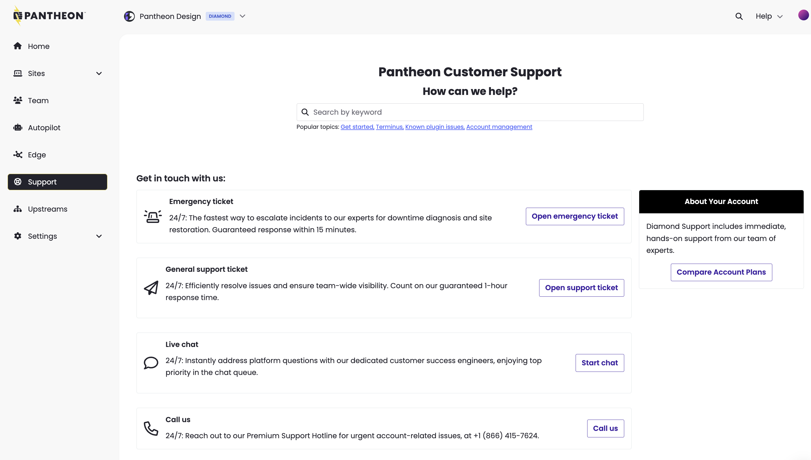

In this section, we go over best practices when writing a support ticket, which helps us resolve your issue faster.

## Best Practices

### Open the Ticket in the Right Place

If you are a member of an [Workspace](/guides/account-mgmt/workspace-sites-teams/workspaces), use the Workspace's Dashboard to visit the Support tab.

Contacting Support from your Personal Workspace will not provide the same support level as a Site Dashboard owned by an Workspace with a higher Account package. For a visual, [see below](/guides/support/support-ticket/#workspace-support-tab).

### Workspace Support Tab

If you are part of an Workspace with an enhanced Account package, navigate to the Support tab from the Workspace's Dashboard to make use of the Workspace's Support level.

### One Ticket Per Issue

Opening multiple tickets on the same issue will only impede our ability to provide timely support. When opening a chat conversation to follow up on a discussion from a ticket, please let us know about the ticket so we can read up on what's already been discussed and attempted.

### Replication Steps

One of the first steps in troubleshooting is almost always to recreate the problem. Please provide us with the exact steps to replicate the issue. If we can't see it, we can't debug it.

To help troubleshoot issues you encounter within a browser, [generate an HAR file](/guides/support/har) and share it with our team.

### Specifics

When discussing an issue, provide timestamps, error messages (in full), screenshots, URLs, and any other specific information that can help to identify problems.

### Custom Access

If your site uses nonstandard admin URLs, custom logins, etc., please let us know.

### Clarification

We're all real humans. We always try our best to understand the situation, but we may not always get it right the first time.

At the same time, our explanations or solutions might not always make sense to you. Don't be afraid to correct us (kindly), or to ask for clarification if we don't seem to understand the issue.
