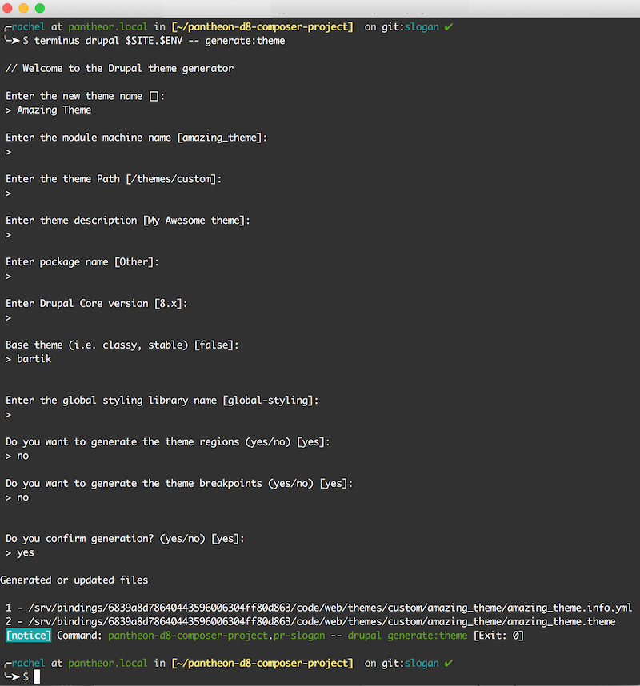
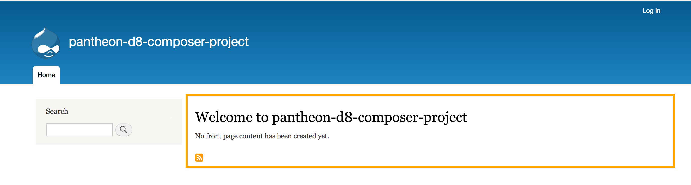

This lesson demonstrates how to create a custom theme from the default [Bartik](https://www.drupal.org/project/bartik) theme using the [Terminus Drupal Console plugin](https://github.com/pantheon-systems/terminus-drupal-console-plugin). For comprehensive documentation on how to create themes for Drupal 8, see [Theming Drupal 8](https://www.drupal.org/docs/8/theming) on Drupal.org.

1. Start by creating a new branch based off the tip of master, then push it up to GitHub:

  ```bash
  git checkout -b custom-theme master
  git push origin custom-theme
  ```

1. Export local environment variables to define your site name and Multidev environment to easily copy and paste example commands in the next sections (replace `pantheon-d8-composer-project`):

  ```bash
  export SITE=pantheon-d8-composer-project
  export ENV=pr-custom-t
  ```

1. Wait for CircleCI to build a new Pantheon Multidev environment (`pr-custom-t`), then use the `generate:theme` command as shown below to start the process of creating a subtheme:

  ```bash
  terminus drupal $SITE.$ENV -- generate:theme
  ```

  <Accordion title="Drupal Console Generate Theme" id="understand-drupal-console" icon="lightbulb">

  Drupal Console will ask a series of questions about your theme. For many of them you can use the default value by just hitting **Enter**. Provide additional information as prompted, such as:

    * Theme: Amazing Theme
    * Base theme: bartik
    * Enter `no` to generate theme regions and theme breakpoints
    * Type `yes` when asked to confirm generation of the theme

  

  Once you do this, the files for your new theme will be written to the directory `code/web/themes/custom/amazing_theme` on the Pantheon Multidev environment. If you gave your theme a different name, replace `amazing_theme` with the appropriate name for your theme.

  </Accordion>

1. Commit theme files generated in the last command to the Multidev environment, either from the Site Dashboard or from the command line. We don't _need_ this particular commit to be built by CircleCI, so we'll add `[ci skip]` to the commit message to skip:

  ```bash
  terminus env:commit $SITE.$ENV --message="Generate subtheme files [ci skip]"
  ```

1. Pull down your last commit from GitHub to your local:

  ```bash
  git pull origin custom-theme
  ```

1. Run the following command to copy the `regions:` section of Bartik's default info file to your new custom theme's info file:

  ```bash
  cat web/core/themes/bartik/bartik.info.yml | sed -n -e '/regions:/,$p' >> web/themes/custom/amazing_theme/amazing_theme.info.yml
  ```

1. Copy the logo from Bartik to your custom theme:

  ```bash
  cp web/core/themes/bartik/logo.svg web/themes/custom/amazing_theme/logo.svg
  ```

1.
    ```bash
    echo "global-styling:
        version: VERSION
        css:
          theme:
            css/main.css: {}" > web/themes/custom/amazing_theme/amazing_theme.libraries.yml
    ```

1. Create a new `css` directory for your custom theme along with a new file named `main.css` inside it. To test that your theme is working, add some very obvious styling such as an orange border around the content region:

    ```bash
    mkdir web/themes/custom/amazing_theme/css && echo "#content {
        border: 4px solid orange;
      }" > web/themes/custom/amazing_theme/css/main.css
    ```


1. Commit changes to your custom theme and push to GitHub:

    ```bash
    git commit -m="Create amazing theme css and library files"
      git push origin custom-theme
    ```

1. After the build from the last step completes, activate your new theme and rebuild the cache:

    ```bash
    terminus drupal $SITE.$ENV -- theme:install --set-default amazing_theme
    ```

    Visit the site in the web browser, it should reflect the change provided by the custom theme:

    ```bash
    terminus env:view $SITE.$ENV
    ```

    

1. You can use the [method described in an earlier lesson](/guides/build-tools/configure) to export configuration changes made in the last step or you can do it from the command line using Terminus and Drush:

    ```bash
    terminus drush $SITE.$ENV -- config-export --yes
    ```


1. Commit your changes in Pantheon from the command line with Terminus, to sync with GitHub:

    ```bash
    terminus env:commit $SITE.$ENV --message="Activate new custom theme"
    ```

1. Return to GitHub and compare the `custom-theme` branch against `master`. You should see a few commits that are able to be merged. Click **Create Pull Request** and go through your team's standard peer review process.
