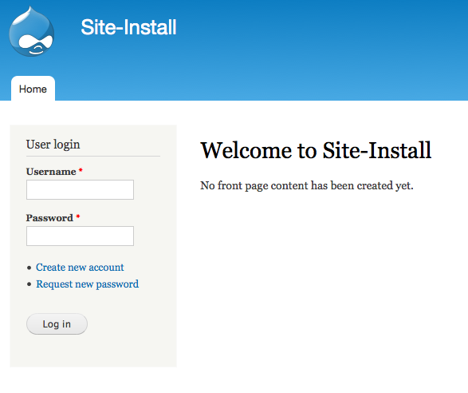
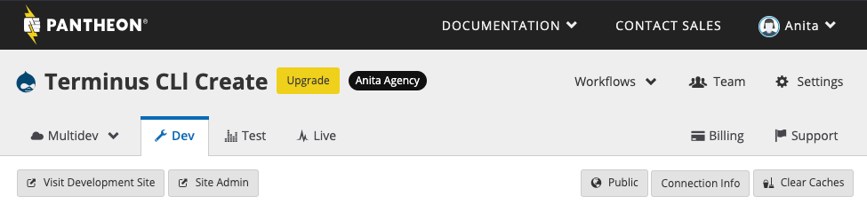
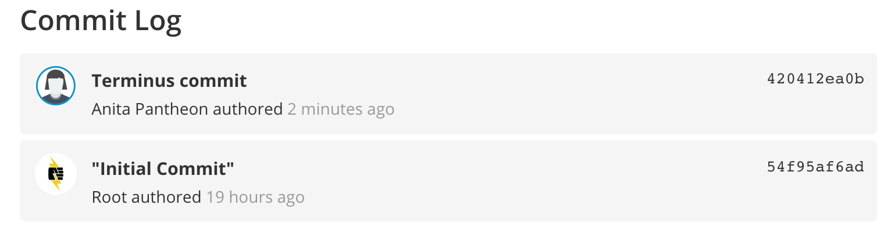
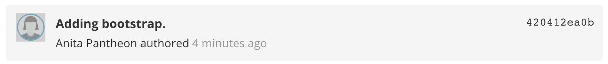

## Create Sites Faster and More Efficiently
The latest version of Pantheon's CLI, [Terminus](/terminus), incorporates not only Drush and WP-CLI, but also the vast majority of tasks available to you within the Pantheon Dashboard. You can create new sites, clone one environment to another, create branches, check for upstream updates, and more. By using Terminus, a site administrator can massively reduce the time spent on relatively simple tasks. In this guide, we will walk through the basics of creating a completely new Drupal site on Pantheon, installing some contrib modules, committing code, and cloning from one site environment to another&mdash;all through the Terminus CLI.

<Alert title="Note"  type="info" >

Drupal 8 reached end-of-life status in November 2021, and is no longer supported by Drupal. Read the [official announcement on Drupal.org](https://www.drupal.org/psa-2021-06-29).

</Alert>

## Installing Terminus

1. [Install Terminus](/terminus/install).

1. Check the status to make sure it works. Depending on your OS, the output may vary, but here's a sample:

```bash{outputLines:2}
terminus auth:login --email=<email> --machine-token=<machine_token>
 [notice] Logging in via machine token.
```

You've installed Terminus and logged into your Pantheon account. For a full list of commands, [refer to this page](/terminus/commands).

## Using Terminus

### List Your Current Sites

Terminus can be used on any Pantheon hosted website you have, and it can also create new sites! Let's get a list of your current Pantheon sites:

```bash{outputLines:2-7}
terminus site:list
+--------------------------+-----------+---------------+--------------------------+
| Site                     | Framework | Service Level | UUID                     |
+--------------------------+-----------+---------------+--------------------------+
| terminus-create          | drupal9   | free          | terminus-create          |
| git-import-example       | drupal    | free          | git-import-example       |
+--------------------------+-----------+---------------+--------------------------+
```

### Create a New Site

Follow the steps below to create a new site.

1. List the available Upstreams:

 ```bash{outputLines:2}
 terminus upstream:list | grep "Drupal 7" | grep "core"
 21e1fada-199c-492b-97bd-0b36b53a9da0   Drupal 7                               drupal7                                         core     drupal
 ```

   - If the Upstream ID in the output you receive is shorter than 36 characters (including hyphens), enlarge your terminal window and run the command again. Otherwise, you might encounter an error similar to:

  ```bash
  Could not find an upstream identified by 21e1fada-199c-492b.
  ```

1. Create a site using the Upstream:

 ```bash{outputLines:2}
 terminus site:create terminus-cli-create "Terminus CLI Create" 21e1fada-199c-492b-97bd-0b36b53a9da0
 [notice] Creating a new site...
 ```

1. View the new site list:

 ```bash{outputLines:2-8}
 terminus site:list
 +--------------------------+-----------+---------------+--------------------------+
 | Site                     | Framework | Service Level | UUID                     |
 +--------------------------+-----------+---------------+--------------------------+
 | terminus-cli-create      | drupal    | free          | terminus-cli-create      |
 | terminus-create          | drupal9   | free          | terminus-create          |
 | git-import-example       | drupal    | free          | git-import-example       |
 +--------------------------+-----------+---------------+--------------------------+
 ```

### Update the Code

Now that the site is created, the next step is to run a Drush install command to get a fully functional Drupal site ready for development. Terminus will run most available Drush commands by simply adding the word "drush" to the command directly afterward, along with the site's Pantheon machine name.

```bash{outputLines:2-7}
terminus drush <site>.<env> -- site-install
Running drush site-install  on terminus-cli-create-dev
dev.a248f559-fab9-49cd-983c-f5@appserver.dev.a248f559-fab9-49cd-983c-f5c0d11a2464.drush.in's password:
Could not find a Drupal settings.php file at ./sites/default/settings.php.
You are about to create a sites/dev-terminus-cli-create.pantheon.io/files directory and create a sites/dev-terminus-cli-create.pantheon.io/settings.php file and DROP all tables in your 'pantheon' database. Do you want to continue? (y/n): y
Starting Drupal installation. This takes a few seconds ...                  [ok]
Installation complete.  User name: admin  User password: ********         [ok]
```

If the command above fails with `exception 'Drush\Sql\SqlException' with message 'Unable to find a matching SQL Class. Drush cannot find your database connection details.'`, you must first create a [`settings.php`](/settings-php) file.

You should now be able to open a web browser and see your brand new Drupal site! On Mac, try using the `open` command to see an environment in your default browser:

```bash{promptUser: user}
open https://dev-terminus-cli-create.pantheon.io
```



There is also the `terminus dashboard <site>.<env> --print` command if, at any point in time, you want to open the site's Pantheon Dashboard.

```bash{promptUser: user}
terminus dashboard <site>.<env>
```



Also, the status of each of the environments within the site can be seen using a `terminus env:list` command.

```bash{outputLines:2-8}
terminus env:list <site>
------ --------------------- ------------------------------------ ----------------- -------- -------------
 ID     Created               Domain                               Connection Mode   Locked   Initialized
------ --------------------- ------------------------------------ ----------------- -------- -------------
 test   2016-12-20 20:57:03   test-terminus-cli-create.pantheonsite.io   git               false    false
 dev    2016-12-20 20:57:01   dev-terminus-cli-create.pantheonsite.io    git               false    true
 live   2016-12-20 20:57:05   live-terminus-cli-create.pantheonsite.io   git               false    false
------ --------------------- ------------------------------------ ----------------- -------- -------------
```

### Install Contrib Modules and Themes

1. Use Drush to download and install some Drupal contrib modules, such as Views and Administration Menu, while the site's Dev environment is still in SFTP mode.

    ```bash{outputLines:2-13}
    terminus drush <site>.<env> -- dl admin_menu
    Running drush dl admin_menu  on terminus-cli-create-dev
    dev.a248f559-fab9-49cd-983c-f5@appserver.dev.a248f559-fab9-49cd-983c-f5c0d11a2464.drush.in's password:
    Project admin_menu (7.x-3.0-rc5) downloaded to                         [success]
    /srv/bindings/c183403f14224eac8471ec0000f9e653/code/sites/all/modules/admin_menu.
    Project admin_menu contains 3 modules: admin_devel, admin_menu_toolbar, admin_menu.
    tests-MacBook-Pro:~ erikmathy$ terminus drush <site>.<env> -- en admin_menu,admin_menu_toolbar
    Running drush en admin_menu,admin_menu_toolbar  on terminus-cli-create-dev
    dev.a248f559-fab9-49cd-983c-f5@appserver.dev.a248f559-fab9-49cd-983c-f5c0d11a2464.drush.in's password:
    The following extensions will be enabled: admin_menu, admin_menu_toolbar
    Do you really want to continue? (y/n): y
    admin_menu was enabled successfully.                                        [ok]
    admin_menu_toolbar was enabled successfully.                                [ok]
    ```

    If you look at the site's Dashboard, the new code will be displayed there, waiting to be committed.

    

1. Commit the changes into the Git repo with the `terminus env:commit` command:

    ```bash{outputLines:2-7}
    terminus env:commit <site>.<env> --message="Initial Commit"
    Success: Successfully committed.
    +---------------------+--------+--------+------------------------------------------+------------------+
    | Time                | Author | Labels | Hash                                     | Message          |
    +---------------------+--------+--------+------------------------------------------+------------------+
    | 2015-02-05T22:40:14 | Root   | dev    | 4297d007d1697e1b9a90073510183149dd1c827f | "Initial Commit" |
    +---------------------+--------+--------+------------------------------------------+------------------+
    ```

1. Open the Pantheon Dashboard to see the new files in the Git commit log.

    

1. Download Bootstrap and then commit to see what a commit message looks like:

    ```bash{outputLines:2-13}
    terminus drush <site>.<env> -- dl bootstrap
    Running drush dl bootstrap  on terminus-cli-create-dev
    dev.a248f559-fab9-49cd-983c-f5@appserver.dev.a248f559-fab9-49cd-983c-f5c0d11a2464.drush.in's password:
    Project bootstrap (7.x-3.0) downloaded to                              [success]
    /srv/bindings/c183403f14224eac8471ec0000f9e653/code/sites/all/themes/bootstrap.
    $ terminus env:commit <site>.<env> --message="Adding bootstrap"
    Success: Successfully committed.
    +---------------------+---------+-----------+------------------------------------------+-------------------+
    | Time                | Author  | Labels    | Hash                                     | Message           |
    +---------------------+---------+-----------+------------------------------------------+-------------------+
    | 2015-02-11T18:25:44 | E Mathy | dev       | 34e988fe427f7dfe9f9af0046c83d49268e1f1ac | Adding bootstrap. |
    | 2015-02-05T22:40:14 | Root    | dev | 4297d007d1697e1b9a90073510183149dd1c827f | "Initial Commit"  |
    +---------------------+---------+-----------+------------------------------------------+-------------------+
    ```

  

1. Initialize the Test environment to move the code, files, and DB from Dev onward in the Pantheon workflow using a `terminus env:deploy` command:

    ```bash{promptUser: user}
    terminus env:deploy <site>.test --sync-content --updatedb
    ```

1. Clear the site cache to ensure a successful deployment:

    ```bash{promptUser: user}
    terminus env:clear-cache <site>.test
    ```

## Congratulations!
You just created a brand new Drupal site on Pantheon! You added modules, committed code, and moved it all from Dev to Test without using a single checkbox, radio button, or colored Ajax slider. To top it off, by using Terminus, it all happened in a third of the time. 

##  Next Steps
- Learn more about [Drush](/drush).

- After you've mastered Terminus, take it a step further with [Continuous Integration](/continuous-integration).
