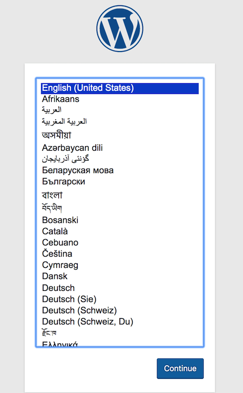
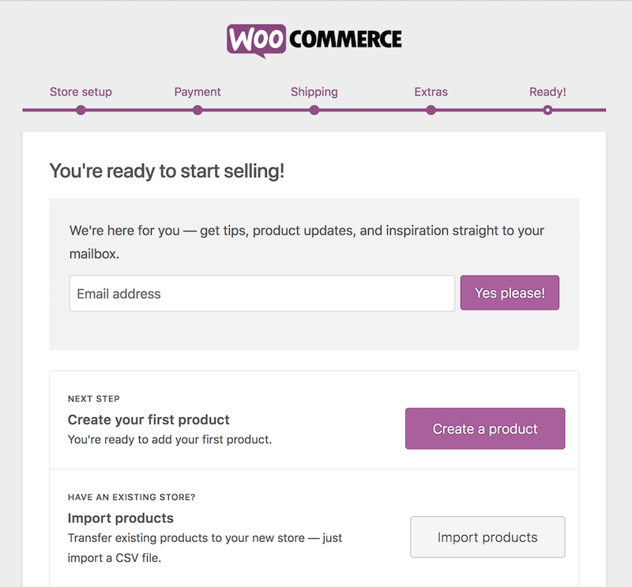

I've already gone ahead and [created a new site on Pantheon](/guides/quickstart/create-new-site).

The first thing we should do is install WordPress and configure it.

1. Click **Install WordPress**. Then, choose your language:

    

2. Configure the site title and create your admin account:

    

3. Now that WordPress is set up, let's configure WooCommerce. For this guide we'll also install Stripe, for easy payments, and WooCommerce services to easily set up shipping with USPS, if you're in the US.

    

4. Go to **Plugins** > **Add New** > and type in WooCommerce. Click **Install Now**. Click **Activate** once the plugin has installed.

    

5. WooCommerce has a well-designed welcome wizard. Take your time going through the welcome wizard. It will help you configure everything you need for your store.

   

   If you select any options that require additional plugins, the welcome wizard will automatically install them for you. In our case Jetpack, WooCommerce Services, the WooCommerce Stripe Payment Gateway, and the Storefront theme will be installed for us automatically.

   

   If you installed WooCommerce Services to get live shipping rates from USPS or Automated Taxes you'll be prompted to install Jetpack & connect your site to WordPress.com. WooCommerce Services needs this connection in order to work.

   <Alert title="Note" type="info">

   Jetpack is a sophisticated plugin that detects test sites. It will turn on [safe mode](https://jetpack.com/support/safe-mode/) and prevent the connection to WordPress.com. For this reason it's best to only activate Jetpack in the ** Live** environment of your site and let it run in dev mode for your ** Dev** and ** Test** environments.

   </Alert>

   If you need to test Jetpack functionality, you can enable the Jetpack connection in safe mode by clicking **Fix Jetpack's Connection** and then **Start Fresh & Create New Connection**.

   To understand more about Jetpack, read their documentation on [safe mode](https://jetpack.com/support/safe-mode/).

6. When you connect your site, you'll see a connection to WordPress.com. This should only take a minute and then it should automatically return you to your WordPress dashboard.

    

  When you get to this page you're done. We've installed all of the required plugins:

    

We won't cover configuring every setting, but I encourage you to read the getting started guide and documentation for each plugin. Now is also a good point to configure your payment gateway so you can [accept test payments](https://robotninja.com/blog/test-woocommerce-payments-via-credit-card/), as well as configure your shipping costs, and tax settings.
