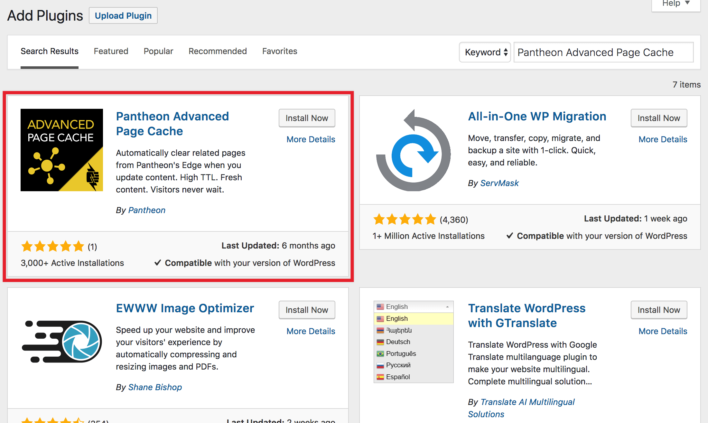
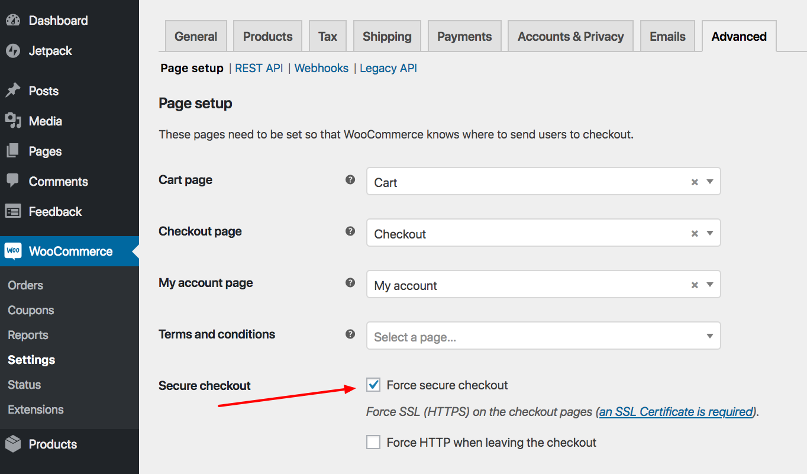

We've configured a few things for our WooCommerce site. But there are a few additional things to configure.

The first is [adding PHP sessions to WordPress](/wordpress-sessions). WordPress and WooCommerce core do not use PHP Sessions, but other plugins and extensions may.

To enable PHP Sessions on Pantheon, install [WP Native PHP Sessions](https://wordpress.org/plugins/wp-native-php-sessions/). It's a free plugin you can download from WordPress.org or install through your WordPress dashboard.

I'll install mine through the plugin installer.

For any site, speed is important, and for eCommerce it's even more important. That's why Pantheon recommends the [Pantheon Advanced Page Cache plugin](https://wordpress.org/plugins/pantheon-advanced-page-cache/). This plugin allows selective cache purging and longer cache lifetimes.

You can [read more about exactly how this works](https://pantheon.io/blog/optimizing-woocommerce-pantheon-advanced-page-cache-wordpress). For our purposes, it speeds up your site and it's worth installing.

You've probably noticed that your Pantheon site already loads in HTTPS. But while it loads HTTPS, it doesn't force HTTPS. For your users' privacy, for payment, and for SEO reasons it's a best practice to force the site to load in HTTPS.

We have a [whole document explaining how to load your entire site in HTTPS](/http-to-https/#wp). This may take a while to set up, so what you can do to get going immediately is configure WooCommerce to force the checkout to load in HTTPS.

Make sure **Force secure checkout** is enabled in **WooCommerce** > **Settings** > **Advanced** > **Page setup**. This has the added benefit of getting rid of one of the admin notices in the backend of your site.

