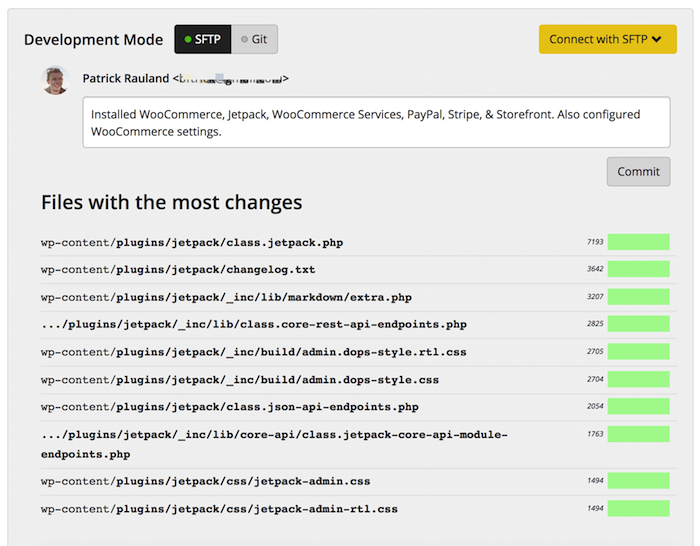
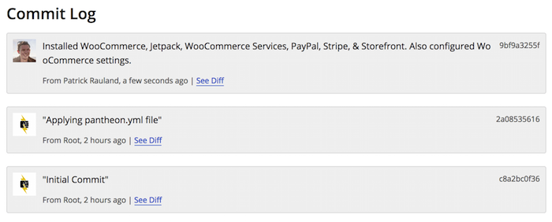

At Pantheon, we believe in best practices for development, and that includes using [version control](https://pantheon.io/features/version-control-workflow) - that's why it's built into our platform. We've done a lot on the ** Dev** environment so far and at this point we're just about ready to move everything over to the ** Live** environment.

However, there's one thing we need to do first. Whenever you install a plugin or write custom code you'll have to commit your changes

Pantheon has two ways to commit changes. [SFTP mode](/sftp), which looks at what files you uploaded and automatically tracks them to be committed, and [Git mode](/git), which allows you to commit files directly with git. Git mode is great for working locally, and SFTP mode is great for working directly on Pantheon.

Since we uploaded files through our WordPress site, and not through a terminal or code editor, let's use SFTP mode to commit these changes.

In your site settings in the Pantheon Site Dashboard, make sure SFTP mode is enabled. Then type in a commit message. Try to be as explicit as possible to help you remember exactly what happened when. It's a best practice to make a commit for each change you make. That way if you wish to revert one thing it can be done easily without losing the other changes:

Once you're all done click **Commit**. When you've finished you should see your changes in the commit log:

We've just made a ton of changes and, before we hand this off to someone to add content to the site, we should [make a backup](/backups) in case we need to restore to this starting state.

With a free plan you can make as many manual backups as you like. If you upgrade to a paid plan you enable automatic backups. Let's create a manual backup.

In your site settings go to Backups and then select how long you want to store your backup. I like to set mine to 6 months which gives me plenty of time to fix any issues.

Click the yellow **Create New Backup** button. You can keep an eye on the backup progress from the **Workflows** menu in the upper-right side of the dashboard.
