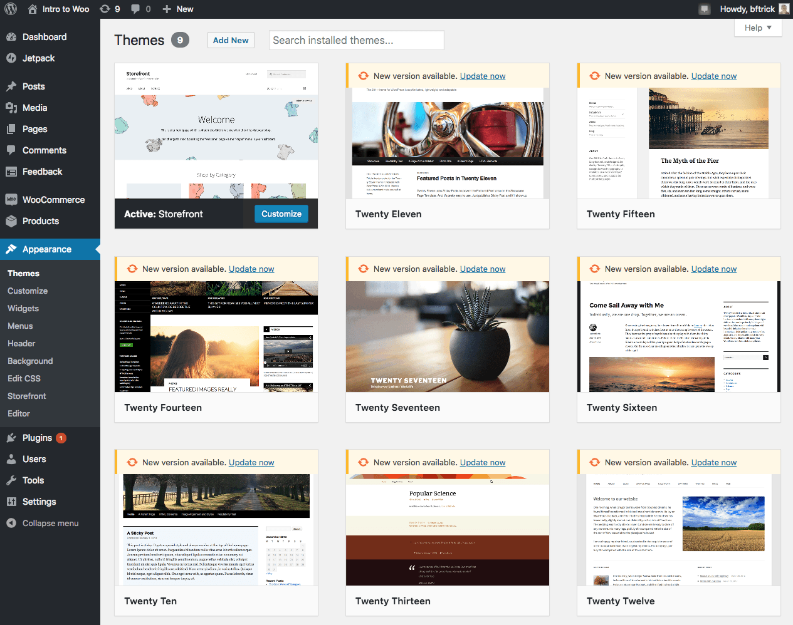

It's a good security practice to remove any plugins or themes you aren't using. So let's get rid of the themes we aren't using. We'll make the change in our ** Dev** environment, then move it to our ** Test** environment to QA, and then move it to ** Live**.

1. In the WordPress admin of our ** Dev** environment under **Appearance** you'll see all of the installed themes.

    

    Hover over each one and click **Theme Details**.

2. A preview of the theme will come up. If the theme is not active, click **Delete** in the bottom right to remove it.

    

    Repeat this for each theme, deleting the ones that are not active.

3. Now we need to commit the changes, just like we did earlier. This ensures they are tracked in version control. Changes that aren't committed cannot be deployed to the ** Test** environment.

    

4. Now that the changes are committed we can move them over to our ** Test** environment with the the ** Deploy** menu.

    

  When you're moving files (ex. Uploaded media files, such as images) or the database, use the clone functionality in the Pantheon dashboard. When you're moving code, use the deploy functionality. As a reminder, code should be deployed from the ** Dev** environment to ** Test** and then ** Live** environments. The database and files (content) should be cloned from the live environment back down to the ** Test** and ** Dev** environments periodically to keep them up to date with the latest content.

  With a quick test we can see all of the other themes were deleted, leaving only the active  Storefront theme.

  

Now that you know how to move content changes around you can keep your store live and accepting new orders while you add functionality to your site in the ** Dev** environment and then test the new changes in the ** Test** environment. Once the changes are ready for production they can be deployed to the ** Live** environment.
