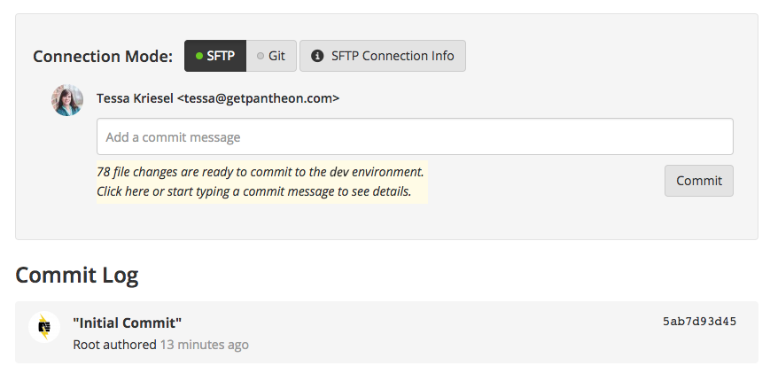
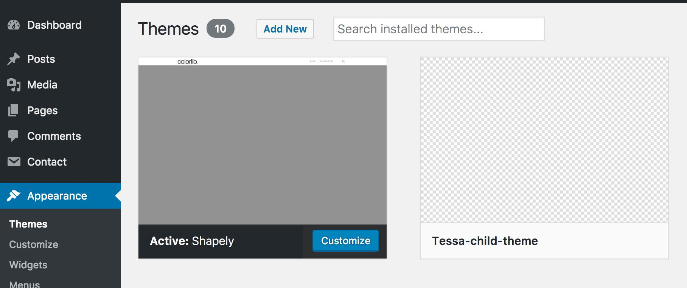

Many developers feel more at home using the command line than they do using a GUI. Edit a text file, issue a command, and bang—you've completed your task. There's just something about doing it all from the command line that makes it a little more exciting. Until recently, WordPress didn't have a great answer for developers who are most at home on the CLI.

WP-CLI is a tool used to manage a WordPress installation. However, don't think of it as a simple backup or search and replace tool. Yes, it can do those things, but it's so much more than that. This guide will walk you through creating and configuring a site from the command line using Pantheon's own CLI, called Terminus, which allows you to call WP-CLI remotely without using a local installation.

## Before You Begin

Be sure that you:

- Are familiar with your operating system's command line.
- Are using a Unix-based system (Linux or Mac OS X). Windows commands may vary slightly.
- Have created a [Pantheon account](https://dashboard.pantheon.io/register). Pantheon accounts are always free for development.

## Install and Authenticate Terminus
Terminus provides advanced interaction with the platform and allows us to run WP-CLI commands remotely. Terminus also opens the door to automating parts of your workflow by combining multiple operations. For more information about Terminus itself, see our [Terminus Manual](/terminus).

1. Install Terminus within the `$HOME/terminus` directory:

  ```bash
  mkdir $HOME/terminus
  cd $HOME/terminus
  curl -O https://raw.githubusercontent.com/pantheon-systems/terminus-installer/master/builds/installer.phar && php installer.phar install
  ```

2. [Generate a Machine Token](https://dashboard.pantheon.io/login?destination=%2Fuser#account/tokens/create/terminus/) from within **User Dashboard** > **Account** > **Machine Tokens**. Then use it to authenticate Terminus:

  ```bash
  terminus auth:login --machine-token=‹machine-token›
  ```

  For details, see [Terminus Manual: Install](/terminus/install).

3. Once installed, verify your session:

  ```bash
  terminus site:list
  ```

  If you see your Pantheon sites, then it was installed and authenticated successfully! Once you are comfortable with Terminus, you may find it faster to use than the browser.

## Create Your Site and Initialize Environments

<Alert title="Note" type="info">

The next few secions of this guide use the example variables `tessa-site-wp` and `"Terminus Demo Site"` as the site name and label. Make sure to replace each instance, as well as other variables like the site URL and user/password combinations, with your desired values.

</Alert>

1. Create a new WordPress site on Pantheon:

  ```bash
  terminus site:create tessa-site-wp "Terminus Demo Site" WordPress
  ```

  If you would like to associate this site with an Organization, you can add the `--org` option to the command above and pass the Organization name, label, or ID. To associate an existing site with an Organization, use the `site:org:add` command.

2. Open your new Site Dashboard in a browser:

 ```bash
 terminus dashboard:view tessa-site-wp
 ```

 Keep this window open while you continue reading so you can see the changes you are making in Terminus almost immediately in your Site Dashboard.

3. Get the platform domain for the Dev environment:

  ```bash
  terminus env:info tessa-site-wp.dev --field=domain
  ```

  You'll need this to fill out the `--url` option in the next step.

4. Use the [WP-CLI `core install`](https://developer.wordpress.org/cli/commands/core/install/) command to install WordPress on the Dev environment:

  ```bash
  terminus wp tessa-site-wp.dev -- core install --url=https://dev-tessa-site-wp.pantheonsite.io --title="Terminus Demo Site" --admin_user=admin --admin_password=changemelater --admin_email=name@yoursite.com
  ```

  As a reminder, WP-CLI is the command line utility for WordPress itself.	Terminus is simply passing through the WP-CLI commands to the site on Pantheon. To get a full list of WP-CLI commands run:

  ```bash
  terminus wp tessa-site-wp.dev -- help
  ```

  The `--` signifies the end of the Terminus options, anything after `--` gets passed straight to WP-CLI.

4. Create the Test environment:

  ```bash
  terminus env:deploy tessa-site-wp.test --updatedb --note="Initialize the Test environment"
  ```

5. Create the Live environment:

    ```bash
    terminus env:deploy tessa-site-wp.live  --updatedb --note="Initialize the Live environment"
    ```

### Export the Site Name as a Variable
1. Instead of having to type the site name out, let's export our site name to a variable so we can copy/paste the remainder of our commands:

  ```bash
  export TERMINUS_SITE=tessa-site-wp
  ```

  This sets an [**environment variable**](https://en.wikipedia.org/wiki/Environment_variable) named `$TERMINUS_SITE` with the value `tessa-site-wp`. Anytime we use the variable name it's replaced in the executed command with the value.

2. We can test this by echoing our variable:

  ```bash
  echo $TERMINUS_SITE
  ```

  You can now copy and paste the remainder of these commands without replacing the site name, as they use the `$TERMINUS_SITE` variable.

3. Let's see our new variable in action. Get the connection information for the Dev environment:

  ```bash
  terminus connection:info $TERMINUS_SITE.dev
  ```

## Install WordPress Plugins
The [WordPress plugin repository](https://wordpress.org/plugins/) has loads of free and paid plugins. For this example we will install and activate the [Contact Form 7](https://wordpress.org/plugins/contact-form-7/) plugin.

1. Install and activate the [Contact Form 7](https://wordpress.org/plugins/contact-form-7/) plugin:

  ```bash
  terminus wp $TERMINUS_SITE.dev -- plugin install contact-form-7 --activate
  ```

  If you have the Site Dashboard open, you'll see that 78 files have changed and are ready to commit in the yellow box. You can use the Site Dashboard interface to review file changes and commit, but we'll continue on the command line.

  


2. Review the file changes:

  ```bash
  terminus env:diffstat $TERMINUS_SITE.dev
  ```

3. Commit your changes to the Dev environment:

  ```bash
  terminus env:commit $TERMINUS_SITE.dev --message="Install CF7"
  ```

  If you refer back to the Site Dashboard, you'll see the commit on the Dev environment:
  

4. Deploy the code to Test and pull content down from Live:

  ```bash
  terminus env:deploy $TERMINUS_SITE.test --sync-content  --updatedb --cc --note="Deploy C7 plugin"
  ```

  <Alert title="Note" type="info">
  
  The `--sync-content` option will pull the database and files down from the Live environment. In a real-world scenario, your content editors most likely have added posts and files in the Live environment. For proper testing, you want those updates present on the Test environment with your deployed code. For more information on options for the this command, run `terminus env:deploy -h`.
  
  </Alert>

5. Activate the Contact Form 7 plugin on the Test environment by making a manual configuration change:

  ```bash
  terminus wp $TERMINUS_SITE.test -- plugin activate contact-form-7
  ```

6. Once you've experimented in the Test environment and verified that your new plugin is working, and everything else is still in working order, deploy to Live:

  ```bash
  terminus env:deploy $TERMINUS_SITE.live --updatedb --cc --note="Deploy after CF7 Install"
  ```

  <Alert title="Note" type="info">

  We don't need the `--sync-content` flag when going to the Live environment because that environment already has our canonical database.

  </Alert>

7. Activate the Contact Form 7 plugin on the Live environment by making a manual configuration change:

  ```bash
  terminus wp $TERMINUS_SITE.live -- plugin activate contact-form-7
  ```

For this example, manually applying configuration changes is a simple and short task. We're only activating one plugin on each environment. However, complex configuration changes are [best managed in code](/pantheon-workflow/#configuration-management) so you can pull fresh content from Live while bringing in the site settings from Dev.


## Install WordPress Themes
Now that you have WordPress installed, let's make it look a little better by adding a new theme. The [WordPress theme repository](https://wordpress.org/themes/) has a plethora of free and paid themes you can install to customize your site. For this example we will use the [Shapely](https://wordpress.org/themes/shapely/) theme.

1. Install and activate the [Shapely](https://wordpress.org/themes/shapely/) theme:

  ```bash
  terminus wp $TERMINUS_SITE.dev -- theme install shapely --activate
  ```

2. Check out the Dev environment's site URL to see the new theme in action. The `terminus env:info` command from earlier gives us the URL. Here it is again with our environment variable:

   ```bash
   terminus env:info $TERMINUS_SITE.dev --field=domain
   ```

3. Commit your changes to the Dev environment:

  ```bash
  terminus env:commit $TERMINUS_SITE.dev --message="Install shapely theme"
  ```

4. No WordPress site is ready for development without a [child theme](https://codex.wordpress.org/Child_Themes). Let's create one! Run [the `scaffold child-theme` WP-CLI command](https://developer.wordpress.org/cli/commands/scaffold/child-theme/) (replace `Tessa-child-theme` and `shapely`):

  ```bash
  terminus wp $TERMINUS_SITE.dev -- scaffold child-theme Tessa-child-theme --parent_theme=shapely
  ```

  You should see the new theme within **Appearance** > **Themes** of the WordPress Dashboard:

  

  Now you're ready to edit your child theme. This allows your parent theme, in our case Shapely, to receive updates without conflict or interference to the functionality of the site.

  Apply configuration changes, such as activating the child theme, then make sure everything looks good on the Dev environment's site URL.

5. Commit your changes to the Dev environment:

  ```bash
  terminus env:commit $TERMINUS_SITE.dev --message="Create Child of Shapely Theme"
  ```

6. Deploy the themes to Test and pull content down from Live:

  ```bash
  terminus env:deploy $TERMINUS_SITE.test --sync-content --updatedb --cc --note="Deploy Themes"
  ```

  Apply configuration changes and make sure everything looks good on the Test environment's site URL.

7. Deploy code to Live, then apply configuration changes:

  ```bash
  terminus env:deploy $TERMINUS_SITE.live --updatedb --cc --note="Deploy Themes"
  ```

## The Power of Terminus and WP-CLI

If you're a developer who lives in the command line, you now see the power of Terminus and WP-CLI. This guide has just scratched the surface of what can be done. Terminus provides the power to manage most aspects of your Pantheon sites, while tools like WP-CLI (and Drush for Drupal) give you the power to manage the inner workings of your WordPress powered site. Now you're ready to take the Sandbox site we've setup and explore on your own to see what else is possible.

Here are some suggestions on where to go from here:

 - [Use the Pantheon Workflow](/pantheon-workflow)
 - [WordPress Configuration Management (WP-CFM)](/wp-cfm)
 - [The Terminus Manual](/terminus)
