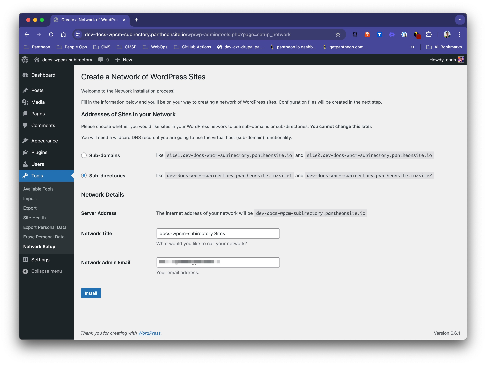
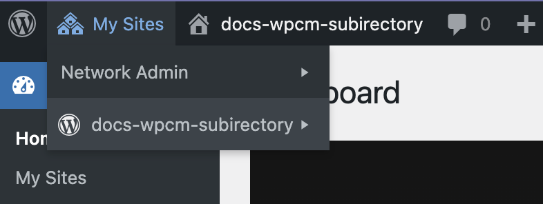

This section provides information on how to configure your WordPress (Composer Managed) site on Pantheon for WordPress multisite. This guide assumes that you have already set up a [WordPress Multisite upstream](/guides/multisite/#request-a-wordpress-multisite) and created a new site using that upstream. If you haven't already, you should also read through our [guide on WordPress Multisite](/guides/multisite) before beginning this process.

Because Bedrock uses `Config::define()` and `config/application.php` instead of traditional `define()` statements in `wp-config.php`, you will not be able to use WP-CLI via Terminus to enable multisite as documented in our standard [multisite configuration guide](/guides/multisite/config/).

<Alert title="Note" type="info">

Adjust placeholders in code snippets as needed throughout this guide. This includes placeholders such as `<site>` and `<env>` in Terminus commands, in addition to placeholders in brackets `<>` in larger code blocks.

</Alert>

## Set Up WordPress Multisite

1. Set the site's connection mode to Git:

    ```bash{promptUser: user}
    terminus connection:set <site>.dev git
    ```
2. Open the `config/application.php` file in your site's codebase and add the following line:

	```php
	Config::define( 'WP_ALLOW_MULTISITE', true );
	```
3. Visit your development site's WordPress admin and navigate to **Tools** > **Network Setup**.
    
4. Choose **Sub-domains** or **Sub-directories** (depending on your needs), fill in the Network Title and Admin Email, and click **Install**.
5. You will be given instructions to update your `config/application.php` file. Below where you added the `WP_ALLOW_MULTISITE` line, copy and paste the code provided. The `SUBDOMAIN_INSTALL` value will be `true` or `false` depending on the option you chose in the previous step. For example, if you chose subdirectories, your `config/application.php` file should look like this:

	```php
	Config::define( 'MULTISITE', true );
	Config::define( 'SUBDOMAIN_INSTALL', false );
	// Use PANTHEON_HOSTNAME if in a Pantheon environment, otherwise use HTTP_HOST.
	Config::define( 'DOMAIN_CURRENT_SITE', defined( 'PANTHEON_HOSTNAME' ) ? PANTHEON_HOSTNAME : $_SERVER['HTTP_HOST'] );
	Config::define( 'PATH_CURRENT_SITE', '/' );
	Config::define( 'SITE_ID_CURRENT_SITE', 1 );
	Config::define( 'BLOG_ID_CURRENT_SITE', 1 );
	```
6. Save your changes and commit them to your Git repository.
7. Log into your site. When you log back into your WordPress admin dashboard, you will see a new **My Sites** menu item in the top left corner. This is where you can manage your network of sites. You now have a WordPress subdirectory multisite network set up on a WordPress (Composer Managed)-based upstream.
	
	
## Using Subdomain Multisite on Pantheon

Pantheon does not support sub-subdomains on the `pantheonsite.io` platform domain. This means that sub-sites on a subdomain multisite will not be accessible by default. See the [Mapping Custom Hostnames](/guides/multisite/config/#map-custom-hostnames-subdomain-configurations-only) panel in the Multisite Configuration guide for how to set up a custom domain for your sub-sites.

## Multisite Search and Replace with WordPress (Composer Managed)
Currently, the built-in dashboard [WordPress Multisite Search and Replace](/guides/multisite/search-replace/) does not support Composer-based WordPress multisites. To perform a search and replace on a WordPress (Composer Managed) multisite, you will need to use WP-CLI via Terminus manually. For more information, see our [WordPress Multisite Search and Replace](guides/multisite/workflows/#run-wp-cli-search-replace-manually) guide.

## More Information

* [WordPress Multisite Configuration](/guides/multisite/config/)
* [WordPress Multisite Search and Replace](/guides/multisite/search-replace/)
* [WordPress Multisite documentation](https://developer.wordpress.org/advanced-administration/multisite/)
* [WordPress Multisite Domain Mapping](https://developer.wordpress.org/advanced-administration/multisite/domain-mapping/)
