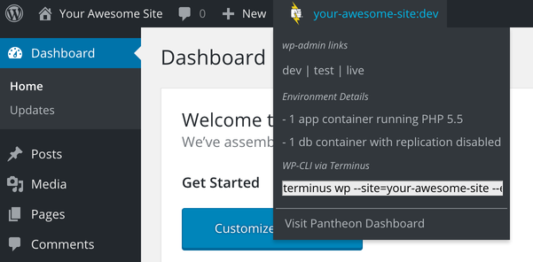

Pantheon maintains multiple plugins to facilitate workflow within WordPress. You can find Pantheon developers in our [Community Forums](https://discuss.pantheon.io/) and [Slack Workspace](https://slackin.pantheon.io/) for real-time discussion of these plugins.

<Alert title="Note" type="info">

Drupal users should refer to [Pantheon Modules](/modules) for details on Drupal modules developed and maintained for the Pantheon workflow.

</Alert>


## Pantheon Must-Use Plugin

[Pantheon Must-Use Plugin](https://github.com/pantheon-systems/pantheon-mu-plugin) is vital to the operation of your site on the Pantheon platform and must not be removed from your codebase. Consider it a part of WordPress core, and do not hack it. The permanent activation of this plugin will not interfere with your local environment.

Refer to [Create a WordPress MU-Plugin for Actions and Filters](/guides/wordpress-configurations/mu-plugin) for information on how to create a custom MU-Plugin.

## Pantheon Advanced Page Cache

[Pantheon Advanced Page Cache](https://wordpress.org/plugins/pantheon-advanced-page-cache) automatically clears related pages from Pantheon's Edge when you update content. Without this plugin, pages expire from cache after 10 minutes (600 seconds) by default. This plugin allows fresh content to be served immediately to anonymous visitors.

## Pantheon HUD

[Pantheon HUD](https://wordpress.org/plugins/pantheon-hud) provides situational awareness within the WordPress Dashboard when working on the Pantheon platform. It's helpful to have a reminder of which environment you're in, as well as quick access to links to get back to Pantheon's Dashboard. This plugin also provides quick access to interface with your WordPress installation via the command line:



Refer to [Configuring Environment Indicators](/guides/environment-configuration/environment-indicator) for installation details.

## [WordPress Native PHP Sessions](https://wordpress.org/plugins/wp-native-php-sessions)

[WordPress Native PHP Sessions](https://wordpress.org/plugins/wp-native-php-sessions) resolves errors with code (themes, modules, or plugins) that rely on PHP's default session manager. Refer to [WordPress and PHP Sessions](/guides/php/wordpress-sessions/#troubleshooting-session-errors) for more information.

### Troubleshooting WP Native PHP Sessions

If you see an error similar to the following in the error logs:

```none
Fatal error: session_start(): Failed to initialize storage module: user (path: ) in …/code/wp-content/plugins/plugin-that-uses-sessions/example.php on line 2
```

The cause is likely a plugin in the [mu-plugins](/guides/wordpress-configurations/mu-plugin) directory that is instantiating a session prior to this plugin loading. To fix this issue, deactivate the WP Native PHP Sessions plugin and instead load it via an mu-plugin that loads first.

For example, create an mu-plugin called `00.php` and add a line in it to include the `wp-native-php-sessions/pantheon-sessions.php` file.

## WP SAML Auth

[WP SAML Auth](https://wordpress.org/plugins/wp-saml-auth/)
provides support for SAML Authentication. The plugin comes bundled with the OneLogin SAML library and [SimpleSAMLphp](https://simplesamlphp.org/). Refer to [Using WP SAML Auth with Google Apps](/guides/wordpress-google-sso) for an example use case.

## WP Redis

[WP Redis](https://wordpress.org/plugins/wp-redis) provides an alternative caching backend, taking work off the database, which is vital for scaling to a larger number of logged-in users. Refer to [Object Cache (formerly Redis) for Drupal or WordPress](/guides/object-cache) for more information.

## WP Solr

[WP Solr](https://wordpress.org/plugins/solr-power/) enables the Pantheon Search (Solr) search engine for your WordPress website. Refer to [Enable Pantheon Search for WordPress](/guides/wordpress-developer/wordpress-solr) for more information.

## More Resources

- [Pantheon Search (formerly Pantheon Solr)](/solr)
- [Object Cache (formerly Redis) for Drupal or WordPress](/guides/object-cache)
