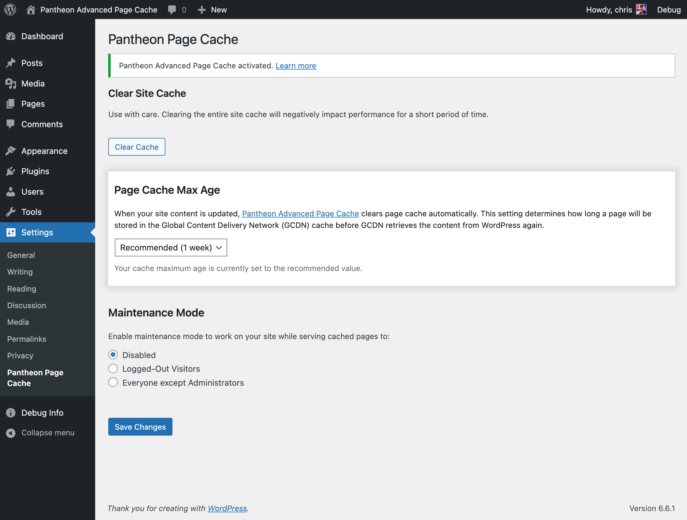

This section provides information on Pantheon's WordPress plugin.

Pantheon maintains an [optimized version of WordPress](https://github.com/pantheon-systems/WordPress) that includes a plugin to control cache expiration. By default, pages expire from the Varnish Edge Cache after 1 week. The plugin sets a default HTTP header: `Cache-Control: public, max-age=604800`

## Clear Site Cache

You can clear the site cache manually or automatically.

- To clear the cache manually, click the **Clear Cache** button.

- To clear the cache automatically, refer to the [Pantheon Advanced Page Cache](https://wordpress.org/plugins/pantheon-advanced-page-cache) and follow the instructions.

## Pantheon Page Cache Plugin Configuration

### Increase the Default Page Cache Max Age Value

You can increase the default page cache max age value to improve the chances that a visitor will request a cached page. Cached page requests reduce page load times.

1. Log in to your WordPress site as an administrator.

1. Click **Settings**.

1. Click **Pantheon Cache**. You'll end up at: `/wp-admin/options-general.php?page=pantheon-cache`

1. Modify the **Default Cache Time**.

    When [Pantheon Advanced Page Cache](https://wordpress.org/plugins/pantheon-advanced-page-cache) is active, your site content should always be fresh and served quickly from Pantheon's Edge Cache. This is why we recommend caching content for a minimum of 1 week. Every page served from the Edge Cache won't hit your application container's PHP workers or MySQL database, which means faster page load times and a better user experience for site visitors.
	
	Since the 2.0 version of Pantheon Advanced Page Cache, the input type for the Page Cache Max Age setting has been changed to a dropdown with the values 1 week, 1 month and 1 year. This setting can be overridden using the `pantheon_cache_default_max_age` filter as described below.

1. Click **Save Changes**.

<Alert title="Note" type="info">

We strongly recommend using the [Pantheon Advanced Page Cache](https://wordpress.org/plugins/pantheon-advanced-page-cache) plugin to ensure that your site content is always fresh and served quickly from Pantheon's Edge Cache. When Pantheon Advanced Page Cache is active, the Pantheon Page Cache admin page will look like the screenshot below. If the PAPC plugin is not active, the Page Cache Max Age setting will be a text input.

</Alert>



### Override the default max age

Since the [1.4.0 update in the Pantheon MU Plugin](/release-notes/2024/04/pantheon-mu-plugin-1-4-0-update), you can override the default `max-age` using a filter. This is useful if you want to set a different max age for specific pages or post types, or if you want to set it to a specific value programmatically.

```php
add_filter( 'pantheon_cache_default_max_age', function() {
    return 2 * WEEK_IN_SECONDS;
} );
```

### Maintenance Mode

You can enable maintenance mode for others while working on your site.

1. Log in to your WordPress site as an administrator.

1. Click **Settings**.

1. Click **Pantheon Cache**. You'll end up at: `/wp-admin/options-general.php?page=pantheon-cache`

1. Modify the **Maintenance Mode**.

    A simple notice displays to users who request a page that is not already cached.
    `Briefly unavailable for scheduled maintenance. Check back in a minute.`

1. Click **Save Changes**.

## Use Pantheon Cache Functions Programmatically

There are functions that are useful to developers within the [Pantheon MU plugin](https://github.com/pantheon-systems/pantheon-mu-plugin/blob/main/inc/pantheon-page-cache.php). You can call them from within your own custom code using various WordPress hooks, such as [`save_post`](https://developer.wordpress.org/reference/hooks/save_post/).

### flush_site

This function flushes the site cache for the entire site. This achieves the same result as the **Clear Site Cache** button on the Pantheon Cache administration page.

```php
/**
 * Clear the cache for the entire site.
 *
 * @return void
 */
public function flush_site()
```

### clean_post_cache

This function flushes the cache for an individual post, which is identified by the `$post_id`. The optional `$include_homepage` argument can also be passed. The default value is `true` if no value is set.

```php
/**
 * Clear the cache for a post.
 *
 * @param  int $post_id A post ID to clean.
 * @return void
 */
public function clean_post_cache( $post_id, $include_homepage = true )
```

### clean_term_cache

This function flushes the cache for an individual term or terms which are passed in an array, or for a complete taxonomy passed via a single taxonomy ID.

```php
/**
 * Clear the cache for a given term or terms and taxonomy.
 *
 * @param int|array $ids Single or list of Term IDs.
 * @param string $taxonomy Can be empty and will assume tt_ids, else will use for context.
 * @return void
 */
public function clean_term_cache( $term_ids, $taxonomy )
```

Additional filters are added and available only when the [Pantheon Advanced Page Cache](https://github.com/pantheon-systems/pantheon-advanced-page-cache/tree/e3b5552b0cb9268d9b696cb200af56cc044920d9?tab=readme-ov-file#adding-custom-keys) plugin is installed and active.

## Automatically Clear Cache on Archive Pages for Specific Custom Post Type

By default, adding a post, page or custom post type, clears the cache for the homepage and associated terms or categories associated with it. To clear cache for a specific page when a specific custom post type is added:

```php
add_action( 'save_post', 'custom_clearcache_archive_page' );
/**
 * Clear cache on a specific page when a specific custom post type is added or modified.
 *
 * @param int $post_id
 * @return void
 */
function custom_clearcache_archive_page( $post_id ){
	if ( get_post_type() === 'book' ) {
		pantheon_clear_edge_paths( ['/books-on-startups-entrepreneurship-and-venture-capital/'] );
	}

	if( get_post_type() === 'public-media' ) {
		pantheon_clear_edge_paths( ['/archives/media/'] );
	}
}
```

The `pantheon_clear_edge_paths` function is declared in the PHP runtime and is only available on the Pantheon platform.

## More Resources

- [Testing Global CDN Caching](/guides/global-cdn/test-global-cdn-caching)
- [Global CDN Caching for High Performance](/guides/global-cdn/global-cdn-caching)
- [Enable Object Cache Pro for WordPress](/object-cache/wordpress)
