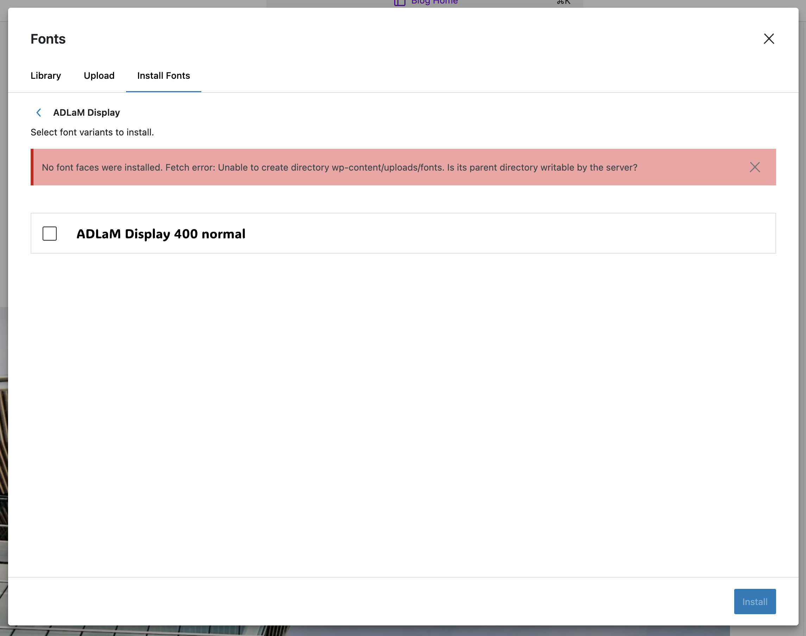
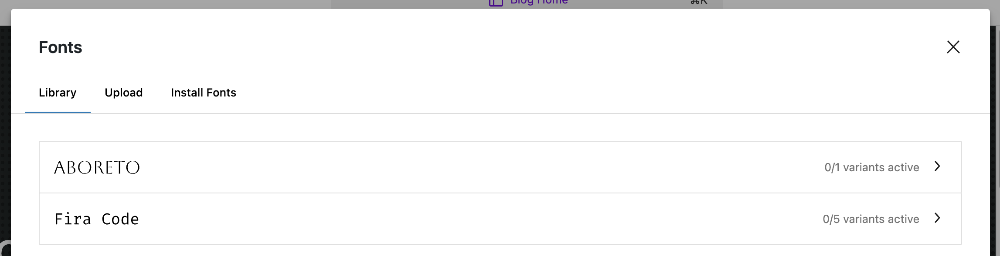
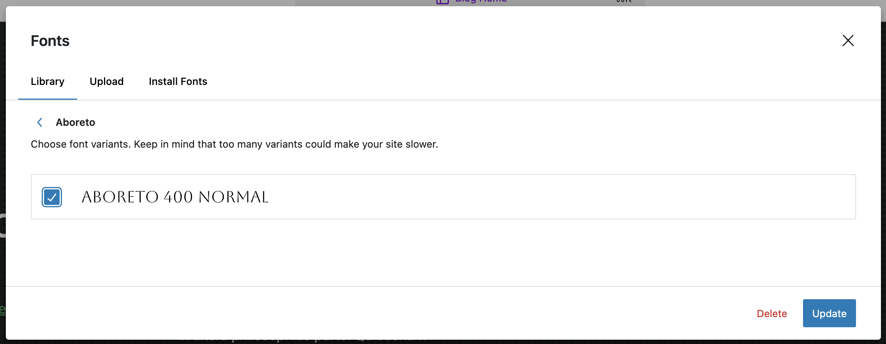

This section provides information on how to use the WordPress Font Library on Pantheon.

WordPress 6.5 introduces a new [Font Library](https://make.wordpress.org/core/2024/03/14/new-feature-font-library/) feature. The Font Library allows you to upload fonts from your computer or add any of the fonts available on Google's font library to your WordPress site. By default, WordPress will install fonts into `wp-content/uploads/fonts/`. 

## Using the `font_dir` Filter

You can change the directory where fonts are stored by using the WordPress core filter `font_dir` like this:

```php
add_filter( 'font_dir', function( $defaults ) {
	$font_dir = '/path/to/your/custom/dir';
	$font_url = site_url( $font_dir );
	
	$defaults['path'] = $font_dir;
	$defaults['url'] = $font_url;
	$defaults['basedir'] = $font_dir;
	$defaults['baseurl'] = $font_url;
	
	return $defaults;
} );
```

<Alert title="Note" type="info" >

If you choose to use the `font_dir` filter, you will need to ensure that the directory you are using is writeable by the web server. This is because WordPress will need to write to this directory when fonts are uploaded. On a Pantheon environment, the easiest way to ensure that a directory is writeable is to use the `wp-content/uploads/` directory. You can dynamically determing the path to the `uploads` directory using the `wp_upload_dir()` function.

</Alert>

## Considerations

WordPress handles fonts more like **media files** than **plugins or themes**. This means that when fonts are added to one Pantheon site environment, they will not necessarily exist in your other environments (e.g. installing a font on Dev does not mean it will push to Test when you deploy). In WordPress, fonts have two parts, there is a font post type (similar to the `attachment` post type for media files) and the font files themselves. Without the font post type existing in the database, WordPress has no way of knowing that a font is installed (in the same way that WordPress has no way that a particular image exists in the `/uploads` directory if it was not uploaded via the media library).

If you intend to override the default behavior, know that committing font files to your repository (e.g. to a `wp-content/fonts` directory) will not make them available automatically on your other environments. There is no automatic reading of the contents of the Fonts directory in WordPress the way that there is for plugins, themes and mu-plugins.

## Troubleshooting

### "No font faces were installed" error message



If you have altered the `font_dir` path and are uploading to a directory that is not writeable, you may see this error message. Ensure that the directory you are using in your `font_dir` filter is writeable (e.g. in `wp-content/uploads/`).

### I've cloned my database from Live and my font is installed but not "active"



If you've cloned your database and files from your live environment to Dev or Test and the font appears in your Font Library but is not "active" (it displays a message like "0/1 variants active"), you can click into the font, select the variant you want, and click update. 



Whether or not a font is "active" is similar to whether or not a plugin or theme is active. If a font is not active, it means the font is installed and recognized by WordPress but it cannot be used on the site until you activate it.

### I've uploaded fonts to my `/fonts` directory, but they aren't showing up in the Font Library

Fonts need to be installed via the Font Library in the WordPress admin. This is because fonts contain data that is stored in a post type. Simply having a font in your `/fonts` directory does not mean it will be recognized by WordPress. See [this Gutenberg issue](https://github.com/WordPress/gutenberg/issues/59102) to track this in WordPress core.

## More Resources
* [New Feature: Font Library](https://make.wordpress.org/core/2024/03/14/new-feature-font-library/)
* [Font Library Gutenberg Tracking Ticket](https://github.com/WordPress/gutenberg/issues/55277)