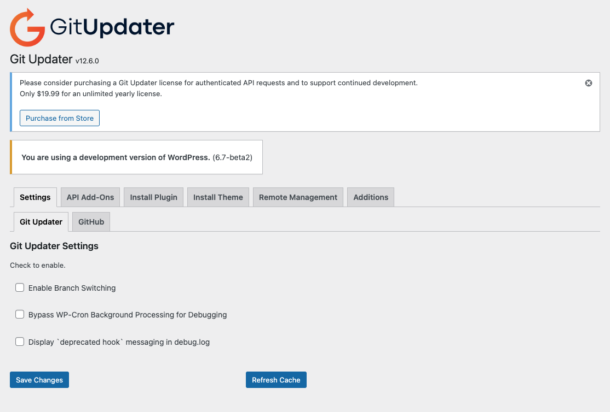
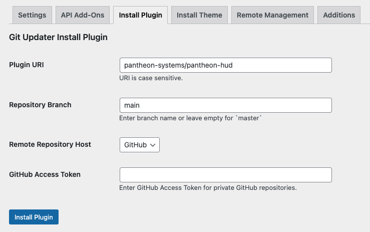
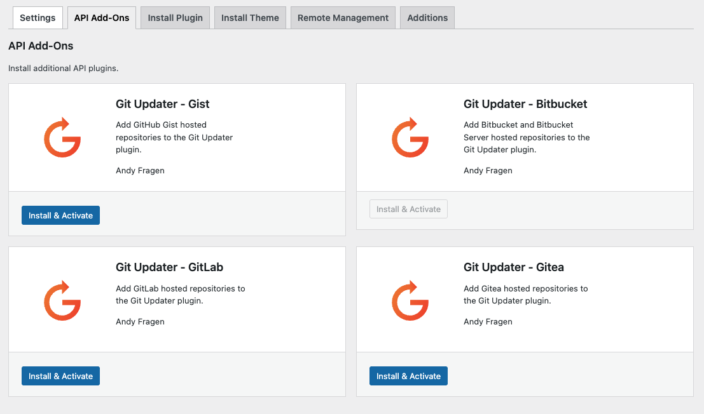

This section provides guidance on how to manage plugins that use third-party sources beyond the WordPress plugin repository. Such places include GitHub, Bitbucket, GitLab or self-hosted sources.

<Alert title="Note" type="info" >

All the guidance in this document is intended to be used in conjunction with Dev or Multidev environments on Pantheon where version-controlled files can be changed directly. [Pantheon's security practices lock down file permissions in the Test and Live environments]("guides/filesystem/files-directories#write-access-on-environments").

</Alert>

## Using Git Updater to install and manage plugins (and themes) from Git repositories

[Git Updater](https://github.com/afragen/git-updater) is a plugin that allows you to install and update plugins and themes from GitHub, Bitbucket, GitLab, or other self-hosted Git repositories. It provides both a mechanism that plugins can use to suggest updates from a Git-based repository as well as a user interface to install plugins from a Git repository that has not been previously configured to do so. Plugins and themes that use Git Updater can then be updated directly from the WordPress dashboard.

Before you begin, make sure the Dev or Multidev environment in which you are working  is set to [SFTP mode](/connection-modes).
That mode can be changed either from the Pantheon dashboard or by using the Terminus `connection:set` command.

```bash{promptUser: user}
terminus connection:set <site>.<env> sftp
```

### Installing the Git Updater plugin

Download the latest zip file for the Git Updater plugin from the [Git Updater website](https://git-updater.com/) or use [WP-CLI through Terminus](https://docs.pantheon.io/guides/wp-cli) to install the plugin from its zip file in the GitHub repository releases page:

```bash{promptUser: user}
terminus wp <site>.<env> -- plugin install https://github.com/afragen/git-updater/releases/download/12.6.0/git-updater-12.6.0.zip --force
```

Once installed, an option for Git Updater will appear under Settings in your WordPress admin dashboard.
Clicking into it for the first time will prompt you to enter a license key or activate the free version.
Once you've gone through the initial prompts, you will be presented with the default admin page for Git Updater which includes out-of-the-box support for GitHub-based plugins and themes.
	


### Installing a plugin or theme from a Git repository

To install a plugin or a theme from a GitHub repository, click on the "Install Plugin" or "Install Theme" tab and enter the Plugin URI (in the format `<vendor>/<plugin-name>` e.g. `pantheon-systems/pantheon-hud`	), the repository branch (default is `master`) and the remote repository host (either GitHub or a zip file).
You can also specify a GitHub Personal Access Token for private GitHub repositories. Then click Install Plugin/Theme.
	

### Updating plugins through Git Updater

Themes and Plugins use a `GitHub Plugin URI` or `GitHub Theme URI` header string in the main plugin file (for plugins) or `style.css` (for themes) in order for the Git Updater to work to update those plugins or themes out of the box.

It is also possible for plugins or themes to receive updates from GitHub or other sources using the Git Updater even if this header is not present by using the Additions tab.

To add a plugin that gets updates from a Git repository but lacks the GitHub Plugin or Theme URI plugin header line, click on the Additions tab, enter the main plugin file name as the Repository Slug (e.g. `pantheon-hud/pantheon-hud.php`), the repository URI (in the format `<vendor>/<plugin-name>`, e.g. `pantheon-systems/pantheon-hud`), the branch (default is `master`), and whether the plugin or theme should look use a Release Asset (defaults to no release asset). Then click Save Changes.


The Git Updater plugin will now check for updates from the specified repository and branch and will update the plugin or theme as necessary from that source rather than the default behavior.

### Using Git Updater with non-GitHub Repositories

Git Updater supports other repository hosts such as BitBucket, GitLab, Gitea and even GitHub Gists. To add support for any of these, go to the API Add-Ons page while your site is in SFTP mode and click Install & Activate for the add-on of your choice.



## Using WP-CLI to install plugins and themes with their own self-hosted update mechanism

Some plugins and themes have their own self-hosted update mechanism that allows them to receive updates from a third-party source. Usually, you can find a download link from the relevant plugin or theme author and upload the zip file to your WordPress site or unzip locally and add to your Pantheon site using SFTP or Git.

However, you can also use WP-CLI through Terminus to install the plugin or theme from the source directly if there is a direct URL that can be used. The code below shows how to install Advanced Custom Fields from the Advanced Custom Fields site:

```bash
terminus wp <site>.<env> -- plugin install https://www.advancedcustomfields.com/latest/ --force
```

Adding the `--force` flag will ensure that the latest version of Advanced Custom Fields is installed even if a plugin with the same slug already exists on your site. (For more information, see the [WP-CLI documentation for `plugin install`](https://developer.wordpress.org/cli/commands/plugin/install/).

## Using Composer to source plugins and packages

Composer is a dependency manager for PHP similar to NPM for JavaScript projects.
A `composer.json` file can be dropped into any project (including an existing WordPress site) to download packages from a specific source.
Most often that package comes from  a version-controlled repository (e.g. GitHub) through [Packagist](https://packagist.org).
The [Composer documentation provides guidance](https://getcomposer.org/doc/05-repositories.md) on how to add projects that may not already be Composer-based or set up in Packagist so that virtually any source can be added to a `composer.json` file.
For more information about using WordPress and Composer, refer to our [Integrated Composer documentation](https://docs.pantheon.io/guides/integrated-composer).
For an example of how to use a custom Composer repository for a premium plugin, see our [Object Cache Pro documentation for our WordPress (Composer Managed) upstream](https://docs.pantheon.io/object-cache/wordpress#installation-and-configuration-for-composer-managed-wordpress-sites).

For WordPress, [WPackagist.org](https://wpackagist.org) acts as a Composer-based mirror of the WordPress.org plugin and theme repository.
WPackagist allows Composer-based WordPress installs to require any plugin or theme that exists in the WordPress repository. Referencing plugins through WPackagist will pull code from WordPress.org.
For the purpose of this document, we will focus only on including packages from third-party sources.

### Adding a plugin from Packagist.org

Some packages, like our own [Pantheon Advanced Page Cache](https://github.com/pantheon-systems/pantheon-advanced-page-cache) plugin are distributed both through the [WordPress plugin repository](https://wordpress.org/plugins/pantheon-advanced-page-cache) and [Packagist](https://packagist.org/packages/pantheon-systems/pantheon-advanced-page-cache).

Before you start, make sure you have the `composer/installers` package in your `composer/json` file.
[`composer/installers`](https://packagist.org/packages/composer/installers) is a core Composer plugin that adds support for additional types of packages beyond the default package types.
In the context of WordPress and Composer, Installers adds support for the `wordpress-plugin`, `wordpress-theme` and `wordpress-muplugin` package types – which means that when packages of those types are installed via Composer, they are stored in `wp-content/plugins`, `wp-content/themes` or `wp-content/mu-plugins`, respectively (as opposed to the default `/vendor` folder for other Composer packages).

If you do not have the Installers package already installed, you can require it with composer using the following command:

```bash{promptUser: user}
composer require –dev composer/installers
```

Now, if you would like to source a Composer-based plugin through Packagist, you can do so by running `composer require <vendor>/<package>`, for example:

```bash{promptUser: user}
composer require pantheon-systems/pantheon-advanced-page-cache
```

You can use the search on Packagist.org to look for packages if you know the name of the plugin or the vendor (likely the plugin author) to see if there is built-in support for Composer-based installation.
However, Composer also supports other VCS-based sources or even static zip files. [Refer to the documentation](https://getcomposer.org/doc/05-repositories.md#vcs) for more information about those types of advanced configuration.
