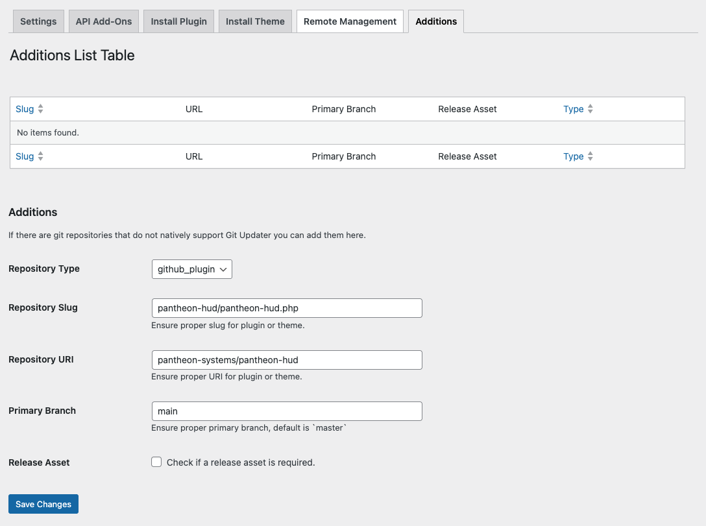

This section provides guidance on how to manage plugins that use third-party sources beyond the WordPress plugin ressources. Such places include GitHub, Bitbucket, GitLab or self-hosted sources.

<Alert title="Note" type="info" >
All the guidance in this document is intended to be used in conjunction with Dev or Multidev environments on Pantheon where version-controlled files can be changed directly. [Pantheon's security practices lock down file permissions in the Test and Live environments](https://docs.pantheon.io/guides/filesystem/files-directories#write-access-on-environments).
</Alert>

## Using Git Updater to install and manage plugins (and themes) from Git repositories

[Git Updater](https://github.com/afragen/git-updater) is a plugin that allows you to install and update plugins and themes from GitHub, Bitbucket, GitLab, or other self-hosted Git repositories. It provides both a mechanism that plugins can use to suggest updates from a Git-based repository as well as a user interface to install plugins from a Git repository that has not been previously configured to do so. Plugins and themes that use Git Updater can then be updated directly from the WordPress dashboard.

0. Before you begin, make sure the Dev or Multidev environment in which you are working  is set to SFTP mode. That mode can be changed either from the Pantheon dashboard or by using the Terminus `connection:set` command.
	```bash{promptUser: user}
	terminus connection:set <site>.<env> sftp
	```
1. Download the latest zip file for the Git Updater plugin from the [Git Updater website](https://git-updater.com/) or use [WP-CLI through Terminus](https://docs.pantheon.io/guides/wp-cli) to install the plugin from its zip file in the GitHub repository releases page:
	```bash{promptUser: user}
	terminus wp <site>.<env> -- plugin install https://github.com/afragen/git-updater/releases/download/12.6.0/git-updater-12.6.0.zip --force
	```
2. Once installed, an option for Git Updater will appear under Settings in your WordPress admin dashboard. Clicking into it for the first time will prompt you to enter a license key or activate the free version. Once you've gone through the initial prompts, you will be presented with the default admin page for Git Updater which includes out-of-the-box support for GitHub-based plugins and themes.
	
3. To install a plugin or a theme from a GitHub repository, click on the Install Plugin or Install Theme tab and enter the Plugin URI (in the format `<vendor>/<plugin-name>` e.g. `pantheon-systems/pantheon-hud`), the repository branch (default is `master`) and the remote repository host (either GitHub or a zip file). You can also specify a GitHub Personal Access Token for private GitHub repositories. Then click Install Plugin/Theme.
	
	
While installing from GitHub is possible, it's not guaranteed that the plugin will be _updated_ from GitHub. Themes and Plugins must have a `GitHub Plugin URI` or `GitHub Theme URI` header string in the main plugin file (for plugins) or `style.css` (for themes) in order for the Git Updater to work to update those plugins or themes out of the box. However, it's possible for plugins or themes to receive updates from GitHub or other sources using the Git Updater even if this header is not present by using the Additions tab.

To add a plugin that gets updates from a Git repository but lacks the GitHub Plugin or Theme URI plugin header line, click on the Additions tab, enter the main plugin file name as the Repository Slug (e.g. `pantheon-hud/pantheon-hud.php`), the repository URI (in the format `<vendor>/<plugin-name>`, e.g. `pantheon-systems/pantheon-hud`), the branch (default is `master`), and whether the plugin or theme should look use a Release Asset (defaults to no release asset). Then click Save Changes.



The Git Updater plugin will now check for updates from the specified repository and branch and will update the plugin or theme as necessary from that source rather than the default behavior.

### Using Git Updater with non-GitHub Repositories

Git Updater supports other repository hosts such as BitBucket, GitLab, Gitea and even GitHub Gists. To add support for any of these, go to the API Add-Ons page while your site is in SFTP mode and click Install & Activate for the add-on of your choice.


## Using plugins and themes with their own self-hosted update mechanism

Some plugins and themes have their own self-hosted update mechanism that allows them to receive updates from a third party source. Usually, you can find a download link from the relevant plugin or theme author and upload the zip file to your WordPress site or unzip locally and add to your Pantheon site using SFTP or Git.

However, you can also use WP-CLI through Terminus to install the plugin or theme from the source directly if there is a direct URL that can be used. The code below shows how to install Advanced Custom Fields from the Advanced Custom Fields site:

```bash
terminus wp <site>.<env> -- plugin install https://www.advancedcustomfields.com/latest/ --force
```

Adding the `--force` flag will ensure that the version of Advanced Custom Fields is the one sourced from `www.advancedcustomfields.com` rather than the default WordPress repository.