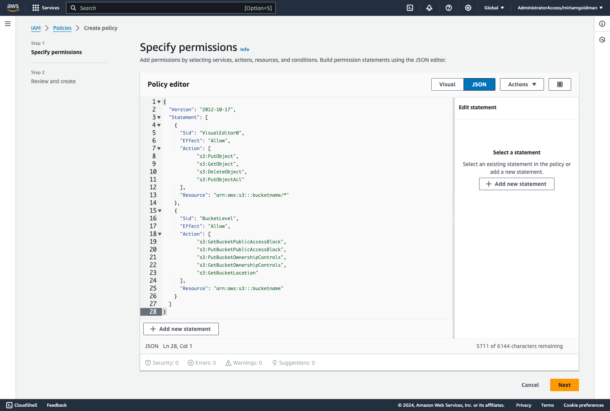

<!--Todo: Relocate this to a single page doc so it can be added to Integrations submenu -->

This section provides information on how to integrate Amazon Web Services (AWS) S3 storage with your WordPress Pantheon site.

AWS offers Simple Storage Service (S3) for scalable storage and content distribution that you can integrate with sites running on Pantheon. Pantheon already offers content distribution through our [Global CDN](/guides/global-cdn), but S3 is a good option for addressing issues with [highly populated directories](/guides/platform-considerations/media-email-support#large-files-and-highly-populated-directories) or [serving large files](/guides/filesystem/large-files).

## Before You Begin

Be sure that you have:

- An existing WordPress site on Pantheon, or [create](https://dashboard.pantheon.io/sites/create) a site.
- A [local clone](/guides/git/git-config#clone-your-site-codebase) of your code repository.
- An account with [Amazon Web Services (AWS)](https://aws.amazon.com/s3/). Amazon offers [free access](https://aws.amazon.com/free/) to most of their services for the first year.
- [Terminus](/terminus) installed on your local computer.

<Alert title="Exports" type="export">

This process uses [Terminus](/terminus) commands. Set the variable `$site` in your terminal session to match your site name before you begin:

```bash{promptUser: user}
export site=yoursitename
export env=dev
```

</Alert>

## Configure S3 within the AWS Console

You must configure the service within your [AWS Management Console](https://console.aws.amazon.com) before integrating S3 with your Pantheon site.

### Create a New AWS S3 Bucket

1. Open your [AWS Console](https://console.aws.amazon.com) and click **S3**.

1. Click **Create Bucket**.

1. Enter a bucket name and then select an **AWS Region**. The bucket name you choose must be unique across all existing bucket names in Amazon S3. You cannot change the name after you create a bucket. Note that the bucket name you choose is visible in the URL that points to the objects stored in the bucket.

1. Select **ACLs enabled** and set **Object Ownership** to **Bucket owner preferred** in the **Object Ownership** section.

   

1. Uncheck the **Block all public access** in the **Block Public Access settings for this bucket** section and then select the checkbox to acknowledge turning off this setting when prompted.

   

1. Leave all other settings to default and then click **Create bucket**.

### Configure your AWS Access

1. Open your **Identity and Access Management (IAM)** dashboard, select **Access Management**, select **Policies**, and then click the **Create policy** button.

   

1. Select `JSON` and paste the code below under the `Policy editor`, then change the `bucketname`  to the name you specified in the [Create a New AWS S3 Bucket](/guides/wordpress-developer/wordpress-s3#create-a-new-aws-s3-bucket) section, and then click **Next**.

   ```bash{promptUser: user}
   {
     "Version": "2012-10-17",
     "Statement": [
       {
         "Sid": "VisualEditor0",
         "Effect": "Allow",
         "Action": [
				"s3:PutObject",
				"s3:GetObject",
				"s3:DeleteObject",
				"s3:PutObjectAcl"
         ],
         "Resource": "arn:aws:s3:::bucketname/*"
       },
       {
         "Sid": "BucketLevel",
         "Effect": "Allow",
         "Action": [
				"s3:GetBucketPublicAccessBlock",
				"s3:PutBucketPublicAccessBlock",
				"s3:PutBucketOwnershipControls",
				"s3:GetBucketOwnershipControls",
				"s3:GetBucketLocation"
         ],
         "Resource": "arn:aws:s3:::bucketname"
       }
     ]
   }
   ```

   

1. Enter your policy name in the **Policy name** field (for example, Pantheons3Access) and then click **Create Policy**.

   

1. Go back to **Access Management** in the IAM dashboard, select **Users**, and then click **Add users** to create a user based on the policy you created.

   

1. Enter a name for your user in the **User name** field (for example, S3-user), and then click **Next**.

   

1. Select **Attach policies directly** in the **Permissions options** section, locate the policy that you created in the above steps, and then click **Next**.

   <Alert title="Note" type="info">

   Steps 1-3 create a custom AWS User policy with read and write permissions to the specific bucket assigned to your site. You can select the **AmazonS3FullAccess** policy to replace the custom policy that you created if you require higher permissions (example: listing buckets in the WP Offload Media plugin).

   </Alert>

   

1. Review the configuration and click **Create user**. This creates a user profile without programmatic access.

1. Open your user profile, select the **Security credentials** tab, and click the **Create access key** in the **Access Keys** section.

   

1. Select the **Application running outside AWS** option and click **Next**.

1. Set the optional tags if desired and then click **Create Access key** to finalize the access. Be sure to note the **Access Key** and **Secret Access Key** and store them securely.

   

## Integrate S3 with WordPress

You must install a plugin such as [S3 Uploads](https://github.com/humanmade/S3-Uploads) or [WP Offload Media](https://wordpress.org/plugins/amazon-s3-and-cloudfront/) to integrate S3 with WordPress.

WP Offload Media requires a paid license but is configurable in the WordPress admin UI and offers a number of options and features, including multisite support. S3 Uploads is open-source but does not include an admin UI and requires [Terminus](/terminus) and [WP-CLI](/guides/wp-cli) for setup and migration.

### Install and Deploy S3 Uploads Plugin

<Alert title="Note" type="info">

This plugin has known [multisite issues](https://github.com/humanmade/S3-Uploads/pull/214). Consider [WP Offload Media](#install-and-deploy-wp-offload-media) if you need an alternative plugin with premium support and a multisite version.

</Alert>

1. Download the latest plugin release from [Github](https://github.com/humanmade/S3-Uploads/releases) and extract it to `wp-content/plugins/`. Note that our documentation has been tested for version 2.0.0.

  <Alert title="Warning" type="danger">

  **Do not** add the plugin as a Git submodule. Git submodules are not supported on the platform. Refer to the [Git guide](/guides/git/faq-git) for more information.

  </Alert>

1. Rename the extracted folder to remove the version number. For example:

   ```bash{promptUser: user}
   mv S3-Uploads-2.0.0/ S3-Uploads
   ```

1. Create and/or copy your **Access Key ID** and **Secret Access Key** from the **My security credentials** section of your AWS account to a text editor on your local computer.

   <Alert title="Note" type="info">

   Consider creating a unique user with limited permissions covering this S3 bucket to authenticate the plugin as a standard security measure.

   </Alert>

1. Add the credentials to `wp-config.php`, as described in the plugin's [README](https://github.com/humanmade/S3-Uploads#getting-set-up) file. For increased security, we recommend a service like [Lockr](/guides/lockr) or the [Terminus Secrets plugin](https://github.com/pantheon-systems/terminus-secrets-plugin) to store and retrieve these credentials securely. Refer to [Secret Management Techniques](/guides/wordpress-developer/wordpress-secrets-management#store-your-keys) for more secure methods to store your keys.

1. Commit and push the new plugin and your `wp-config.php` file updates to the Dev environment, then switch to SFTP mode and activate the plugin:

    ```bash{promptUser: user}
    terminus wp $site.dev plugin activate S3-Uploads
    ```

1. Use WP-CLI to verify your AWS setup.

    ```bash{promptUser: user}
    terminus wp $site.dev s3-uploads verify
    ```

#### Migrate existing media with S3 Uploads and WP-CLI

You can migrate existing media files to S3 with the following command:

```bash{promptUser: user}
terminus wp $site.dev -- s3-uploads migrate-attachments
```

Optionally, add the `--delete-local` flag to remove the local copies of the media files.

This command will also provide a search/replace command for your database to update references to the newly-migrated files when completed. Note that you must run this on all Pantheon environments (Dev, Test, and Live).

#### Multisite Compatibility

WP Offload Media plugin is supported.

Refer to the [WP Offload Media documentation](https://deliciousbrains.com/wp-offload-media/doc/multisite-per-subsite-bucket-and-custom-domain-settings/) for more information.

#### URL Rewriting

URLs saved in the database use S3's provided URL (for example, https://bucketname.s3.amazonaws.com/uploads/2023/01/image.jpg) by default. You can use [Advanced Global CDN](/guides/agcdn/agcdn-features#domain-masking-and-reverse-proxy) to mask the URLs to match your site's domain for SEO purposes. [Contact sales](https://pantheon.io/contact-sales) if you do not have AGCDN or open a [support ticket](/guides/agcdn/submit-request#submit-a-request) to request help with Domain Masking if you have AGCDN.

#### Additional Configuration

Check out the plugin's [README file](https://github.com/humanmade/S3-Uploads/blob/master/README.md) for information on advanced configuration, such as cache control, URL rewriting, and offline development.

### Install and Deploy WP Offload Media

Follow documentation from [DeliciousBrains](https://deliciousbrains.com/wp-offload-media/doc/quick-start-guide) to install and deploy WP Offload Media. No specialized configuration is required for this plugin to run on Pantheon.

## More Resources

- [Integrate Your Fastly Account on Pantheon with Amazon S3](/guides/fastly-pantheon/fastly-amazon-s3)
- [Securely store your Secret Keys in WordPress](/guides/wordpress-developer/wordpress-secrets-management#store-your-keys)
- [Mask your S3 URLs to match your domain](/guides/agcdn/agcdn-features#domain-masking-and-reverse-proxy)
- [AWS S3 Setup for Drupal](/drupal-s3)
