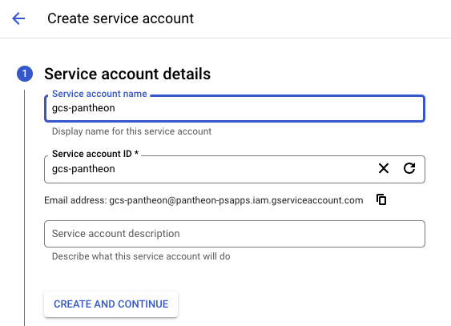
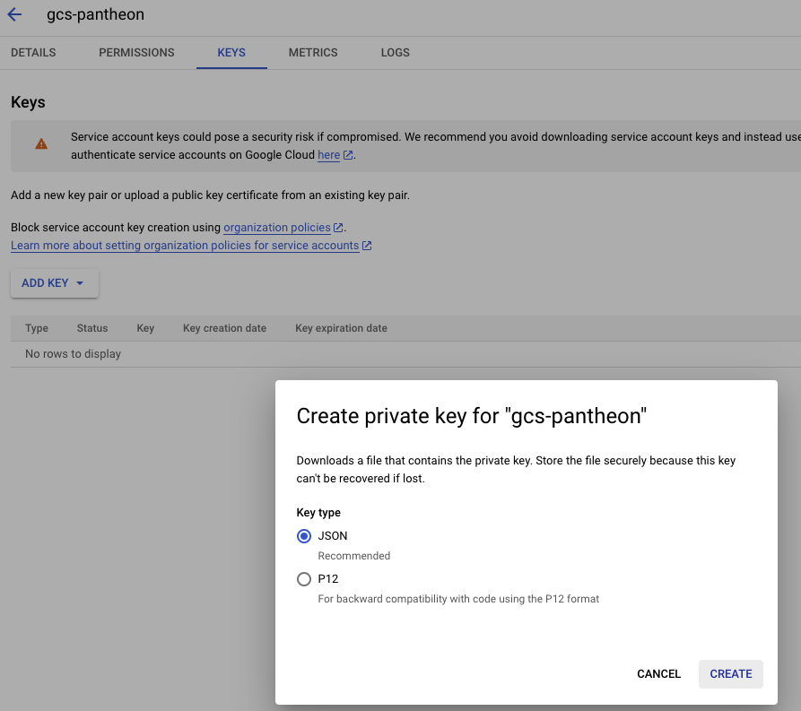
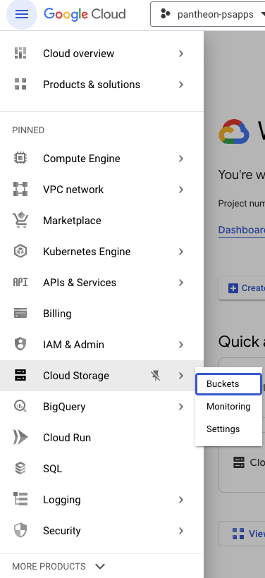
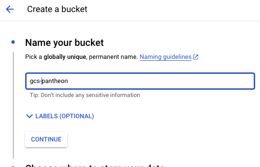
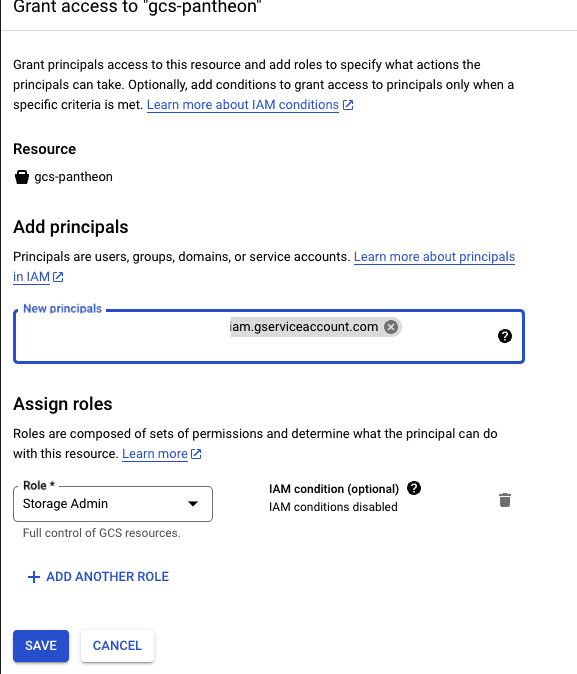

This section provides information on how to integrate Google Cloud Storage (GCS) with your WordPress Pantheon site.

GCS is a scalable storage and content distribution solution that you can integrate with sites running on Pantheon. Pantheon already offers content distribution through our [Global CDN](/guides/global-cdn), but GCS is a good option to address issues with [highly populated directories](/guides/filesystem/large-files) or [serving large files](/guides/filesystem/large-files#large-files) and as alternative for AWS S3.

## Before You Begin

Be sure that you have:

- An existing WordPress site on Pantheon, or [create](https://dashboard.pantheon.io/sites/create) a site.
- A [local clone](/guides/git/git-config#clone-your-site-codebase) of your code repository.
- An account with [Google Cloud Platform (GCP)](https://cloud.google.com/). GCP offers [free credit](https://console.cloud.google.com/freetrial)) to try out their services.
- [Terminus](/terminus) installed on your local computer.

<Alert title="Exports" type="export">

This process uses [Terminus](/terminus) commands. Set the variable `$site` in your terminal session to match your site name before you begin:

```bash{promptUser: user}
export site=yoursitename
export env=dev
```

</Alert>

## Configure Google Cloud Storage within the AWS Console

You must configure the service within your [Google Cloud Console](https://console.cloud.google.com/) before integrating Google Cloud Storage with your Pantheon site.

### Create a Google Service Account

You must have a service account to programmatically access your GCS bucket and assign fine-grain access.

1. Go to your GCS account, select **IAM & Admin**, select **Service Accounts**, and then click **Create Service Account**.

   

1. Name your service account, click **Create and Continue**, and then click **Done** to finalize the account creation.

   

1. Note the email that is automatically assigned to your service account, select the **Keys** tab, select **JSON** in the pop-up, then click **Create**. This downloads a JSON file. Make sure you store this JSON file securely.

   

### Create a New GCS Bucket

1. Go to your **GCS** account, select **Cloud Storage**, select **Buckets**, and then click **Create Bucket**.

   

1. Name your bucket, select **Region**, and then select the region from the drop-down menu that is closest to your website (US, Canada, Europe or Australia) during site creation.

   

   

1. Uncheck the **Enforce public access prevention on this bucket** and select **Fine-grained** under **Access control**.

   

1. Make sure that **Data encryption** is set to **Google-managed encryption key** and then click **Create**.

   

1. Go to the **Permissions** tab, click the **Grant Access** button, enter the email that was automatically assigned under your service account in the **New Principal** field, select **Storage Admin** under **Assign Roles**, and then click **Save**.

   

## Integrate Google Cloud Storage (GCS) in WordPress

You must install a plugin such as [WP Offload Media Lite](https://wordpress.org/plugins/amazon-s3-and-cloudfront/) or [WP Stateless](https://wordpress.org/plugins/wp-stateless/) to integrate GCS with WordPress.

WP Offload Media Lite is a free version but there is a premium version that includes support and additional features, such as multisite support. Refer to [installation and configuration](https://wordpress.org/plugins/wp-stateless/#installation) for instructions.

WP-Stateless is another option for GCS integration. Refer to the [full installation guide](https://wp-stateless.github.io/docs/manual-setup/) for instructions.

## URL Rewriting

URLs saved in the database use GCS-provided URLs (for example, `https://storage.googleapis.com/example.com/2023/1/image.jpg`) by default.[Advanced Global CDN](/guides/agcdn/agcdn-features#domain-masking-and-reverse-proxy) can mask the URLs to match your site's domain for SEO purposes. [Contact sales](https://pantheon.io/contact-sales) if you do not have AGCDN or open a [support ticket](/guides/agcdn/submit-request#submit-a-request) to request Domain Masking if you have AGCDN.

## More Resources

- [Integrate Your Fastly Account on Pantheon with Amazon S3](/guides/fastly-pantheon/fastly-amazon-s3)
- [AWS S3 Setup for WordPress](/guides/wordpress-developer/wordpress-s3)
- [Securely Store your API Keys in WordPress](/guides/wordpress-developer/wordpress-secrets-management)
- [Mask your Google Cloud Storage URLs to match your domain](/guides/agcdn/agcdn-features#domain-masking-and-reverse-proxy)
