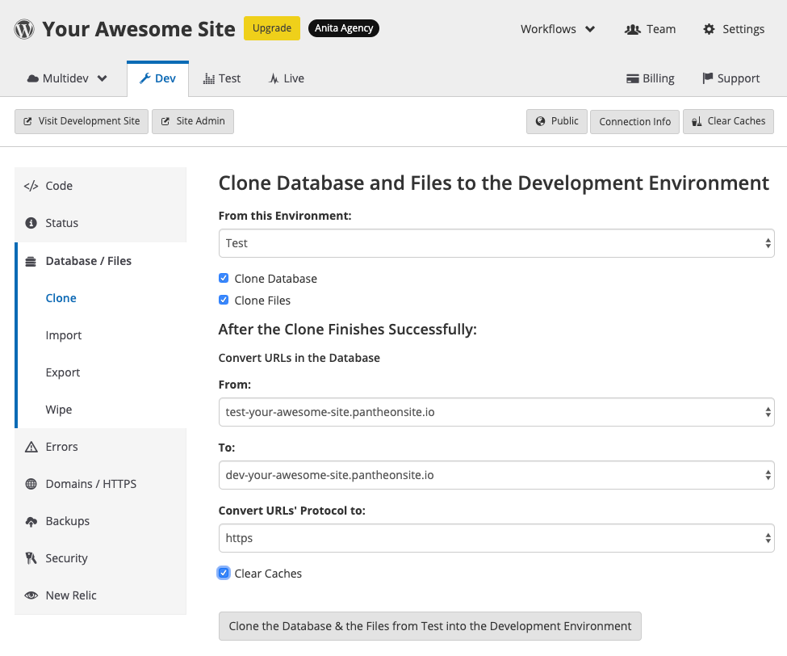

This section provides information on how to correct broken links.

## Update Links Referencing IP:Port

Links in your content may eventually stop working by accident or due to web rot. This happens when links placed in your site's code use an IP address instead of your actual domain name. These links will eventually break when your application container’s IP address changes due to the nature of Pantheon’s cloud-based infrastructure.

## Links constructed using SERVER_NAME or SERVER_PORT

Some code relies on `$_SERVER['SERVER_NAME']` and `$_SERVER['SERVER_PORT']` to construct URLs. This doesn't work well on Pantheon because this environmental data is for temporary container data, which can lead to broken links. Refer to [SERVER_NAME and SERVER_PORT on Pantheon](/server_name-and-server_port) and [WordPress Plugins and Themes with Known Issues](/plugins-known-issues) for more information.

## There's a Plugin For That

There are a number of plugins that can help you fix and maintain your links. Visit WordPress.org and search for [broken link](https://wordpress.org/plugins/search.php?q=broken+link) for a comprehensive list of plugins. The [Broken Link Checker](https://wordpress.org/plugins/broken-link-checker/) plugin is the most popular and is active on more than 400,000 WordPress sites.

### Install Broken Link Checker

You can install the [Broken Link Checker](https://wordpress.org/plugins/broken-link-checker/) plugin from your [WordPress dashboard](/cms-admin/#wordpress-dashboard) by following these steps:

1. Set your Connection Mode [SFTP](/guides/sftp).

1. Click **Plugins**, then select **Add New**.

1. Search for "Broken Link Checker".

1. Click **Install Now**, then click **Activate**.

#### Use the Plugin

You will see a new option within the Tools section of your WordPress dashboard when the plugin is installed and activated. Notice that there are no reported broken links. This is normal as you won't see any broken links until WordPress runs it's next Cron job. WordPress checks all your posts, comments, pages, etc., in the background and look for broken URLs. Each URL is queued to be checked so that performance is not negatively affected.

Broken Link Checker is a reporting tool and won't keep you from creating bad links. The best solution for linking to your own content is to use relative paths. Use `/my-cool-blog-post` instead of `https://example.com/my-cool-blog-post` to avoid portability problems.

## Update Environment URLs on Pantheon

WordPress stores URLs in various places in the database. This can cause unexpected behavior due to Pantheon's multi-environment workflow. WP-CLI's search & replace functionality is integrated into the workflow to assist in updating URLs.
​

[Pantheon's workflow](/pantheon-workflow) for WordPress includes an additional feature to update environment URLs automatically. Note that you can't override the defaults that are selected when performing a clone operation when you update the URL to match whatever environment you're cloning to. You can convert HTTP to HTTPS and vice versa if this varies among your environments.

### Fix WordPress Content References to the Wrong Domain After Cloning

<Partial file="search-replace-domains.md" />

## More Resources

- [Pantheon WebOps Workflow](/pantheon-workflow)
- [WordPress Plugins and Themes with Known Issues](/plugins-known-issues)