This lesson demonstrates how to utilize Git while developing over SFTP with a local file client and text editor. Often, premium plugins or themes need to be downloaded from the plugin provider and uploaded to your site. In this example, we will replicate that by uploading a new theme, creating a child theme, and then finally make some example customizations to the stylesheet -- all while submitting our work to version control along the way in sensibly grouped commits. ARE YOU UPDATING

## Upload a Theme

1. Download the [Bento](https://wordpress.org/themes/bento/) theme from WordPress.org to your local machine.

1. Navigate to **<span class="glyphicons glyphicons-embed-close" aria-hidden="true"></span> Code** in the **<span class="glyphicons glyphicons-wrench" aria-hidden="true"></span> Dev** tab of your Site Dashboard. Confirm your Connection Mode is still set to **SFTP**.

1. Establish a secure connection from your local to Pantheon using an SFTP client of your choice (this guide uses [Transmit](https://panic.com/transmit/)).

  Click **Connect with SFTP** then select the link to **Open SFTP Client**:

  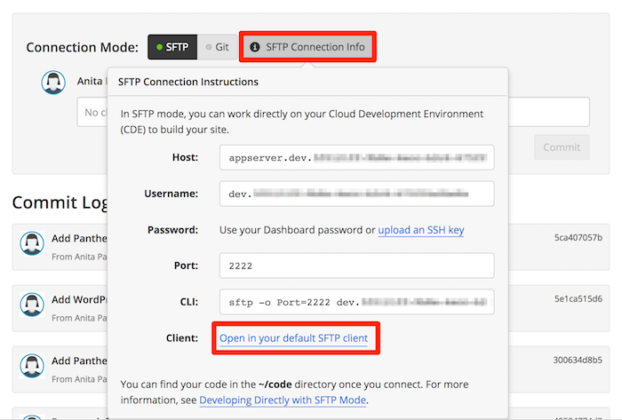

  If you have already set up an SSH key, as recommended in the **Before You Begin** section of the [guide's introduction](/guides/wordpress-git/#before-you-begin), you should see a new window open for your SFTP client where you can see local files and remote files on Pantheon. In Transmit, local files are managed on the left and Pantheon's on the right:

  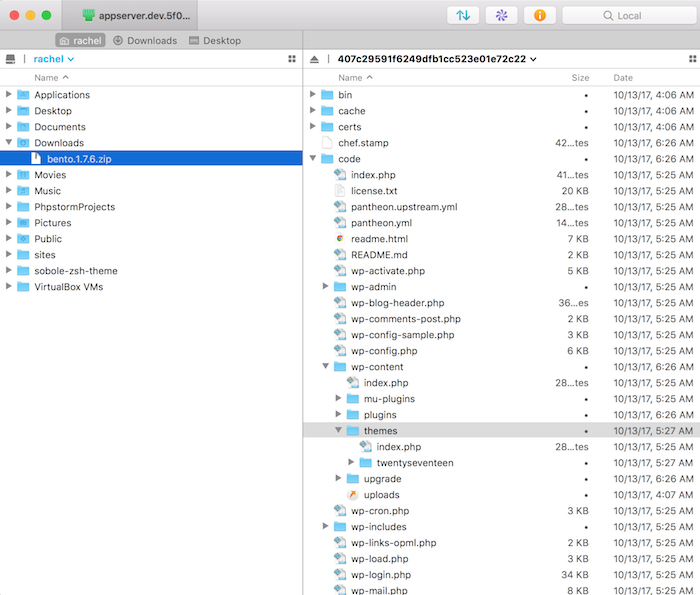

 <Accordion title="Troubleshooting" id="unique-anchor" icon="wrench">

   ### Manually Connect via SFTP

   If for some reason your client does not establish a connection to Pantheon by clicking the handy default link, use the provided values from the Site Dashboard's **Connect with SFTP** to open a connection.

   1. The default window when opening the Transmit application provides a dialog titled **Quick Connect** where you can **Connect via SFTP**:

     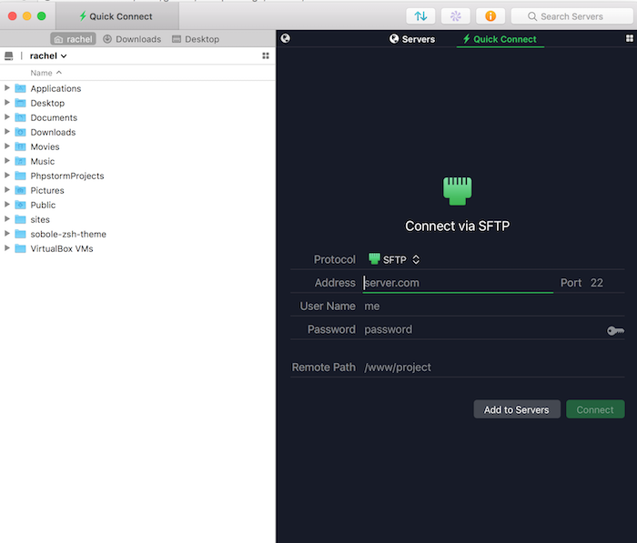

   1. Copy the value provided by Pantheon for **Host** and paste into Transmit's **Address** field. Do the same for **Port** and **Username**.

   1. Click the key icon next to the **Password** field to add your private SSH key, or authenticate using your Pantheon Dashboard password.

   1. Click **Connect**:

     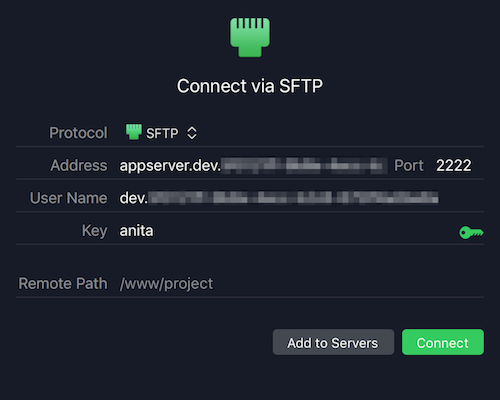

 </Accordion>

4. Navigate to the `code/wp-content/themes` directory within the remote file manager for Pantheon on the right side. Then drag and drop the Bento theme folder from your local computer onto Pantheon to upload the theme. You'll see Transmit begin uploading, then confirm once it's done:

  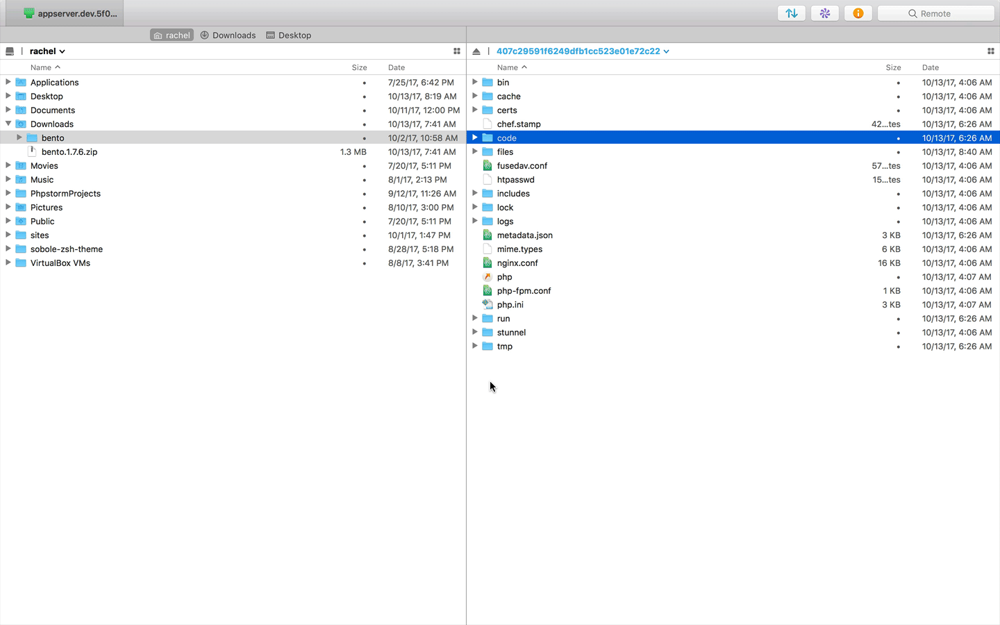

  That's all it takes! You can now activate the Bento theme in the WordPress Dashboard.

5. Return to the Site Dashboard on Pantheon, and you should see quite a few files ready to be committed to Git. That's from the theme we just uploaded. Write a commit message then click **Commit** to submit our new theme to version control:

  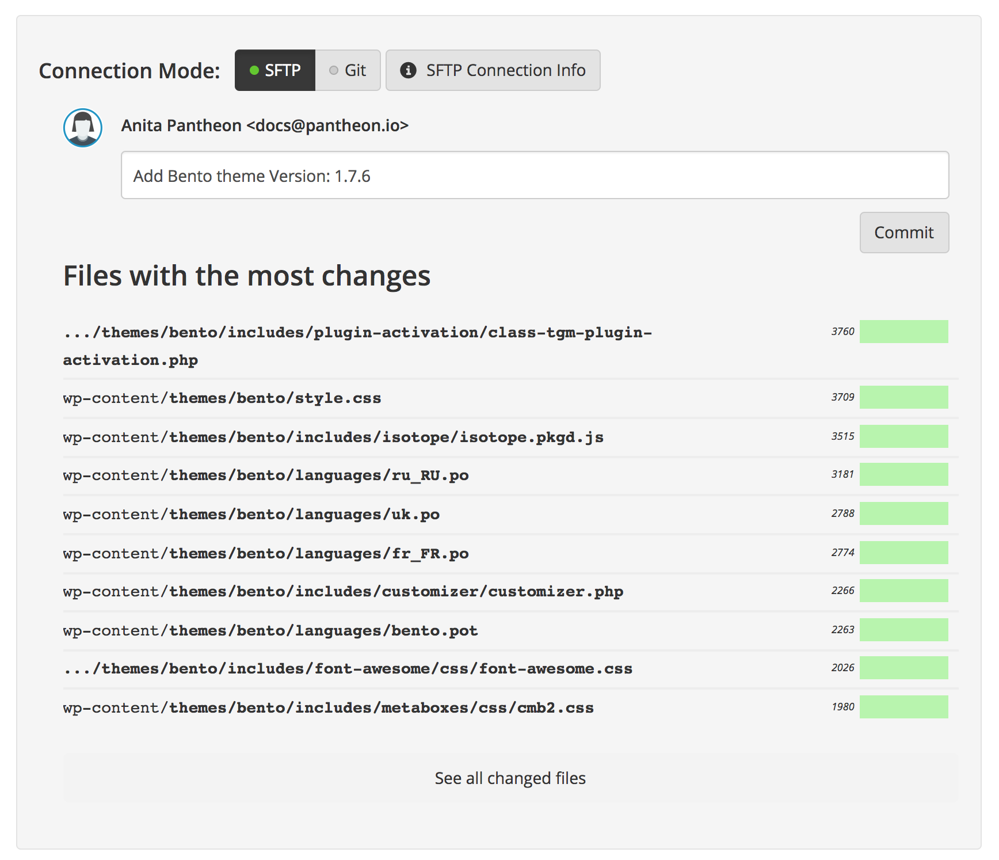

## Create a Child Theme

If you intend to tweak the look and feel of a theme using custom functions or styles, you need to do it in a child theme. Otherwise, you'll lose that customization on the next update to the theme.

The child theme inherits all the features of the Bento theme. It's simply a spot to safely extend the theme so that customizations persist after future updates.

1. Use Transmit and navigate to the remote `code/wp-content/themes` directory on Pantheon.

1. Right-click then select **New Folder** and name it `bento-child`:

  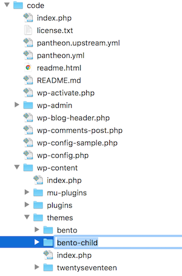

1. Right-click the `bento-child` directory then select **New File** and name it `style.css`:

  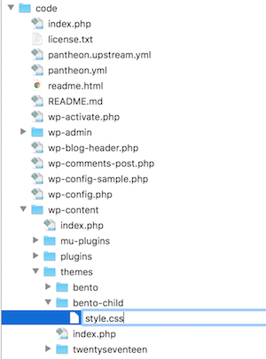

1. If you don't already have your SFTP client configured to use your preferred text editor, you can do that now. Here's how we configured Transmit so that double-clicking a file opens it up for edits in [Atom](https://atom.io/) (**Transmit** > **Preferences** > **Files** from the app menu):

  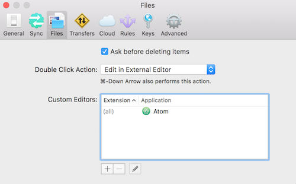

1. Double-click the new `style.css` file within Transmit to open it up for edits in Atom, then add the following to the top:

  ```css:title=style.css
  /*
  Theme Name:   Bento Child
  Description:  A Bento-based child theme for demo purposes on Pantheon.
  Author:       <Your Name>
  Template:     bento
  Version:      1.0.0
  */
  ```

  Here is what it looks like in the Atom text editor.

  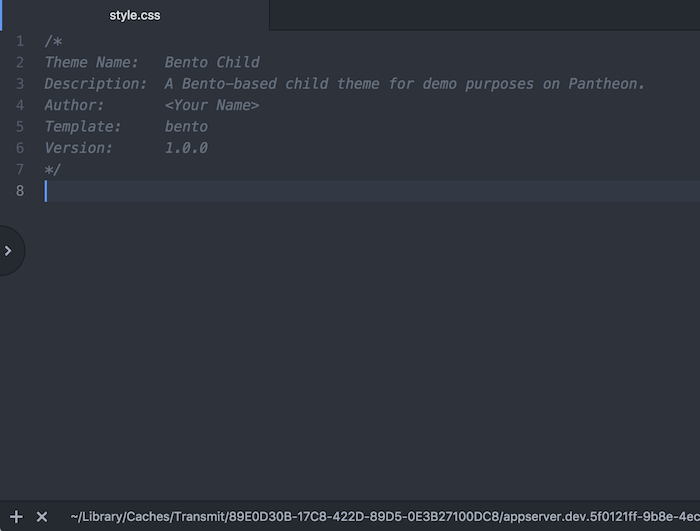

6. Save your additions to the `style.css` file in Atom. Saving changes to this file in Atom will trigger Transmit to upload the file to Pantheon automatically.

7. Right-click the `bento-child` directory then select **New File** and name it `functions.php`. Open the file in Atom by double-clicking, then add the following code (which tells WordPress to apply our child theme's stylesheet) and save:

  ```php:title=functions.php
  <?php

  add_action( 'wp_enqueue_scripts', 'bento_child_enqueue_styles' );
  function bento_child_enqueue_styles() {
    $parent_style = 'bento-theme-styles';
      wp_enqueue_style( $parent_style, get_template_directory_uri() . '/style.css' );
      wp_enqueue_style( 'child-style',
          get_stylesheet_directory_uri() . '/style.css',
          array( $parent_style ),
          wp_get_theme()->get('Version')
      );
  }
  ```

8. Now we should have a working child theme. From the WordPress Dashboard, navigate to the Appearance tab and activate the child theme.

 <Accordion title="ProTip" id="unique-anchor1" icon="lightbulb">

 ### WP-CLI & Terminus

 You can do the exact same process from the command line using [Terminus](/terminus), the Pantheon CLI. Install Terminus, then run a WP-CLI command against the **<span class="glyphicons glyphicons-wrench" aria-hidden="true"></span> Dev** environment to create the child theme scaffold for you automatically. That's right, go from all the steps above to a one-liner to kick things into warp speed:

 ```bash{promptUser: user}
 terminus wp <site>.<env> -- scaffold child-theme bento-child --parent_theme=bento
 ```

 </Accordion>

9. Return to the Site Dashboard on Pantheon, and you should see two files ready to be committed to Git. They're from the child theme we just created. Write a commit message then click **Commit** to submit our new child theme to version control:

  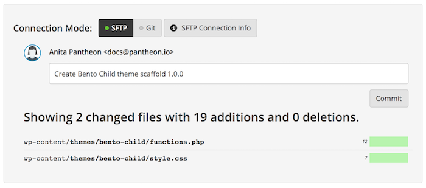

## Customize the Stylesheet

Finally, let’s make a few small customizations to our active child theme using Transmit and Atom.

1. In Transmit, double-click the `style.css` file within the child theme's remote directory to open it up for edits in Atom.

1. Add the following CSS snippets towards the bottom:

  ```css:title=style.css
  .site-content a:not(.button) {
      color: deepskyblue;
  }

  .site-header {
      background-color: salmon;
  }
  ```

1. Save the file changes in Atom.

1. Refresh the **<span class="glyphicons glyphicons-wrench" aria-hidden="true"></span> Dev** environment's site URL and you should see your changes reflected. The header background should be salmon and the page should have deepskyblue anchors:

  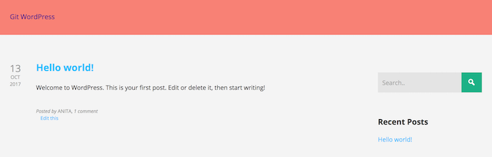

1. Return to the Site Dashboard on Pantheon, and you should see one file ready to be committed to Git. That's from recent edits to the child theme's `style.css` file. Write a commit message then click **Commit** to submit our new styles to version control:

  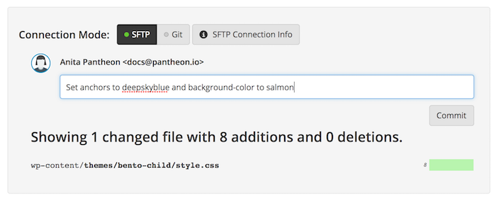

This example is a very simple demonstration of the edit process, and is not intended to be a comprehensive resource on extending the layout or design of a theme (which likely means writing custom PHP functions). If you're looking for advanced tips on how to build and maintain themes efficiently checkout the [Theme Handbook](https://developer.wordpress.org/themes/advanced-topics/child-themes/) on WordPress.org.
