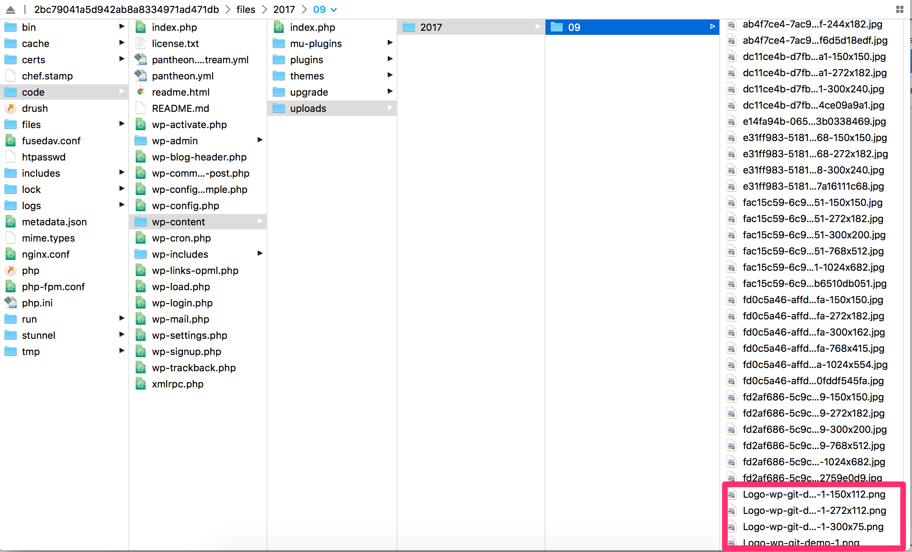

In this lesson, we'll demonstrate how media files are handled on Pantheon. Media refers to anything in the `wp-content/uploads/` directory, which is intentionally excluded from version control. Git isn't needed to manage content like this, so we won't use version control in this lesson.

1. Let's upload a custom logo in the WordPress Dashboard. Feel free to use this example:

  

1. Within the ** Dev** environment's WordPress Dashboard, navigate to **Appearance** > **Customize** > **Site Identity** then upload a new logo.

1. Click **Save and Publish**:

  

1. Refresh the ** Dev** environment's site URL and you should see your changes reflected.

  If you expected this change to show up as a pending change, ready to be committed - that's not how this kind of content works. It's not code; there won't be any changes in the Pantheon Site Dashboard to submit to version control since media is ignored by Git.

  Use your SFTP client to upload media to the file directory (`wp-content/uploads/`) outside the WordPress Dashboard:

  

  For more information on managing files across environments, see [Use the Pantheon Workflow](/pantheon-workflow).
