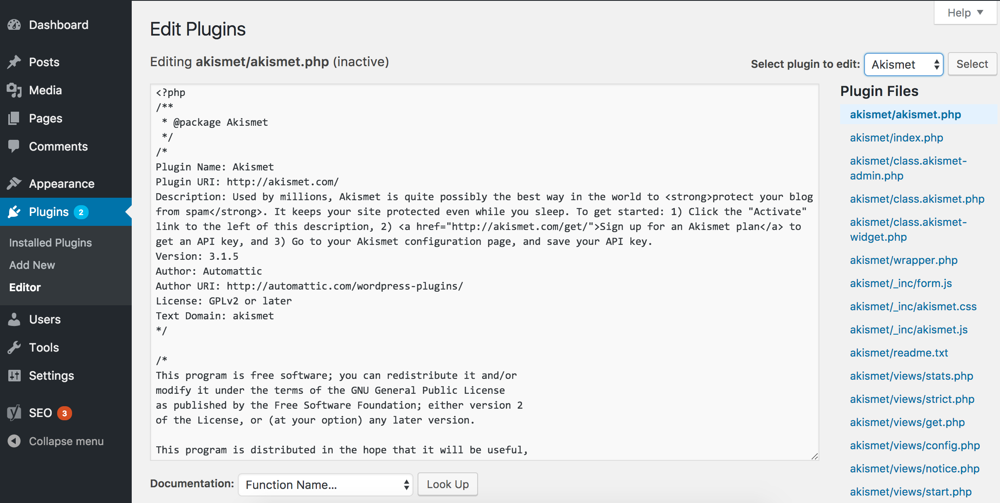
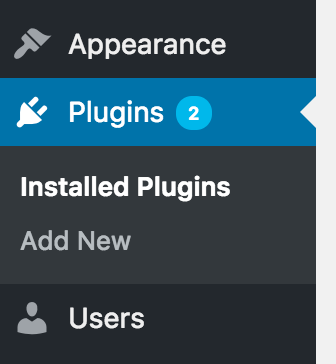
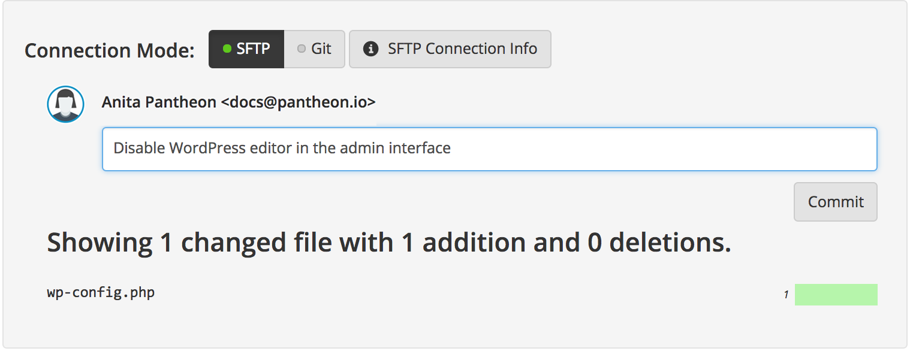

## Remove Default WordPress Editor

WordPress allows privileged users to edit code directly from the admin panel. This is found in both the **Appearance** and **Plugins** menus in the admin UI.

 

This editor is not recommended for a few reasons. You (or your client) may not want administrative users to be able to view and possibly modify the site's code inadvertently. Also, those who **are** familiar with this admin panel will not be able to edit code as expected in the **<span class="glyphicons glyphicons-equalizer"></span> Test**, and **<span class="glyphicons glyphicons-cardio"></span> Live** environments, because of how Pantheon secures each. Finally, even basic text editors have spellcheck, undo/redo, custom fonts, code formatting, and other useful features this barebones editor lacks.

It's a common practice to disable this editor, as well as a good example to show how to edit a core WordPress file.

## Configuration

1. Using your SFTP client, download the `wp-config.php` file, and add these lines of code to the bottom of the file:

  ```php:title=wp-config.php
  /* Disable admin file editor */
  define( 'DISALLOW_FILE_EDIT', true );
  ```

1. Once you upload this edited file, you should see the editor is not longer an option

 

1. Finally, on the Pantheon dashboard, add a relevant message and commit this change.

 

While we recommend disabling this admin panel, it isn't a requirement. If you prefer to use this to edit code, remember that you must be in SFTP mode on the Pantheon dashboard, and you can only make code changes in the **<span class="glyphicons glyphicons-wrench"></span> Dev** environment.
