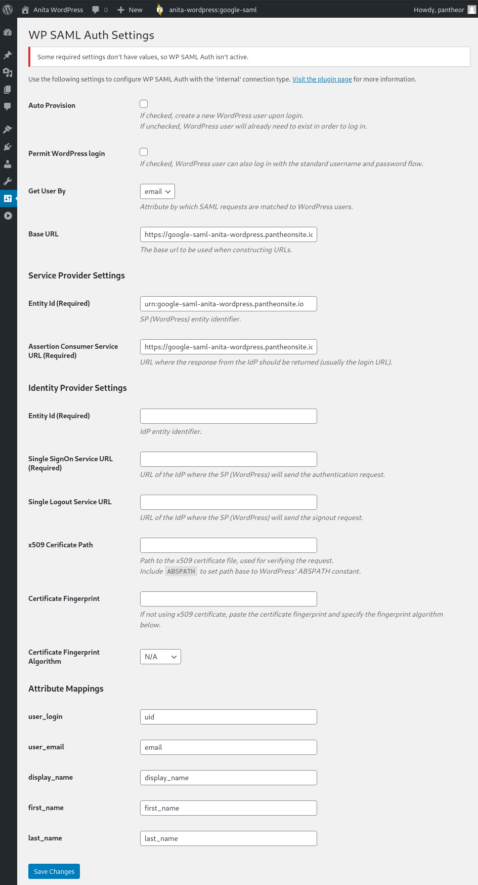

In this step, we'll install the WP SAML Auth plugin and bring up the settings page, which provides values we'll need later.

## Choose Your Environment

If your site has [Multidev](/guides/multidev) enabled, we suggest working in a new multidev environment to avoid conflicting with the work of other developers on your team. Otherwise, you'll be working from the Dev environment.

<Alert title="Environment Variables" type="export">

If you're using [Terminus](/terminus), set the `$env` variable to your multidev environment, or dev if not:

```bash{promptUser: user}
export env=multidevname # or dev
```

</Alert>

## Set the Connection Mode

This guide assumes you're working on Pantheon, as opposed to a local development environment. To that end, make sure the connection mode for your working environment is set to **SFTP**. You can do this [from the Pantheon Site Dashboard](/sftp#sftp-mode), or with Terminus:

```bash{promptUser: user}
terminus connection:set $site.$env sftp
```

## Install the Plugin

From the WordPress Admin dashboard, go to **Plugins** and click on **Add new**. Search for the keywords "wp saml auth" and install the plugin provided by *Pantheon*. Once installed, activate it.

If you're using Terminus, you can install the plugin with WP-CLI:

```bash{promptUser: user}
terminus wp $site.$env -- plugin install --activate wp-saml-auth
```

<Alert type="info" title="Pro Tip">

Good developers commit after every set of like changes. Commit your changes to version control [from the Pantheon Site Dashboard](/sftp#committing-sftp-changes), or with Terminus:

```bash{promptUser: user}
terminus env:commit --message "installed WP SAML Auth plugin" $site.$env
```

</Alert>

## Plugin Settings and Values

Open the plugin's settings page (`/wp-admin/options-general.php?page=wp-saml-auth-settings`):



Note that some fields are already filled in, and some are empty. Leave this page open in a separate tab or window, as we'll be referencing and adding to this page in the following steps.
