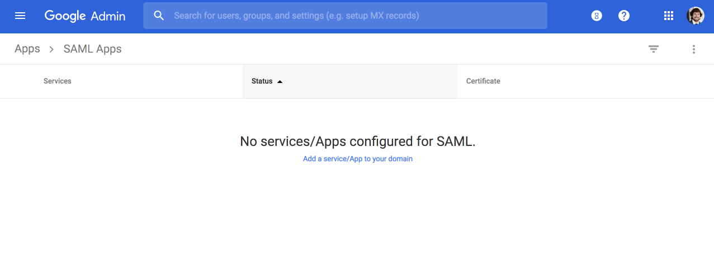
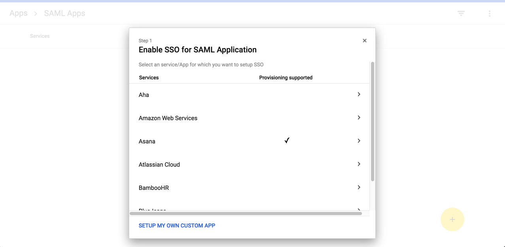
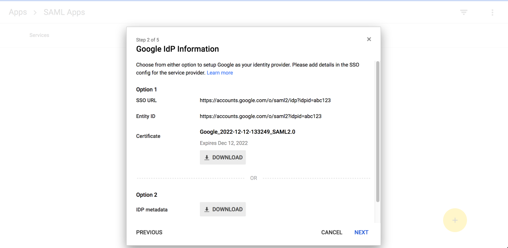
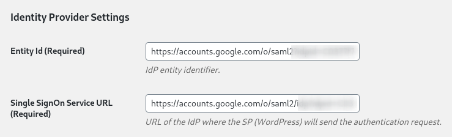
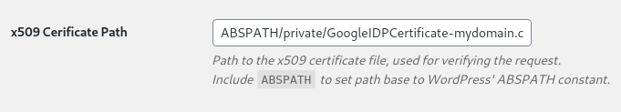
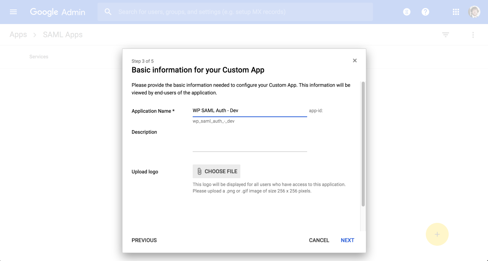
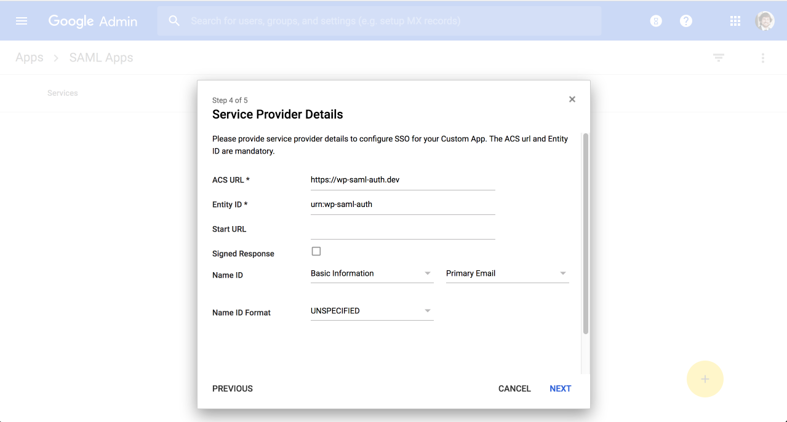
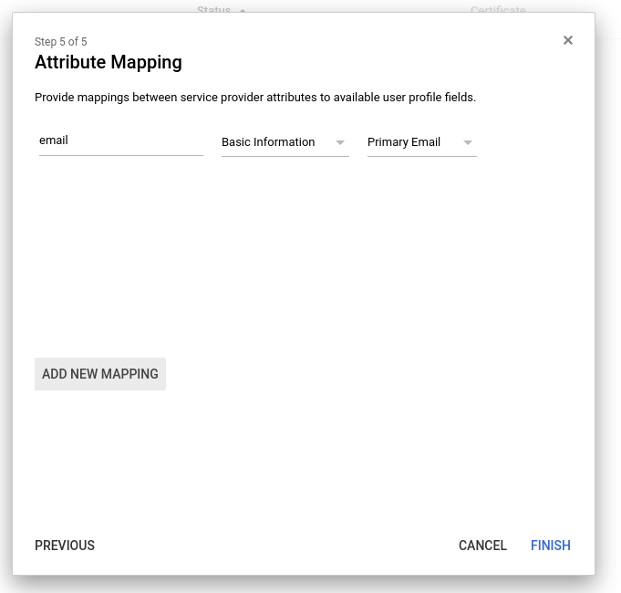
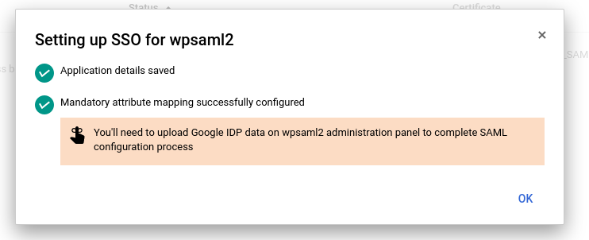

In this step, we'll create a custom Google Apps SAML application. This will be the gateway between the users in our Google organization and WordPress. We'll also define which Google users have access to the app.

## Define a new SAML App

1. Find the [**SAML Apps** dashboard](https://admin.google.com/AdminHome?hl=en#AppsList:serviceType=SAML_APPS) in the Google Apps admin, and click **Add a service/App to your domain**:

  

1. When the modal opens, select **SETUP MY OWN CUSTOM APP**:

  

## IdP Information

1. The **Google IdP Information** modal provides values and a certificate to pass back to the WP SAML Auth plugin. The key details are in the Option 1 section:

   

   - **SSO URL**: URL for WordPress to redirect to when initiating the SSO process.

   - **Entity ID**: How WordPress knows to recognize Google Apps.

   - **Certificate** - How Google Apps knows to trust a request coming from WordPress.

1. Copy the **SSO URL** and **Entity ID** values and paste them into the corresponding fields under **Identity Provider Settings** on the plugin settings page:

  

1. Download and commit the certificate file to your [`private` directory](/private-paths#private-path-for-code) so it's inaccessible from the web. You can add upload this file over [sftp](/sftp), or commit it to a local clone of the Git repository, then commit and push. If the latter, you will need to first switch the connection mode to Git:

  <TabList>

  <Tab title="SFTP" id="cert-by-sftp" active={true}>

  ```bash{outputLines: 2-6, 8}
  sftp -o Port=2222 google-saml.1f2a347b....0@appserver.google-saml.1f2a347b....drush.in
  sftp> cd code/private/
  sftp> put GoogleIDPCertificate-mydomain.com.pem
  Uploading GoogleIDPCertificate-mydomain.com.pem to /srv/bindings/972dd.../code/private/GoogleIDPCertificate-mydomain.com.pem
  GoogleIDPCertificate-mydomain.com.pem                                                                            100% 1253    27.6KB/s   00:00
  sftp> quit
  terminus env:commit --message "Added the Google IDP Certificate to a protected path" $site.$env
   [notice] Your code was committed.
  ```

  </Tab>

  <Tab title="Git" id="cert-by-git">

  ```bash{promptUser: user}
  terminus connection:set $site.$env git
  git add private/GoogleIDPCertificate-mydomain.com.pem
  git commit -m "Added the Google IDP Certificate to a protected path"
  git push origin $env #or master, if working on the dev environment
  ```

  </Tab>

  </TabList>

1. Add the certificate path to the WP SAML Auth plugin settings, using the `ABSPATH` variable:

  

1. Click **Save Changes** on the plugin settings page, and **Next** on the Google App modal.

1. On the Basic Information page, add a name for your app that you'll recognize in a year's time:

    

  You can also add a description and logo at this stage. Remember, the more detail you provide now, the easier it will be for you or someone else to review this configuration in the future. Click **NEXT** to continue.

## Service Provider Information

1. The Service Provider Details modal asks for information from the WP SAML Auth plugin, which is the SAML service provider for our WordPress site. Refer back to the plugin settings page for the **ACS** (Assertion Consumer Service) **URL**, **Entity ID**, and **Start URL** (listed as **Base URL**). Copy and paste these values:

  

  Once you've filled out these fields, click **NEXT**.

1. On the Attribute Mapping page, you'll need to specify any attributes you'd like Google Apps to return in the SAML response, and then keys you'd like to use for those attributes.

   Without any additional configuration, WP SAML Auth understands this attribute mapping:

   - SAML IdP (Google Apps) -> WordPress
   - `email` -> `user_email`
   - `uid` -> `user_login`
   - `first_name` -> `first_name`
   - `last_name` -> `last_name`

  Click **ADD NEW MAPPING**, and map at least one identifying attribute. Using `email` as an example:

  

1. Click **FINISH** and your application is created!

  You can safely dismiss the **Setting up SSO** warning, as we'll provide additional configuration later:

  

## See Also

- [GSuite Admin Help - Set up your own custom SAML application](https://support.google.com/a/answer/6087519)
