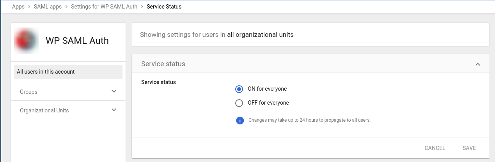
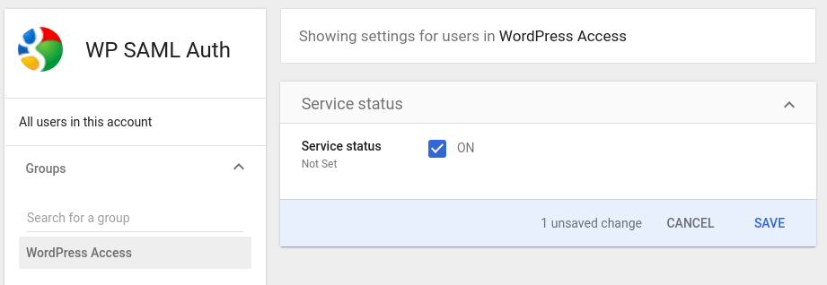
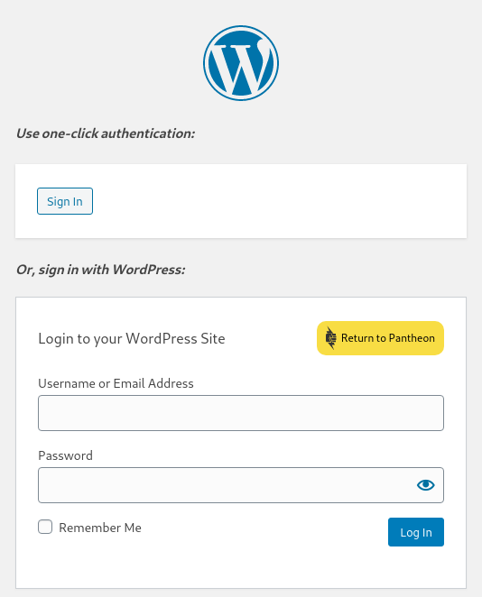
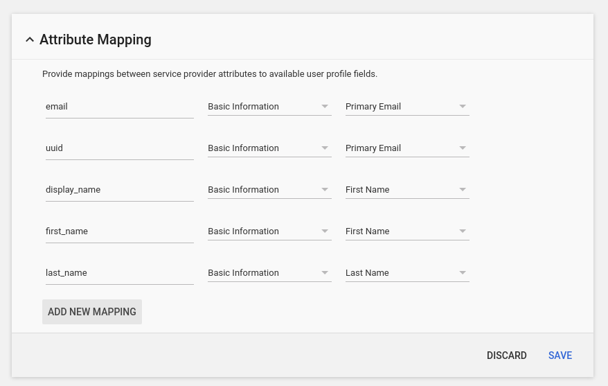
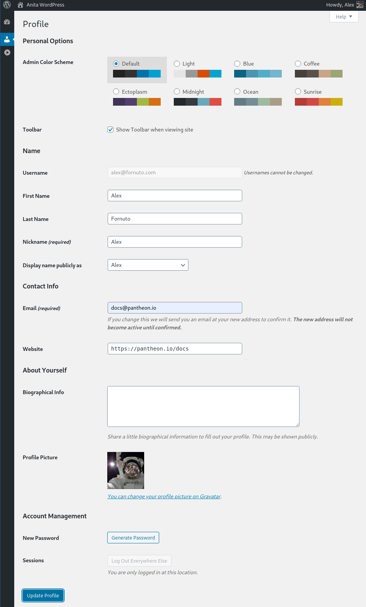

## Access Permissions

Before you can sign in to WordPress with Google as your identity provider, you must click **EDIT SERVICE** and either set the **Service status** to "ON for everyone", or configure a group or organizational unit with access.

The image below shows the service enabled for all users in the organization:

  

Alternately, you can define a group or organizational unit and turn on the service for it specifically:

  

## Attribute Mapping

At this point, you should see a new section on `wp-login.php` titled ***Use one-click authentication:***

  

Google accounts whose email matches existing WordPress users should now be able to log in to WordPress.

### Creating New Users

WP SAML Auth enables by default "Auto Provision", which will create a new WordPress user on login, but you must first define additional attribute mappings.

1. In the WP SAML Auth settings page, edit the attribute mapping for `user_login` from `uid` to `email`, and click **Save Changes**.

1. In the [SAML Apps](https://admin.google.com/AdminHome?hl=en#AppsList:serviceType=SAML_APPS) section of the Google Admin dashboard, click on your SAML app, then click to expand **Attribute Mapping**.

1. Using the **ADD NEW MAPPING** button and referencing the **Attribute Mappings** section of the plugin settings page, define mappings for the remaining values:

  

  These mappings are shown as an example. Adjust to match your organization. Click **SAVE** once you're finished mapping.

Now, Google users new to your WordPress site can sign in, and will be directed to update their WordPress profile:

