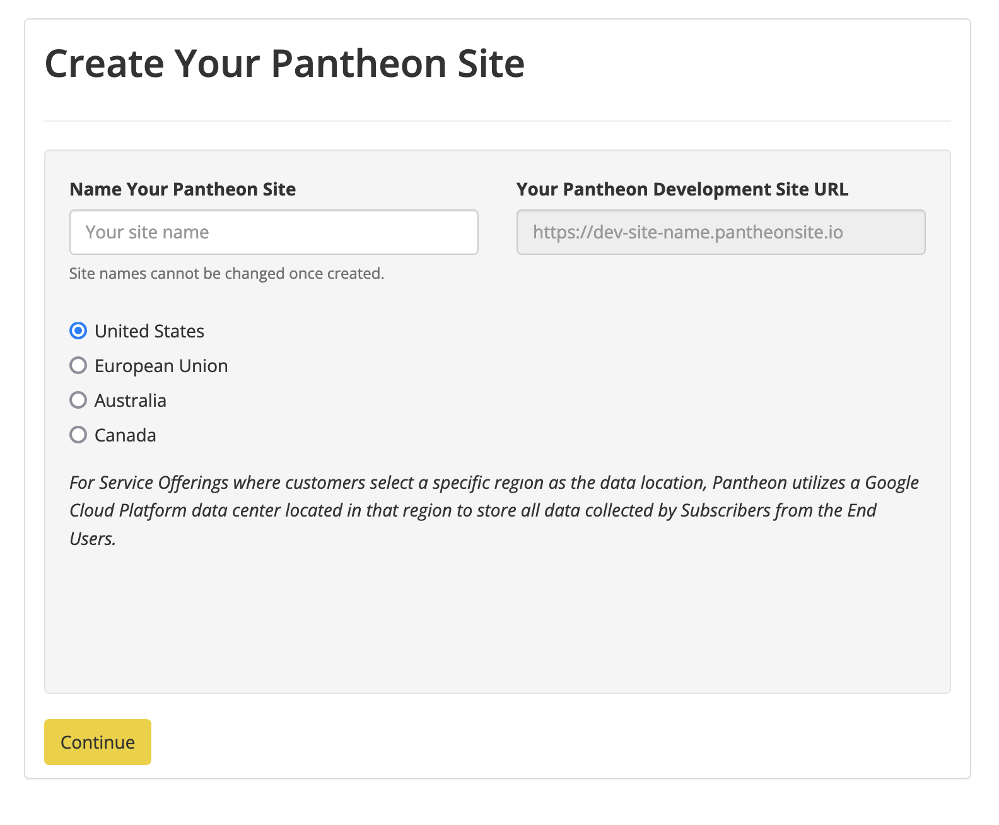
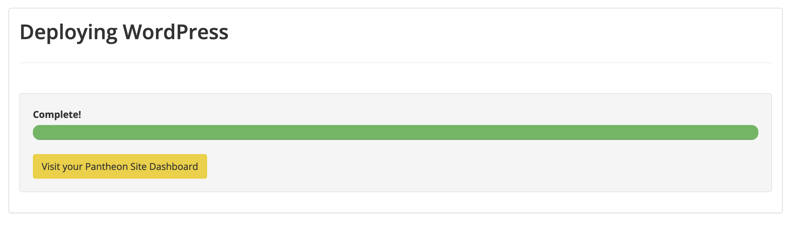
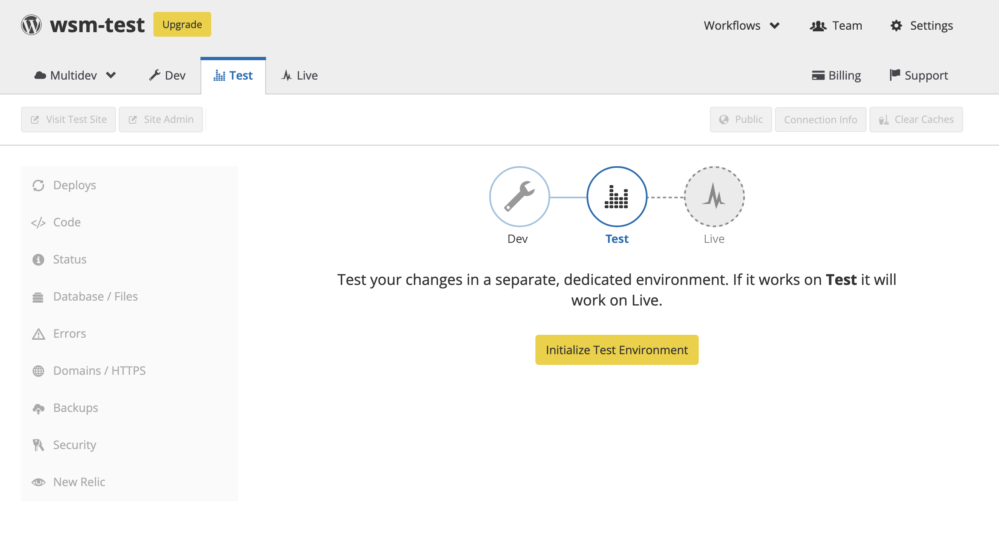

This page provides steps on creating a new WordPress site on Pantheon. 

1. [Create an account](https://dashboard.pantheon.io/register) with Pantheon if you do not already have one.

1. Login to your Pantheon account.

    The Sites tab of your User Dashboard opens by default unless you are registered as an agency and this is your first time logging in. In that case, you’ll land on your Organization Dashboard. Navigate to your User Dashboard by selecting your name in the menu bar, then My Dashboard.

1. Select <Icon icon="plus" text="Create New Site"/>.

1. Enter a name for your site and select the check box to make the site part of your organization (only if you are part of an agency).

1. Click **Continue**.

    

1. Select the WordPress **Deploy** button to create your WordPress site.

    

1. Wait for your site to finish deploying (this can take a couple of minutes) and then visit your Pantheon [Site Dashboard](/guides/quickstart/workflow/).

    

## Initialize Your Test and Live Environments

1. Click the <Icon icon="equalizer" text="Test"/> tab in the Site Dashboard > click **Create Test Environment**.

    This can take a couple of minutes. Note that you must create your Test environment before you can create your Live environment.

    

1. Click <Icon icon="new-window-alt" text="Visit Test Site"/> to open your Test site in a new browser tab with the URL `test-YOURSITE.pantheonsite.io`.

1. Click the <Icon icon="cardio" text="Live"/> tab in your Site Dashboard > click **Create Live Environment** to create your live environment.

    This can take a couple of minutes. You will have Dev, Test, and Live copies of your site running in three separate environments when it finishes.

1. [Clone](/guides/quickstart/clone-live-to-dev/) your Live environment to your Dev environment (optional). 

 1. Navigate to the <Icon icon={"wrench"} text={"Dev"}/> environment in your Site Dashboard > click <Icon icon={"embed-close"} text={"Code"}/>.

   <Alert title={"Note"} type={"info"}>
     Dev is the only environment on Pantheon where you can add or change code,
     and the only place where you can access and change your Development Mode.
   </Alert>

## Configure Your Development Mode

1. Select [SFTP](/guides/quickstart/connection-modes/#sftp-connection-mode) or [Git](/guides/quickstart/connection-modes/#git-connection-mode) as as your Development Mode. 

    You can develop in [Git mode](/guides/git/git-config), or you can develop with [SFTP mode](/guides/sftp), or even switch between both modes depending on your task and workflow.

    

1. Review and follow the steps in the [Using Git with SFTP & WordPress Guide](/guides/wordpress-git/) to ensure that you understand the best ways to:

    - Install plugins
    - Manage themes
    - Upload media
    - Edit your site configuration

## WordPress Multisite

This section is optional, and is only intended for customers who would like to create a network of sites using a single copy of the WordPress codebase and a common database.

1. Review the [WordPress Site Networks Guide](/guides/multisite/) to ensure that you understand Multisite considerations and Multisite governance.

1. Request a [WordPress Site Network](/guides/multisite/#request-a-wordpress-site-network).

1. Complete the configuration steps in WordPress Site Networks Guide to [install](/guides/multisite/config/#install-the-wordpress-site-network) and [configure](/guides/multisite/config/#configure-the-wordpress-site-network) the WordPress Site Network created for you in step 2.

## More Resources

- [Getting Started with Git](/guides/git/git-config)

- [Undo Git Commits on Pantheon](/guides/git/undo-commits)

- [Git Faqs](/guides/git/faq-git)
