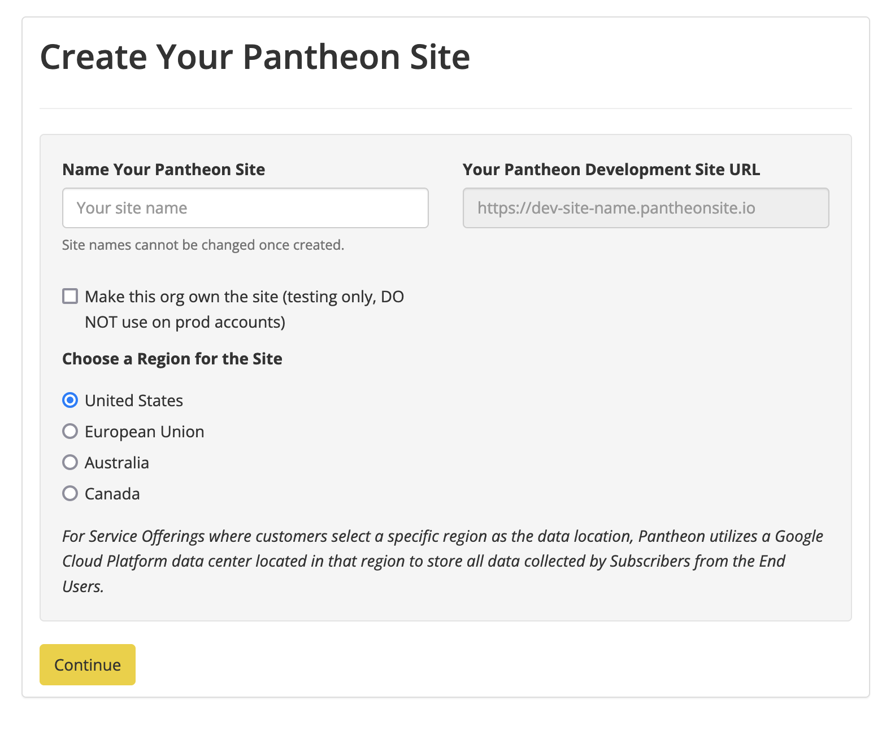
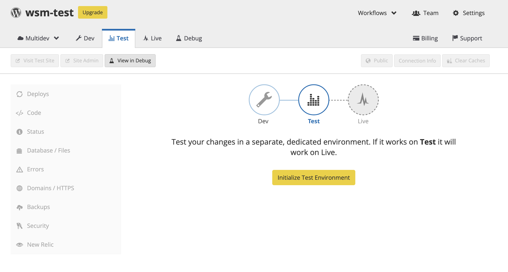

This page provides steps on creating a new WordPress site on Pantheon. 

1. [Create an account](https://dashboard.pantheon.io/register) with Pantheon if you do not already have one.

1. Login to your Pantheon account.

    The Sites tab of your User Dashboard opens by default unless you are registered as an agency and this is your first time logging in. If so, you’ll land on your Organization Dashboard. Navigate to your User Dashboard by selecting your name in the menu bar, then My Dashboard.

1. Select <Icon icon="plus" text="Create New Site"/>.

1. Enter a name for your site and select the check box to make the site part of your org only if you are part of an agency.

1. Click **Continue**.

1. Select the WordPress **Deploy** button to create your WordPress site.

1. Wait for your site to finish deploying (this make take a couple of minutes) and then visit your Pantheon [Site Dashboard](/guides/quickstart/site-dashboard/).

1. Click the <Icon icon="equalizer" text="Test"/> tab in the Site Dashboard and then click **Create Test Environment**.

    This can take a couple of minutes. Note that your must create your Test environment before you can create your Live environment.

1. Click <Icon icon="new-window-alt" text="Visit Test Site"/> to open your Test site in a new browser tab with the URL `test-YOURSITE.pantheonsite.io`.

1. Click the <Icon icon="cardio" text="Live"/> tab in your Site Dashboard and then click **Create Live Environment** to create your live environment.

    This can take a couple of minutes.

You now have Dev, Test, and Live copies of your site running in three separate environments.

