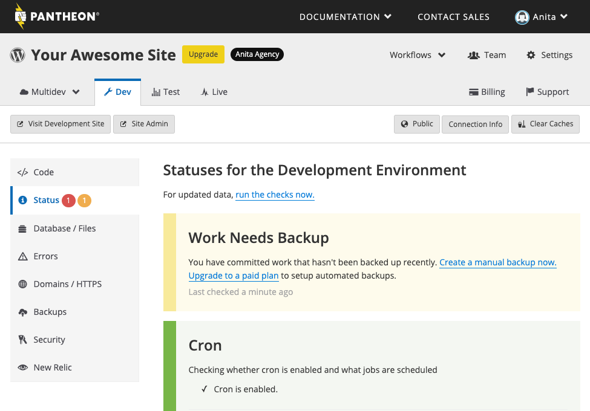

Pantheon provides static site analysis as a service for WordPress sites to make best practice recommendations on site configurations. These reports are found in the Site Dashboard under the **Status** tab, and are accessible by site team members.



## Overview

Pantheon provides recommendations that fit the vast majority of use cases by using a technique known as static program analysis which gathers performance and behavior patterns to see how a site works.

This mechanism does not actually perform requests on your site, and in doing so avoids the observer effect. This process is non-intrusive and does not require installation or configuration. Reports and results are issued automatically, and can help detect common problems and provide insight into your site.

## How Does it Work?

WP Launch Check is a site audit extension for WP-CLI designed for Pantheon customers, although it is fully usable outside of Pantheon.

## WPScan (Recommended)

WP Launch Check uses the [WPScan API](https://wpscan.com/api) to check for outdated or vulnerable plugins. The service sends alerts when your plugins need to be updated. Follow the steps below to use this service.

1. Obtain an [API token](https://wpscan.com/pricing) from the WPScan website.

1. Add the token to your site's `wp-config.php` file using the following PHP code: 

    ```php:title=wp-config.php
    define( 'WPSCAN_API_TOKEN', '$your_api_token' );
    ```
1. Define the environment.

    You'll also need to define which environment you want WPScan to run on using the `PANTHEON_WPSCAN_ENVIRONMENTS` constant. This constant is required to use the WPScan functionality, and allows you to decide whether or not scans are done on multiple environments, or just one.

    To scan one environment:

    ```php:title=wp-config.php
    define( 'PANTHEON_WPSCAN_ENVIRONMENTS', 'live' );
    ```

    To scan multiple environments:

    ```php:title=wp-config.php
    define( 'PANTHEON_WPSCAN_ENVIRONMENTS', ['dev', 'test', 'live'] );
    ```

    To scan all environments:

    ```php:title=wp-config.php
    define( 'PANTHEON_WPSCAN_ENVIRONMENTS', '*' );
    ```

<Alert title="Note"  type="info" >

Scanning multiple or all environments exhausts your daily API request quota faster.

</Alert>

## Run Launch Check Manually

You can manually perform a site audit with WP Launch Check from the command line using [Terminus](/terminus).

1. Run the following command:

    ```php{promptUser: user}
    terminus wp <site>.<env> -- launchcheck <subcommand>
    ```

For more information about WP-CLI, visit their [GitHub page](https://github.com/wp-cli/wp-cli). For more information on WordPress Launch Check, go to the [GitHub repo](https://github.com/pantheon-systems/wp_launch_check/).

## What Does Launch Check Evaluate?

### Cron

Cron is disabled by default because the `platform-run` job in the WordPress Upstream runs once every hour. You can enable Cron if you would like to use it. The launch check will return the following message if Cron is disabled.

`Cron appears to be disabled, make sure DISABLE_WP_CRON is not defined in your wp-config.php.`

### Database

The database stores your site's data including:

- pages and other content
- user data
- plugins and themes
- categories, tags, and system-wide settings
- tables 

Launch Check displays database stats, including:

- Rows count in a given table

- Tables using InnoDB storage engine (suggests a query to run if not)

    InnoDB has row level locking; MYISAM has table level locking. If a query is being performed on a table with MYISAM storage engine, no other query can modify the data until the first has given up its lock, which can result in tremendous performance issues for web applications.
    To learn how to move your tables to InnoDB, see [Moving MySQL tables from MyISAM to InnoDB](/guides/mariadb-mysql/myisam-to-innodb).

- [Transients](https://developer.wordpress.org/apis/handbook/transients/) and expired transients which are cached data temporarily stored in the `wp_options` table. 

The `wp_options` table stores several types of data for your site, including:

- settings for your plugins, widgets, and themes
- temporarily cached data
- site URL and home URL
- category settings
- autoloaded data

If your website is running slow and you receive the following message in the database stats: `consider autoloading only necessary options`, review [Optimize Your wp-options Table and Autoloaded Data](/optimize-wp-options-table-autoloaded-data).

### Probable Exploits

This check will display a list of exploited patterns in code, the file name that has the exploit, line number, and match.

### Object Cache

This tells you if Object Caching and Redis are enabled.

If you receive an error message similar to the example below, you'll need to move `object-cache.php` from the `plugin` directory to the `wp-content` directory. For more information, see [Object Cache (formerly Redis) for Drupal or WordPress](/guides/object-cache).
    
`Cannot redeclare class WP_Object_Cache in/srv/bindings0fef773f42984256a4f6feec2556a5ed/code/wp-content/plugins/wp-redis/object-cache.php`
    
### Plugins

This check lists all your enabled plugins and alerts you when they need to be updated. It also checks for any vulnerabilities.

- **Green:** All of your plugins are up-to-date
- **Yellow:** Highlighted plugins need to be updated
- **Red:** Displays all vulnerabilities and unsupported plugins

#### Unsupported Plugins

- [WP Super Cache](https://wordpress.org/plugins/wp-super-cache/)
- [W3 Total Cache](https://wordpress.org/plugins/w3-total-cache/)
- [batcache](https://wordpress.org/plugins/batcache/)

### PHP Sessions

Displays the files that references sessions. If any are found, you'll be prompted to install the [WordPress Native PHP Sessions](https://wordpress.org/plugins/wp-native-php-sessions) plugin.

## Support

If you have a feature request, message enhancements, or found a bug, please look at the [project's issues](https://github.com/pantheon-systems/wp_launch_check/issues) and submit a new issue if someone else has not already posted it. Pull requests are always welcome!

## More Resources

If you have a Drupal site, see [Launch Check - Drupal Performance and Configuration Analysis](/drupal-launch-check).
