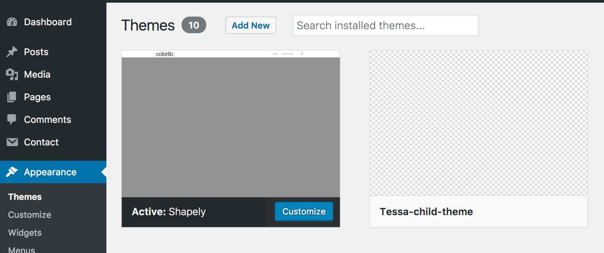

This section provides information on how to install WordPress plugins and themes with WP-CLI.

## Install WordPress Plugins
The [WordPress plugin repository](https://wordpress.org/plugins/) has loads of free and paid plugins. For this example we will install and activate the [Contact Form 7](https://wordpress.org/plugins/contact-form-7/) plugin.

1. Install and activate the [Contact Form 7](https://wordpress.org/plugins/contact-form-7/) plugin:

    ```bash
    terminus wp $TERMINUS_SITE.dev -- plugin install contact-form-7 --activate
    ```

    If you have the Site Dashboard open, you'll see that 78 files have changed and are ready to commit in the yellow box. You can use the Site Dashboard interface to review file changes and commit, but we'll continue on the command line.

    


2. Review the file changes:

    ```bash
    terminus env:diffstat $TERMINUS_SITE.dev
    ```

3. Commit your changes to the Dev environment:

    ```bash
    terminus env:commit $TERMINUS_SITE.dev --message="Install CF7"
    ```

    If you refer back to the Site Dashboard, you'll see the commit on the Dev environment:
    

4. Deploy the code to Test and pull content down from Live:

    ```bash
    terminus env:deploy $TERMINUS_SITE.test --sync-content  --updatedb --note="Deploy C7 plugin"
    ```
  
    Ensure you clear the site cache after deploying the code to Test:
  
    ```bash
    terminus env:clear-cache <site>.test
    ```
  
    <Alert title="Note" type="info">
  
    The `--sync-content` option will pull the database and files down from the Live environment. In a real-world scenario, your content editors most likely have added posts and files in the Live environment. For proper testing, you want those updates present on the Test environment with your deployed code. For more information on options for the this command, run `terminus env:deploy -h`.
  
    </Alert>

5. Activate the Contact Form 7 plugin on the Test environment by making a manual configuration change:

    ```bash
    terminus wp $TERMINUS_SITE.test -- plugin activate contact-form-7
    ```

6. Once you've experimented in the Test environment and verified that your new plugin is working, and everything else is still in working order, deploy to Live:

    ```bash
    terminus env:deploy $TERMINUS_SITE.live --updatedb --note="Deploy after CF7 Install"
    ```
  
    Ensure you clear the site cache after deploying the code to Live:
  
    ```bash
    terminus env:clear-cache <site>.live
    ```

    <Alert title="Note" type="info">

    We don't need the `--sync-content` flag when going to the Live environment because that environment already has our canonical database.

    </Alert>

7. Activate the Contact Form 7 plugin on the Live environment by making a manual configuration change:

    ```bash
    terminus wp $TERMINUS_SITE.live -- plugin activate contact-form-7
    ```

For this example, manually applying configuration changes is a simple and short task. We're only activating one plugin on each environment. However, complex configuration changes are [best managed in code](/pantheon-workflow/#configuration-management) so you can pull fresh content from Live while bringing in the site settings from Dev.


## Install WordPress Themes
Now that you have WordPress installed, let's make it look a little better by adding a new theme. The [WordPress theme repository](https://wordpress.org/themes/) has a plethora of free and paid themes you can install to customize your site. For this example we will use the [Shapely](https://wordpress.org/themes/shapely/) theme.

1. Install and activate the [Shapely](https://wordpress.org/themes/shapely/) theme:

    ```bash
    terminus wp $TERMINUS_SITE.dev -- theme install shapely --activate
    ```

2. Check out the Dev environment's site URL to see the new theme in action. The `terminus env:info` command from earlier gives us the URL. Here it is again with our environment variable:

    ```bash
    terminus env:info $TERMINUS_SITE.dev --field=domain
    ```

3. Commit your changes to the Dev environment:

    ```bash
    terminus env:commit $TERMINUS_SITE.dev --message="Install shapely theme"
    ```

4. No WordPress site is ready for development without a [child theme](https://codex.wordpress.org/Child_Themes). Let's create one! Run [the `scaffold child-theme` WP-CLI command](https://developer.wordpress.org/cli/commands/scaffold/child-theme/) (replace `Tessa-child-theme` and `shapely`):

   ```bash
    terminus wp $TERMINUS_SITE.dev -- scaffold child-theme Tessa-child-theme --parent_theme=shapely
   ```

    You should see the new theme within **Appearance** > **Themes** of the WordPress Dashboard:

    

    Now you're ready to edit your child theme. This allows your parent theme, in our case Shapely, to receive updates without conflict or interference to the functionality of the site.

    Apply configuration changes, such as activating the child theme, then make sure everything looks good on the Dev environment's site URL.

5. Commit your changes to the Dev environment:

    ```bash
    terminus env:commit $TERMINUS_SITE.dev --message="Create Child of Shapely Theme"
    ```

6. Deploy the themes to Test and pull content down from Live:

    ```bash
    terminus env:deploy $TERMINUS_SITE.test --sync-content --updatedb --note="Deploy Themes"
    ```
  
    Ensure you clear the site cache:
  
    ```bash
    terminus env:clear-cache <site>.live
    ```

    Apply configuration changes and make sure everything looks good on the Test environment's site URL.

7. Deploy code to Live, then apply configuration changes:

    ```bash
    terminus env:deploy $TERMINUS_SITE.live --updatedb --note="Deploy Themes"
    ```
    
    Ensure you clear the site cache:
  
    ```bash
    terminus env:clear-cache <site>.live
    ```