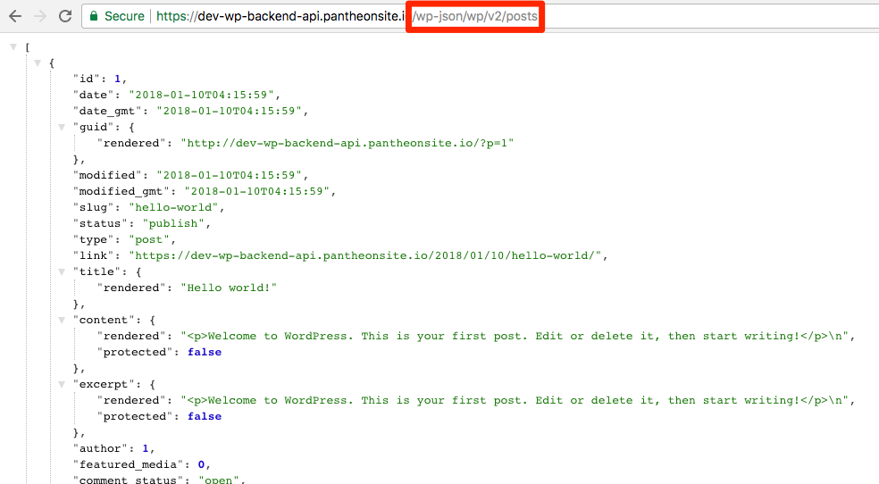

Pantheon supports running WordPress and Drupal as an API (Application Programming Interface) for the backend of headless sites, which enables the CMS to interact with external frontend applications over HTTP requests.

For example, a mobile application <Popover content="A separate and external frontend application that is not running on Pantheon." /> that uses the `GET`, `POST`, and `DELETE` HTTP methods to perform CRUD operations <Popover title="CRUD" content="Create, read, update and delete." /> on a CMS's database <Popover content="The Drupal or WordPress site running on Pantheon as the backend API." />.

## Decoupled Architecture Overview
WordPress and Drupal are traditionally monolithic CMSs, meaning they serve as the frontend and backend of a site. Decoupled architecture (**headless**) is a development model that uses a CMS to manage content in the backend with a completely separate frontend component to render that content in the browser.

Some key differences of decoupled architecture include:

  

  

   

   

   **Decoupled Frontend** 
   Presentation can be handled in a variety of ways, from interactive JS frameworks like Angular, to static generators, to mobile apps, or even another CMS. Multiple frontends can peacefully coexist.
   

 

 

 

 

   

   

   **Content Via Web Service API** 
   The content for the site is accessible via a web-service API, usually in a RESTful manner and in a mashup-friendly format such as JSON.
   

 

 

 

 

   

   

   **CMS Backend and Database** 
   There is a traditional database-driven CMS which editors use to maintain the content for the site, usually via the same admin interface as always.
   

 

 

### Pantheon's Platform Benefits
Backend APIs running on Pantheon take advantage of the following platform features for optimal performance:

* [**Global CDN**](/global-cdn): Cache backend API responses from WordPress or Drupal in 40+ global POPs (points of presence).
* **Redis**: Leverage object caching for backend APIs that use the database-driven admin interface of the CMS to edit or add content. For details, see [Object Cache (formerly Redis) for Drupal or WordPress](/object-cache).
<!--todo: does solr belong here? help wanted describing the benefits of solr in context of decoupled site.]-->

## Exposing the Backend API
Running WordPress and Drupal as an API on Pantheon can be done on any Drupal or WordPress upstream. The process to [create](/create-sites), [update core](/core-updates), and [launch](/guides/launch) a backend API on Pantheon does not deviate from the standard procedures.

<TabList>

<Tab title="WordPress" id="wp-api" active={true}>

Since WordPress 4.7, the WordPress API is included as part of core. There's no action needed to expose the API on Pantheon. Explore default routes and endpoints like `/wp-json/wp/v2/posts` in your browser:

We recommend using a trusted browser extension to format the JSON response from the API so it's easier to read.

Refer to the [Rest API Handbook](https://developer.wordpress.org/rest-api/) from WordPress.org's Developer Resources for full documentation on this web service.

</Tab>

<Tab title="Drupal 8" id="d8-api">

#### Core Modules
With the release of Drupal 8, Web Services have been implemented to core through different modules:

* **RESTful Web Services (rest)** - Exposes entities and other resources via a RESTful web API. It depends on the Serialization module for the serialization of data that is sent to and from the API.
* **Serialization (serialization)** - Provides a service for serialization of data to and from formats such as JSON and XML.
* **Hypertext Application Language (hal)** - Extends the Serialization module to provide the HAL hypermedia format. This is what is used as the primary format in Drupal 8 Core. It only adds two reserved keywords, `_links` for link relations (also used by Github's Pull Request API) and `_embedded` for embedded resources. The HAL hypermedia format can be encoded in both JSON and XML.
* **HTTP Basic Authentication (basic_auth)** - This module implements basic user authentication using the HTTP Basic authentication provider. It facilitates the use of a username and password for authentication when making calls to the REST API. It is advised to enable SSL when used in production.

#### Resources Configuration

By default, not all resources or endpoints are enabled. You may need to individually enable `GET`, `POST`, `PATCH` and `DELETE` operations for each web service like node entity or user. Read about the overview and steps for the configuration on the [API overview page](https://www.drupal.org/docs/8/api/restful-web-services-api/restful-web-services-api-overview).

There is a contributed module called [REST UI](https://drupal.org/project/restui) which provides an admin interface for enabling or disabling resources, serialization formats and authentication providers. Use this to quickly manage and save your configuration.

#### Resources using Views

Because Views is also part of core, you can make a JSON resource once REST and Serialization modules are enabled. Just create a view and select "REST export" as its display type. Name the path as you like.

* Use Filter Criterias to extract content as you like it (e.g., `/json/articles?nid=5`).
* You can also use Contextual Filters if we want to just append the end of the path (e.g., `rest/views/articles/1`) for filtering results.

#### Example Requests

To create a node entity, we must send a `POST` request to `/entity/node` with the `Content-Type` header set to `application/hal+json` and declare the required type and title fields in the request `BODY`.

If you have Basic Authentication enabled, you need to set headers `PHP_AUTH_USER` and `PHP_AUTH_PW` to authenticate as our user.

</Tab>

<Tab title="Drupal 7" id="d7-api">

Web Services are implemented through various plugins in Drupal 7.

  - [RESTful](https://www.drupal.org/project/restful)
  - [RESTful Web Services](https://www.drupal.org/project/restws)
  - [Services](https://www.drupal.org/project/services)

The service module has several integration features, and other web service formats. It also has [several supporting modules](https://www.drupal.org/node/750036) that extend the Drupal 7 functionalities made available to the API.

<Alert title="Note" type="info">

While not a REST API service by itself, you can create a JSON view using the [Views Datasource](https://www.drupal.org/project/views_datasource) module.

</Alert>

</Tab>

</TabList>

## Frequently Asked Questions

### Can I use other frameworks or distributions?
You can use [custom upstreams](/custom-upstream), [make your own build](/guides/build-tools) or [install distributions](/start-state/#public-distributions) that may serve as a backend API. For example, [Contenta](http://www.contentacms.org) (Drupal 8 API distribution) can be used on the platform.

### How can I troubleshoot the backend API?
We recommend using one of the following Chrome extensions to debug HTTP requests:

* [Postman](https://chrome.google.com/webstore/detail/postman/fhbjgbiflinjbdggehcddcbncdddomop?hl=en)
* [Dev HTTP Client](https://chrome.google.com/webstore/detail/dev-http-client/aejoelaoggembcahagimdiliamlcdmfm/related)
* [Restlet Client](https://chrome.google.com/webstore/detail/restlet-client-rest-api-t/aejoelaoggembcahagimdiliamlcdmfm)
