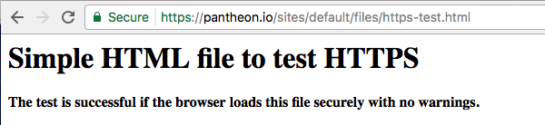
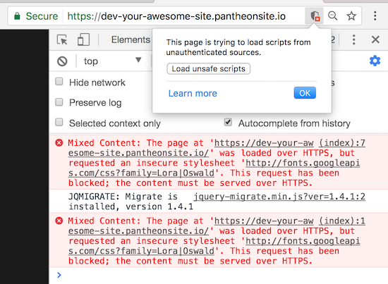
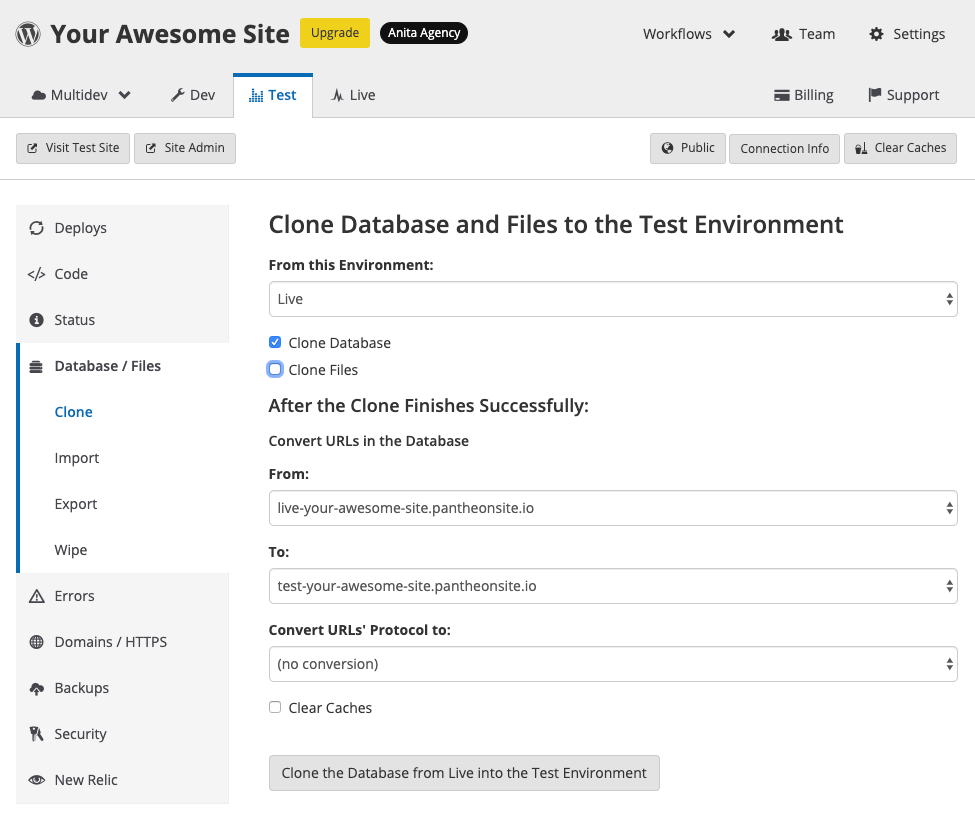
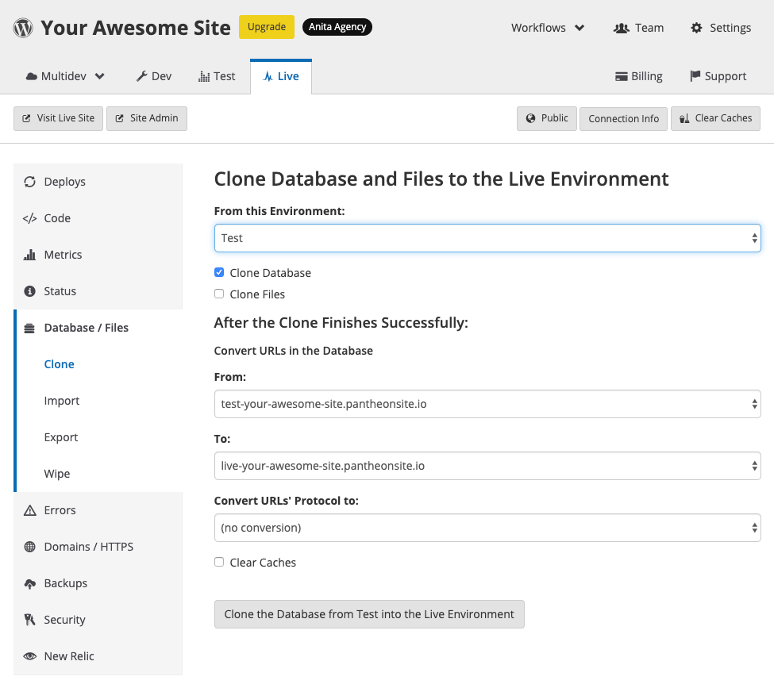

All new sites created on Pantheon are configured for HTTPS by default. HTTPS is available immediately for Platform domains like `multidev-example.pantheonsite.io`.

When you upgrade to a paid plan you can connect a custom domain. For more information on HTTPS provisioning for custom domains see [HTTPS on Pantheon's Global CDN](/https).

The following describes how to switch WordPress and Drupal sites over from HTTP to HTTPS.

## Before You Begin

Be sure that you have:

- A [Paid Pantheon plan](/guides/launch/plans)
- A [Custom Domain](/domains#custom-domains) connected to the target Pantheon environment (typically Live), set to the [primary domain](/domains#primary-domain), with DNS properly configured.
- HTTPS provisioned, indicated by the following notice:

  <Alert title="HTTPS" type="dash-success">

  <span class="glyphicons glyphicons-ok text-success" color="#5CB85C"></span> Let’s Encrypt certificate deployed to Pantheon’s Global CDN. Certificate renews automatically with no additional cost.

  </Alert>

## Test HTTPS Availability and Existing Redirects

Start by testing a simple HTML or Text file in your browser with HTTPS on your custom domain. The test is successful if the browser loads the file securely with no warnings:



Requests bounced from HTTPS to HTTP indicate test failure. Remove existing redirects to HTTP within the site's framework (e.g., `wp-config.php` or `settings.php`) in addition to CDN configurations if applicable (e.g., page rules in Cloudflare).

Mixed-content warnings in the browser are expected at this stage; such issues will be visible in Chrome as an HTTPS URL with either no “Secure” label *or* a “Secure” label and a small warning icon:



Continue once you're able to load a normal page of your WordPress or Drupal site with HTTPS without _redirecting_ (browser warnings are okay for now).

## Assume HTTPS Within WordPress and Drupal

Configure your site to assume users are visiting via HTTPS and the site’s primary domain. Templates for example should reference HTTPS in absolute CSS and Javascript sources, even when accessed with HTTP. While testing, you may find it necessary to bust through the edge cache by adding something like `?cache-bust=1` to the end of a URL.

### Reveal Violations in bulk

There are more than a few ways to identify mixed-content violations across your site, but Google Chrome is arguably one of the fastest and simplest. Right click on a page showing as insecure and select inspect, then review the console.

Another easy to use tool is [https://www.whynopadlock.com/](https://www.whynopadlock.com/), for those who prefer GUIs.

Fans of the command line might find [mixed-content-scan by Bramus](https://github.com/bramus/mixed-content-scan) helpful.

### Hotfix Violations in bulk

If you're in a bind and need a quick fix, set the `Content-Security-Policy` header to `upgrade-insecure-requests` to upgrade all HTTP resources to the HTTPS protocol client-side, on the fly:

```php
// Upgrade HTTP requests to secure HTTPS
header("Content-Security-Policy: upgrade-insecure-requests;");
// Report all insecure requests, but do not refuse
header("Content-Security-Policy-Report-Only: img-src https:; script-src https: 'unsafe-inline'; style-src https: 'unsafe-inline';");
```

Use this as temporary solution while working to fix each problem at its origin.

### Database Cleanup

Use the following techniques to replace insecure references to your domain in the site's database. The result should be that the browser loads pages of your WordPress or Drupal site securely with no warnings.

<TabList>

<Tab title="WordPress" id="tab-1-id" active={true}>

#### Via Plugin

You can use the [Really Simple SSL](https://wordpress.org/plugins/really-simple-ssl/) plugin to automatically detect and fix mixed content messages. For additional details, see [this related blog post](https://pantheon.io/blog/how-get-rid-those-pesky-mixed-content-messages-wordpress).

#### Via WP-CLI

If you'd rather not add another plugin to the site you can use [Terminus](/terminus) to run `wp search-replace` to converts URLs from HTTP to HTTPS:

```bash{promptUser: user}
terminus remote:wp <site>.<env> -- search-replace 'http://www.example.com' 'https://www.example.com' --all-tables --verbose
```

#### Via Site Dashboard

If you don't have Terminus installed, or are unfamiliar with working in the command line, WordPress sites have the option to replace the URLs from the Pantheon Dashboard.

<Alert title="Warning" type="danger">

This will not work for Multisite installations, and can result in data loss on sites with active transactions, as well as other non-standard configurations.

</Alert>

1. From the **Test** environment, clone your database from Live:

  

  <Alert title="Warning" type="danger">

  Be *sure* that you are cloning in the right direction. If you accidentally replace your Live environment's database, you can lose data.

  </Alert>

1. Now, from the **Live** environment, clone your database back from Test, making sure to select "https" under **Convert URLs' Protocol to:**:

    

</Tab>

<Tab title="Drupal" id="tab-2-id">

  Drupal 7 sites can use [Drush Search and Replace (sar)](https://www.drupal.org/project/sar) by [adding custom Drush commands](/drush/#add-custom-drush-commands).

  Drupal 8 sites can use the [Entity API](https://www.drupal.org/docs/8/api/entity-api/introduction-to-entity-api-in-drupal-8) to fetch data from entities in the database that may include insecure references.

</Tab>

</TabList>

## Clear Caches

Clear Drupal and WordPress object caches in the [database and/or in Object Cache](/object-cache#clear-cache) in addition to manually flush edge caches by going to your Pantheon Dashboard and clicking the **Clear Caches** button.

At this point, all visitors to the site should be able to securely access all pages over HTTPS with no browser warnings.

## Redirect to HTTPS and the primary domain

The best way to redirect to HTTPS is via the [HSTS header](https://developer.mozilla.org/en-US/docs/Web/HTTP/Headers/Strict-Transport-Security). Pantheon lets you configure this header in the [pantheon.yml](/pantheon-yml) file.

<Partial file="hsts.md" />

<Partial file="primary-domain.md" />

<Partial file="remove-primary-domain.md" />

It's a best practice for SEO and security to standardize all traffic on HTTPS and choose a primary domain. Configure redirects to the primary domain with HTTPS in [pantheon.yml](/pantheon-yml#enforce-https--hsts)

If your site configuration prevents you from setting the primary domain from the platform level, you can use PHP redirects:

<Accordion title="PHP Redirection" >

<Partial file="_redirects.md" />

</Accordion>

Attempting to visit any page with HTTP or a non-primary domain should redirect to a page with the primary domain and a “Secure” label. For additional redirect scenarios, see [Domains and Redirects](/domains#-see-more-redirect-scenarios).
