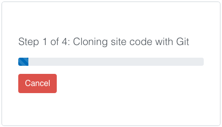
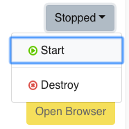
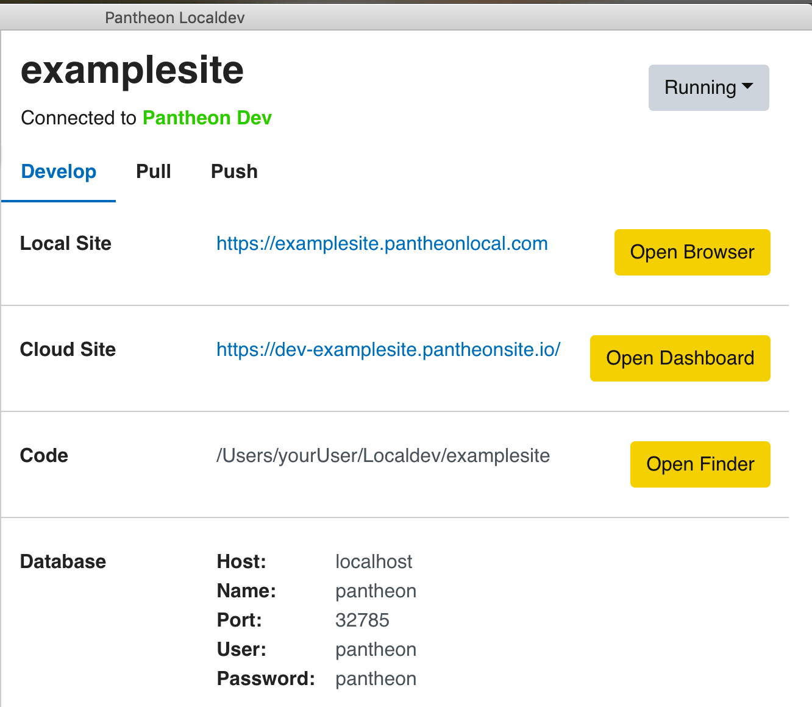

Pantheon offers a number of [ways to connect to your site](/guides/quickstart/connection-modes). In addition to Git and SFTP modes, [Pantheon Localdev](https://pantheon.io/localdev) gives you a graphical interface to your Pantheon sites, complete with a containerized local environment that makes it easy to develop and preview your site locally while still maintaining the [Pantheon Workflow](/pantheon-workflow).

Localdev lets you [use an integrated development environment (**IDE**)](#use-a-local-ide-to-develop-your-pantheon-site) to edit files and code, and push changes to Pantheon right from your desktop. Use it if you want to avoid the command line, or to develop sites with a fully functional local preview, even when you don't have an internet connection.

Localdev is in active development, with new features and updates coming soon. Please submit feedback and feature requests through the [Pantheon Localdev Customer Feedback](https://docs.google.com/forms/d/e/1FAIpQLSdy2WU7H3bSd94YmEuTvGhzmmT_xP3LlCgORXOkTt-M8UIAXw/viewform) form.

## Install and Connect Localdev

[Create a machine token](/machine-tokens/#create-a-machine-token) before you continue.

If you have an older version of Localdev already installed on your machine, remove it to avoid potential compatibility issues. Newer versions of Localdev include support for automatic updates.

1. Download and install the [latest Localdev](https://pantheon-localdev.s3.amazonaws.com/localdev-stable.dmg) `.dmg`
1. Localdev checks the Docker installation. Once it's done, click **Continue installation**
1. Enter the machine token you created for Localdev.
   - Click **View your Pantheon machine tokens** to open a browser to the *Machine Tokens* tab of your account.
1. Click **Submit Token** and wait for it to connect
1. Click **Begin sync** to synchronize Localdev with your account

Once Localdev is installed, a list of your sites is displayed in a column on the left.

## Download and Test Beta Versions
Download Edge versions to get the latest features, bug fixes, instructions, and help test Localdev.

1. From within your Localdev installation, select Settings in left menu.
1. In the Current Version section, click on `switch to edge`:

  

<Alert type="info" title="Note">

Help improve Localdev by sharing bug reports and feedback in the [GitHub issue queue](https://github.com/pantheon-systems/localdev-issues), or join the [Pantheon Community](/pantheon-community) to post in the [Localdev Slack channel](https://pantheon-community.slack.com/messages/CB2H8065D). Get your [Slack invite here](https://slackin.pantheon.io/).

</Alert>

## Connect and Clone your Site Locally

Select a site and click **Pull for local development** to clone the site locally and boot the local environment.

Each site is cloned to its own directory within `~/Localdev/` by default. If your site specifies `web_docroot: true` in its [pantheon.yml](/pantheon-yml/#site-local-configurations-pantheonyml) or [pantheon.upstream.yml](/pantheon-yml/#custom-upstream-configurations-pantheonupstreamyml) file (a nested docroot) the site's code will be located in the `web` subdirectory.

Since this is the first time you are cloning the entire site code, this will take several minutes. Unless you [reset Localdev to its defaults](#log-out-and-reset-to-defaults), you will only need to do this once per site.

If there are any errors, Localdev will revert all changes and return you to the "Clone your development site" screen. Try the process again, then consult the [Troubleshooting section](#faq-troubleshooting-and-support) below for how to contact Support.

## Start the Container

In the upper right hand corner, click the grey **Stopped** button and click **Start** to start the local server.

Once the container has been started, you can preview the site using the **Open Browser** button in the **Local Site** section, and track changed files using the **Pull** and **Push** tabs.

## Use a Local IDE to Develop your Pantheon Site

There are a number of IDEs that have built-in Git tools or plugins available for working with Git from within the IDE:

- [Atom](https://atom.io/)
- [Sublime Text](https://www.sublimetext.com/)
- [TextMate](https://macromates.com/)
- [Visual Studio Code](https://code.visualstudio.com)
- [PhpStorm](https://www.jetbrains.com/phpstorm)

See your editor's documentation for specific steps on how to commit and push changes from inside the editor.

## Push and Pull Changes to Pantheon

If you have a Git client that you're already comfortable with, you can use it to track, commit, push, and pull as you normally would. Navigate or point your Git client to track your local code directory, for example: `/Users/yourUser/Localdev/examplesite`.

To have Localdev deal with Git for you, use the **Pull** and **Push** tabs.

In **Pull** tab, check the **Pull code** option to copy the site's code from the Pantheon Dev environment to your local environment. The *Last Pull* line below each option's area shows the last time the code was synched.

After you make changes to your site:

1. Navigate to the **Push** tab
1. Select the information you want pushed to the Pantheon Development environment
1. Enter a **Git commit message** that describes the changes made in this particular push
1. Click **Push**

## Advanced Steps

For users looking to be more hands on and willing to use the terminal, try [Terminus](/terminus) and [Lando](https://docs.devwithlando.io/started.html). The [Local Development](/local-development) doc can help you get started.

## FAQ, Troubleshooting, and Support

### What does Localdev do about existing Lando config files?

Localdev will use the existing `.lando` file only when the site is initially cloned. After the initial site clone, there is currently no `lando rebuild` equivalent that will force Localdev to reconsider the landofile.

Note that if there are services specified in `.lando`, Localdev will return an error.

### Can WordPress Site Networks be developed through Localdev?

At this time, WordPress Site Network (also known as WordPress Multisite) development is not supported through Localdev.

### How do you configure PHP versions for sites in the LocalDev environment? 

LocalDev will [respect the changes made to your local `pantheon.yml`](https://pantheon.io/docs/php-versions#configure-php-version) file. 

A force rebuild is required for the changes to take effect:

 

You can verify which version of PHP your site is using by clicking Launch Terminal, then running `php -v`: 

### Contact Support / File an Issue

While Localdev is in beta, [support request best practices](/support/#best-practices) are especially important for our team to help you resolve the issue, or to report any potential issues in Localdev itself.

1. Navigate to the **Settings** tab and confirm that *Usage and Crash Data* is set to **Allow reports**. This allows the application to automatically submit crash data to Pantheon Support.
   - Application reports are collected and stored locally in `~/.pantheonlocaldev`.

1. Reproduce the error and note the steps taken.
   - If the error is inconsistent, make note of this as well. Multiple reports of an inconsistent error help our team troubleshoot.

1. Report the error:
   - [Contact Support via your Dashboard](https://dashboard.pantheon.io/#support/support/all) or [via Chat](/support/#real-time-chat-support) and include the steps you took to reproduce the error.

### Provide Feedback or Feature Requests

Please submit feedback and feature requests through the [Pantheon Localdev Customer Feedback](https://docs.google.com/forms/d/e/1FAIpQLSdy2WU7H3bSd94YmEuTvGhzmmT_xP3LlCgORXOkTt-M8UIAXw/viewform) form.

### Log out and Reset to Defaults

The steps in this section should only be used as a last resort. This resets Localdev and will remove the machine token and all local copies of your connected sites.

1. Click **Settings**
1. **Reset to defaults**
1. **Proceed with reset**

## Changelog

<LocaldevChangelog />
