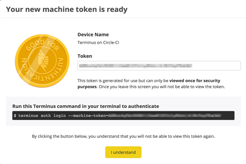

Machine tokens are used to uniquely identify your machine and securely authenticate via [Terminus](/terminus).

Machine tokens:  

- Provide the same access as your username and password
- Do not expire
- Can only be viewed when you’re creating it
- Should be revoked when no longer used to help keep your account safe

## Create a Machine Token

1. For [Legacy Dashboard](/guides/legacy-dashboard) users: from your User Dashboard, click **Account**, and select [Machine Tokens](https://dashboard.pantheon.io/users/#account/tokens/).

<Partial file="machine-tokens-new-dash.md" />

1. Click **Create Token**.

1. Enter a token name, and click **Generate Token**.

1. Copy and save your machine token now, as you will not be able to view or edit it later.

1. Click **I understand** to continue.



## Authenticate into Terminus

Use your token to authenticate into Terminus, replacing `<email@example.com>` and `<machine_token>`:

```bash{promptUser: user}
terminus auth:login --email=<email@example.com> --machine-token=<machine_token>
```

Machine tokens are keyed to the email address associated with your Pantheon user account. Once a token has been used to authenticate Terminus, future sessions are authenticated with your email address:

```bash{promptUser: user}
terminus auth:login --email <email@example.com>
```

## Switch Between Multiple Pantheon User Accounts

Machine tokens are paired with the email address associated with your Pantheon user account, so you can easily switch between users.

Log in to another account by running:

```bash{promptUser: user}
terminus auth:login --email <email@example.com>
```

## Revoke a Machine Token

For security purposes, we recommend removing tokens from your account when they are no longer used.

1. For [Legacy Dashboard](/guides/legacy-dashboard) users: from your User Dashboard, click **Account**, and select [Machine Tokens](https://dashboard.pantheon.io/users/#account/tokens/).

<Partial file="machine-tokens-new-dash.md" />

1. Locate the token you want to delete, and click **Revoke Token**.

1. Type **Revoke**, and click **I understand the consequences. Revoke this token.**

## Benefits of Using Machine Tokens

- Bot users with machine tokens can use Terminus to authenticate to and operate on Pantheon from a continuous integration (CI) server.

- Users in organizations with SAML Single-Sign On (SSO) can authenticate with Terminus.

## Troubleshooting

### Microsoft Edge

Currently, machine tokens cannot be generated using Microsoft Edge browser. As a workaround, generate the token using Mozilla Firefox or Google Chrome, which has been tested as working on Windows 10.

### Invalid Token Names

The following token names are not allowed, and will be automatically renamed to "Generic Feature Phone":

- pantheon hud
- pantheonHud
- pantheon-hud

## More Resources

[The Ins and Outs of Token-Based Authentication](https://scotch.io/tutorials/the-ins-and-outs-of-token-based-authentication)
