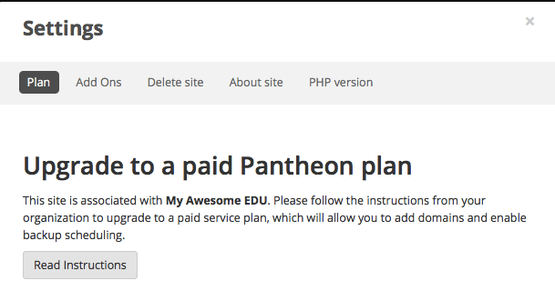
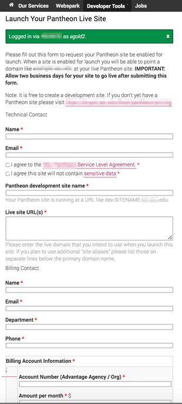

Pantheon for EDU+ allows Organization Administrators to manage who can change service level [plans](https://pantheon.io/pricing) for sites within their [organization](/organizations). When a site is associated with an EDU+ Organization, billing is managed through a contract with Pantheon, and only Organization Administrators can change a site's plan.

When a site is not associated with an organization, you can add a credit card to change the site's plan.

If you have a free Pantheon for EDU account and would like to upgrade to Pantheon for EDU+, [complete this form](https://pantheon.io/pantheon-edu-plus) to contact our Sales team.

## Specify Take Live/Payment Instructions

From the Organization Dashboard, click the **Settings** tab, find **Site Billing Configuration** and enter a **Customized Billing Instructions URL**, a **Customized Site Plan Change URL**, and a **Terms of Service** to be shown to users who are not Organization Administrators in the site's settings.

These settings allow a payment flow so your EDU+ Organization can collect information needed to take the site live, manage accounting, and chargebacks to the appropriate department or unit within your organization.

The URL includes information that you can use to auto-populate a form you control. For example:

```none
https://www.awesome.edu/technology/web/payment-form?site_name=my-site&id=6b23f58b-132b-4547-93bd-71bb34fc0b1d&service_level=free&owner=Jane%Smith&email=jane%40awesome.edu
```

This allows you to collect the site name, site UUID, site owner, and site owner's email address. You may also want to collect an accounting number, desired plan, technical contact name and email address, domain names, desired go live date, and additional comments.

## Change the Service Level (Org Admin)

1. From the Site Dashboard, click the **Upgrade** button:

 

 Otherwise, click the **current plan** next to the site name:

 

1. Click **Select** below the plan you choose, and select the Plan Size if it's a Performance plan.

1. Review the new plan on the **Confirm Purchase** page, and click **Place Your Order**.

  Because billing is handled by the organization, the plan change is immediate, and you'll be returned to the Site Dashboard.

   - If the site plan isn't shown on the Dashboard immediately, refresh the page or click the **Workflows** button for status.

## Change the Service Level (Team Member)

1. From your Site Dashboard, select **Settings**.
2. Your organization has specific information you'll need to complete. Click **Read Instructions** to continue.  

3. Enter the required site and plan information in your organization's form. Below is an example form; however, each organization will have its own custom form.

