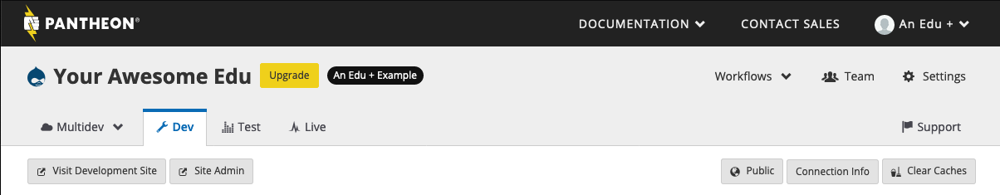
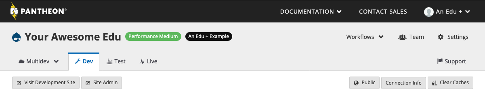

Pantheon for EDU+ allows Organization Administrators to manage [site plans](https://pantheon.io/pricing) for sites within their [organization](/organizations). When a site is associated with an EDU+ Organization, billing is managed through a contract with Pantheon, and only Organization Administrators can confirm a site plan change.

If you have a free Pantheon for EDU account and would like to upgrade to Pantheon for EDU+, [complete this form](https://pantheon.io/pantheon-edu-plus) to contact our Sales team.

## Change the Site Plan

1. As an [organization administrator](/change-management#roles-and-permissions), from the Site Dashboard, click the **Upgrade** button:

 

 Otherwise, click the **current plan** next to the site name:

 

1. Click **Select** below the plan you choose, and select the Plan Size if it's a Performance plan.

  

1. Review the new plan on the **Confirm Purchase** page, and click **Place Your Order**.

  Because billing is handled by the organization, the plan change is immediate, and you'll be returned to the Site Dashboard.

    - If the site plan isn't shown on the Dashboard immediately, refresh the page or click the **Workflows** button for status.
