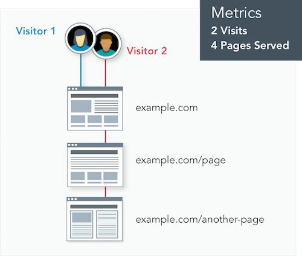

## Access Metrics
1. Navigate to ** Metrics** within the ** Live** environment of your Site Dashboard.
2. Toggle available date ranges by clicking **Day**, **Week**, or **Month**:
  

## Available Metrics
<Partial file="traffic-dl.md" />

Imagine two visitors go to `example.com`. The first visitor exits from the home page, but the second visitor continues to browse two additional pages. This would be tracked as **2 Visits** and **4 Pages Served**.

_Visits_ and _visitors_ have different meanings. If one of the visitors returns again the next day, it would be counted as 3 Visits, but there'd be only 2 visitors.
## Frequently Asked Questions

### How often is data collected?
Data is updated daily, shortly after midnight UTC, with data for the previous day.

### How long do you keep the data?
Data is retained for the following amounts of time:

| Period  | Data Retention |
| ------- | -------------- |
| Day     | 28 days        |
| Week    | 12 weeks       |
| Month   | 12 months      |

### Can I download or access the raw data directly?
Raw data is not currently available.

### Why doesn't Pantheon's traffic match my analytics?

There are some inherent limitations with using an analytics suite (e.g. Google Analytics) when measuring site traffic. For details, see [Traffic Limits and Overages](/traffic-limits/#why-doesnt-pantheons-traffic-match-my-analytics).

This table shows some of the reasons why traffic in the Dashboard may differ from your analytics suite:

<Partial file="traffic-analytics-table.md" />

### How does Pantheon handle overages?
All non-Basic plans come with free overage protection. Where there is a pattern of consistent overage, we will align a site's plans with its load on the platform. For details, see [Traffic Limits and Overages](/traffic-limits).

### What about bots?
Pantheon-identified bots are excluded from the Visits and Pages Served Metrics.

### What about redirects?
Only requests with a 2xx status count as pages served, so 301 redirects will not be included in metrics.

### Can I see metrics for other environments?
Yes! Metrics are now available for the entire site or by environment via the [Terminus](/terminus) `metrics` command.

### Why don't I see any data, or why don't I see a full 12 months of data?
Data is shown for dates after March 18, 2018. If your site is not yet on the Global CDN data will not be available. To upgrade, see [Pantheon Global CDN](/global-cdn).

### Are multiple user agents on the same originating IP address counted separately?
Yes. For example, multiple devices on the same home network visiting your site would each be considered a unique visitor.

### Can I check metrics from the command line with Terminus?
Yes! Access to metrics via the Terminus `metrics` command. [Install Terminus](/terminus/install) or update to the [current release](/terminus/updates#updates) for access to the `metrics` command.

## See Also
- [Traffic Limits and Overages](/traffic-limits)
- [Manage Plans in the Site Dashboard](/site-plan)
- [Site Plans FAQs](/site-plans-faq)
