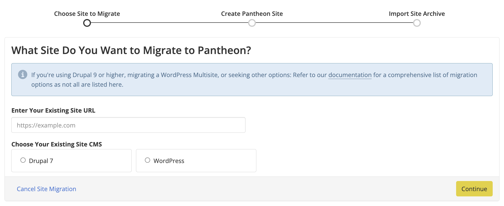
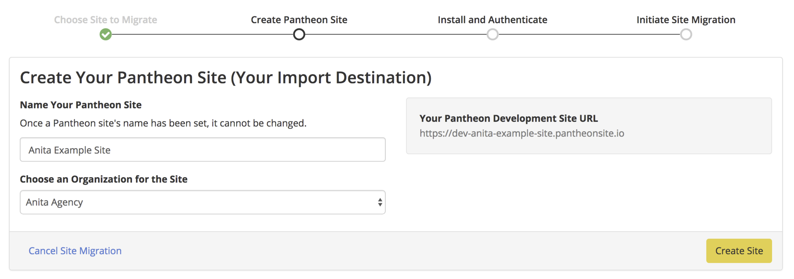
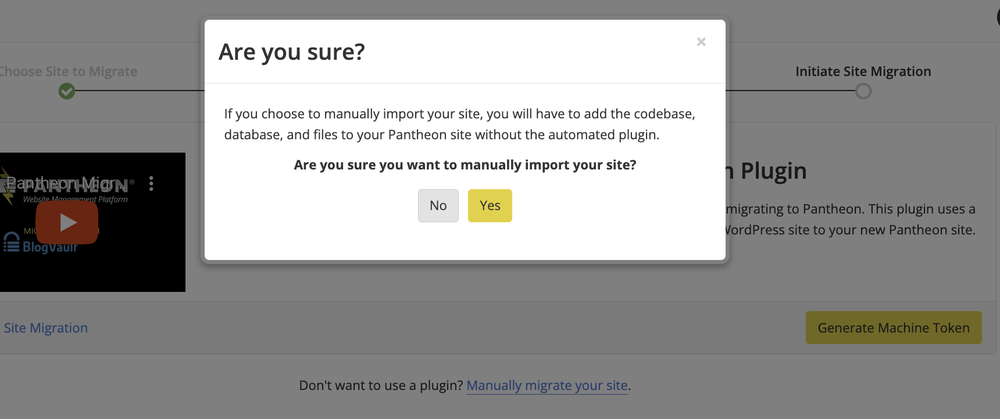
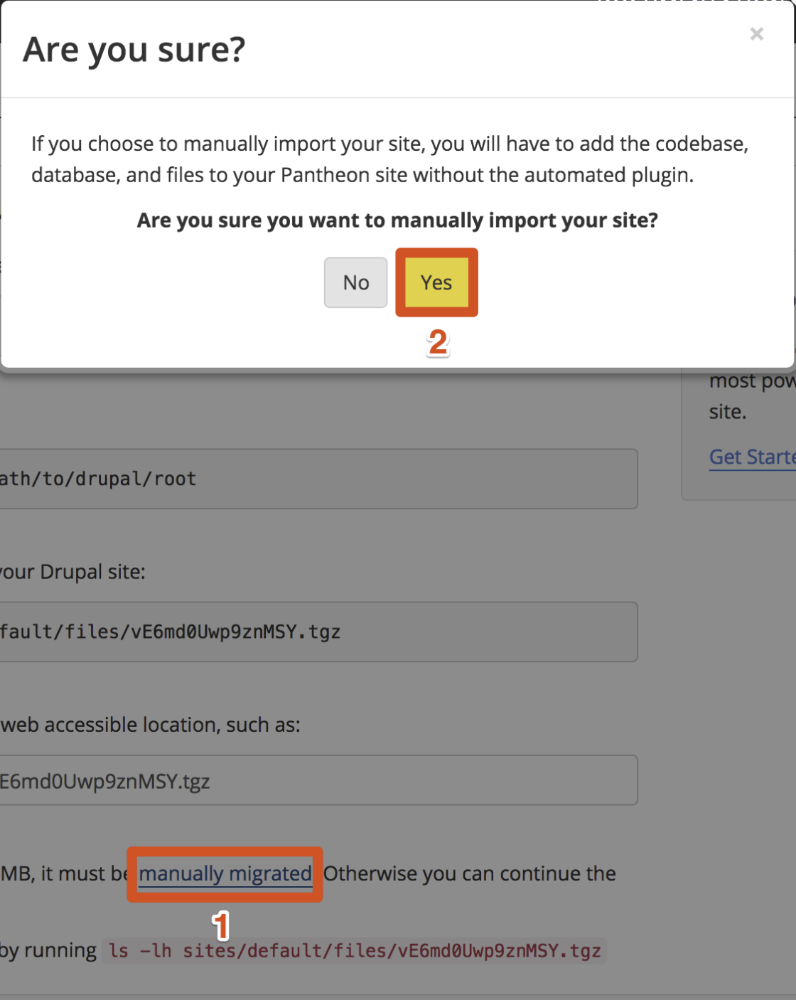
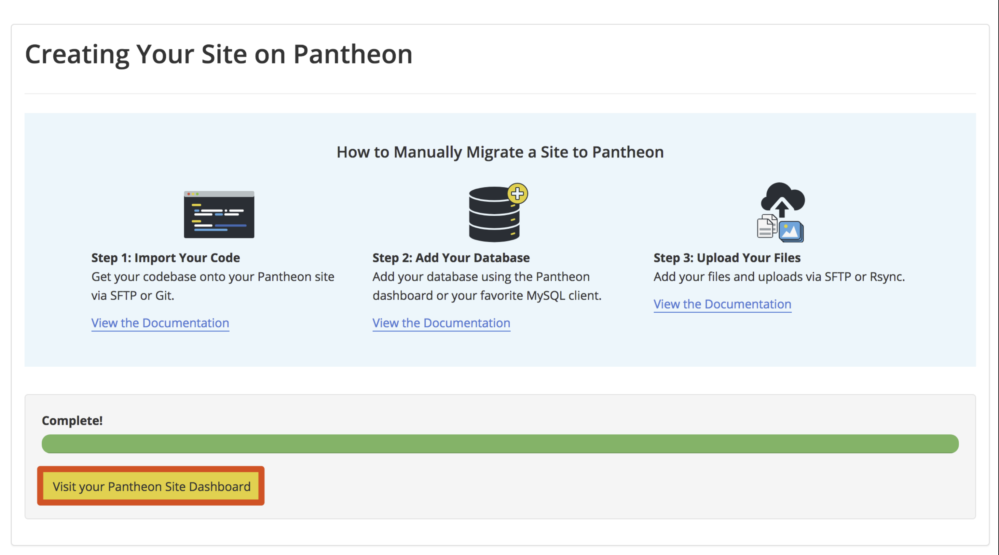
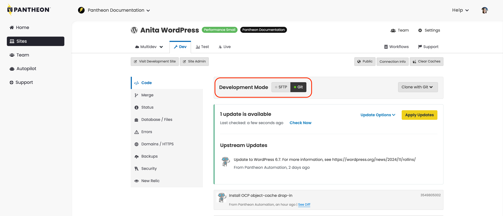

Manually migrate your site to Pantheon when any of the following apply:

<Alert title="Note" type="info" >

If you are using Drupal version 9 or higher, or are moving a Drupal site **and** want to upgrade to the latest version of Drupal, use one of the following guides instead:

- Your site is Composer-managed: [Migrate a Composer Managed Drupal Site from Another Platform](/guides/drupal-unhosted-composer) or  [Import Drush Site Archives with Terminus](/guides/drush/drush-import)
- Your site is not Composer-managed: [Migrate a Drupal Site from Another Platform](/guides/drupal-unhosted)

</Alert>

- **Large Drupal Site Archive**: Site archive exceeds the import file size limit of 500MB.
- **Large WordPress Site**: WordPress site exceeds 500MB.
- **Preserve Git History**: You'd like to preserve your site's existing Git commit history.
- **[WordPress Multisite](/guides/multisite)**
- **Plugin install unavailable on existing WordPress site**: For example, if your existing site is hosted on WordPress.com, you'll be unable to install the Pantheon Migrations plugin.
- **Local WordPress Site**: If your WordPress site is only on your local machine and not yet live.
- **Debug Failed Migration**: It can be helpful to migrate your code, database, and files separately if the standard migration procedure failed.


<Alert title="Note for Composer-based Sites" type="info" >

The steps outlined below do not work for Composer-based sites. If you have need help migrating a Composer-based site (or any site, for that matter), site migrations are one of the services offered by our [Professional Services](/guides/professional-services/website-migration-service) team.

</Alert>

## Before You Begin

To ensure a successful migration, complete the following tasks on the source site before you start:

- Read [Platform Considerations](/guides/platform-considerations)
- Upgrade to the latest version of WordPress or Drupal core
- Reference your plugins and/or modules against [Modules and Plugins with Known Issues](/modules-plugins-known-issues)
- Make sure your code is compatible with PHP 7.2 or greater. Review your [CMS's PHP version requirements](/guides/php/php-versions#cms-version-requirements). You may need to [adjust PHP versions](/guides/php/php-versions#configure-php-version).
- Clear all caches
- Remove unneeded code, database tables, and files
- [Configure SSH keys](/ssh-keys)

<Accordion title="Advanced Tips for Successful Migration" id="advanced-before-you-begin" icon="lightbulb">

#### .gitignore

Check the contents of your current codebase for existing `.gitignore` files. To be compatible with the platform, using the Pantheon version is advised. Otherwise, attempts to import files to restricted paths could break the import process. See the platform-provided versions for [WordPress](https://github.com/pantheon-systems/WordPress/blob/default/.gitignore), [Drupal 7](https://github.com/pantheon-systems/drops-7/blob/master/.gitignore), and [Drupal (Latest Version)](https://github.com/pantheon-upstreams/drupal-composer-managed/blob/main/.gitignore).

#### Local Drupal configurations

To preserve the database connection credentials for a site built on a local development environment, and to exclude them from version control, move your `settings.php` file to `settings.local.php` and add it to `.gitignore` so that it will be ignored by Git and included from Pantheon's `settings.php` when working on your site locally. Make sure that you can modify it, and restore the protections after the move:

```bash{promptUser: user}
chmod u+w sites/default/{.,settings.php}
mv sites/default/{settings.php,settings.local.php}
chmod u-w sites/default/{settings.local.php,.}
```

Sites running Drupal 7 must add a `settings.php` file that includes `settings.local.php` as this file is not bundled on Pantheon.

</Accordion>

## Create Pantheon Site

1. [Go to your Personal Workspace](/guides/account-mgmt/workspace-sites-teams/workspaces#switch-between-workspaces) and click the **Migrate Existing Site** button:

1. Enter your current website URL, choose your site type, and click **Continue**:

   

   Note: It is possible to upload a site running locally by putting in the local url. For example, (`http://localhost`).

1. Name your site and select an [Workspace](/guides/account-mgmt/workspace-sites-teams/workspaces) (optional), then click **Create Site**:

   

1. Click the link to manually migrate your site then select **Yes** to confirm:

  <TabList>

  <Tab title="WordPress" id="wp-confirm" active={true}>

  

  </Tab>

  <Tab title="Drupal" id="drops-confirm">

  

  </Tab>

  </TabList>

1. Click **Visit your Pantheon Site Dashboard**:

  

Now that you have a new site on Pantheon, you're ready to add the major components from your existing site: custom code, files, and the database.

## Import Your Code

Your **code** is all custom and contributed modules or plugins, themes, and libraries. The codebase should not include the `wp-content/uploads` (WordPress) / `sites/default/files` (Drupal) directory, or any other static assets you do not want tracked by version control.

The codebase for each CMS upstream offered by Pantheon can be found on GitHub:

 - [Drupal 7](https://github.com/pantheon-systems/drops-7)
 - [Drupal 9+](https://github.com/pantheon-upstreams/drupal-composer-managed)
 - [WordPress](https://github.com/pantheon-systems/wordpress)

  <Alert title="Note" type="info">

  If your existing site is already version controlled and you would like to preserve the commit history, import the code from the command line with Git using the instructions below. If you prefer to avoid the command line entirely, we suggest importing the codebase using an SFTP Client such as [Transmit](https://panic.com/transmit/) or [Cyberduck](https://cyberduck.io/).

  </Alert>

### SFTP Client

1. Navigate to **<Icon icon="code" /> Code** in the **<Icon icon="wrench" /> Dev** tab of your Site Dashboard. Confirm that Development Mode is set to **SFTP**.

1. Click **Connect with SFTP** to access the credentials for connecting to your preferred SFTP client.

1. Click **Open SFTP Client** to open your default local SFTP client, and enter your password when prompted.

  If you run into issues, please refer to Pantheon's [SFTP documentation](/guides/sftp/sftp-connection-info).

1. Do not overwrite WordPress or Drupal core files on your Pantheon site. Upload your existing site's themes as well as plugins or modules to their locations within the root directory (`code` or `wp-content`, as shown below).

  <TabList>

  <Tab title="WordPress" id="wp-code" active={true}>

    Copy the following directories from your existing site to a matching directory in your new site's `code/wp-content` directory:

    - `mu-plugins`
    - `plugins`
    - `themes`

    As well as any other folders under `wp-content` that are *not* `wp-content/uploads`.

  </Tab>

  <Tab title="Drupal" id="d7-code">

    Copy all files and folders inside the `code/sites` directory, *except* `code/sites/default/files`, from your existing site to a matching directory in your new site's `code/sites`:

    - `libraries`
    - `modules`
    - `profile`
    - `themes`
    - `vendor`
    - `sites`, excluding `sites/default/files`.

    Refer to the "Custom and contrib parts of your Drupal project" section of [Basic Directory Structure of a Drupal Project](https://www.drupal.org/node/2621480) for more details.

  <Alert title="Note" type="info" >

    You must prepare the directory and the database if you are using Multisite and want to migrate a sub-site.

    1. Copy the base site to a new directory.

    1. Delete all sites, with the exception of:

       - `sites/{sitename}`: the site you are migrating
       - `sites/all`: contains all of your site's modules and themes

    1. Rename `sites/{sitename}`  to `sites/default`.

  </Alert>

  </Tab>

  </TabList>

1. Return to the Site Dashboard on Pantheon, and you should see quite a few files ready to be committed to version control. Write a commit message such as "Import existing codebase" then click **Commit**.

### Git

1. Navigate to your existing site's code directory in a local terminal. If your existing code is _not_ already version controlled with Git, create a repository and add an initial commit:

    ```bash{promptUser: user}
    git init
    git add .
    git commit -m "initial commit"
    ```

1. From the **<Icon icon="wrench" /> Dev** environment of the Site Dashboard, set the site's Development Mode to Git:

  

1. Copy the SSH URL for the site repository. *Do not copy* `git clone` or the site name.

  The URL should look similar to the following:

  ```bash
  ssh://codeserver.dev.{site-id}@codeserver.dev.{site-id}.drush.in:2222/~/repository.git
  ```

1. Add your new Pantheon site as a remote destination for your local code repository (replace `<ssh_url>` with the SSH URL copied in the previous step):

  ```bash{promptUser: user}
  git remote add pantheon <ssh_url>
  ```

1. Select the appropriate version of Git running on your local machine (`git --version`), then merge the codebase from your new Pantheon site with your existing site's codebase:

  <TabList>

  <Tab title="Git 2.8 and Below" id="28-step6">

  ```bash{promptUser: user}
  git pull --no-rebase --squash -Xtheirs pantheon master
  ```

  </Tab>

  <Tab title="Git 2.9 and Above" id="29-step6"  active={true}>

  ```bash{promptUser: user}
  git pull --no-rebase --squash -Xtheirs pantheon master --allow-unrelated-histories
  ```

  </Tab>

  </TabList>

  The output will resemble:

  ```bash
  Squash commit -- not updating HEAD
  Automatic merge went well; stopped before committing as requested
  ```

  If you are prompted for authentication, configure an [SSH Keys](/ssh-keys).

1. Review your current index using `git status`, then commit all changes.

  ```bash{promptUser: user}
  git add .
  git commit -m "Adding Pantheon core files"
  ```

1. Align your local branch with its remote counterpart on Pantheon:

  <TabList>

  <Tab title="Git 2.8 and Below" id="28-step8">

  ```bash{promptUser: user}
  git pull pantheon master --no-rebase
  ```

  </Tab>

  <Tab title="Git 2.9 and Above" id="29-step8" active={true}>

  ```bash{promptUser: user}
  git pull pantheon master --no-rebase --allow-unrelated-histories
  ```

  </Tab>

  </TabList>

1. Push your newly merged codebase up to your Pantheon site repository:

  ```bash{promptUser: user}
  git push pantheon master
  ```

1. Go to the **<Icon icon="code" /> Code** tab of your **<Icon icon="wrench" /> Dev** environment on the Site Dashboard. You should see your site's pre-existing commit history and the most recent commit adding Pantheon's core files.

## Add Your Database

The **Database** import requires a single `.sql` dump that contains the site's content and configurations.

1. Create a `.sql` dump using the [mysqldump](https://dev.mysql.com/doc/refman/5.7/en/mysqldump.html) utility. For example:

  ```bash
  mysqldump db_name > backup-file.sql
  ```

1. Enter your username and password when prompted to authenticate the command.

    - You might want to consider using a terminus credential fetch to avoid entering credentials for future automation steps.

1. Run the command below to load the dump file back into the server:

  ```bash
  mysql db_name < backup-file.sql
  ```

You can also use the Pantheon Dashboard to add your site's database.

<Partial file="drupal/migrate-add-database-part2.md" />

## Migrate Your Files

**Files** refer to anything within `sites/default/files` for Drupal or `wp-content/uploads` for WordPress, which typically includes:

- Uploaded images
- Generated stylesheets
- Aggregated scripts

Files are not under Git version control and are stored separately from the site's code. You must create and archive of your files and export it before you can upload it.

### Export Your Files

Export a `tar.gz` or `.zip` file of your files directory:

  <TabList>

  <Tab title="WordPress" id="files-wp-anchor" active={true}>

  Navigate to your WordPress site's root directory to run this command, which will create an archive file in your user's home directory:

  ```bash{promptUser: user}
  cd wp-content/uploads
  tar -czf ~/files.tar.gz .
  ```

  </Tab>

  <Tab title="Drupal" id="files-drops-anchor">

  Navigate to your Drupal site's root directory to run this command, which will create an archive file in your user's home directory:

  ```bash{promptUser: user}
  cd sites/default/files
  tar -czf ~/files.tar.gz .
  ```

  </Tab>

  </TabList>

### Upload Your Files

You can use the Pantheon Dashboard, SFTP, or Rsync to upload your site's files.

#### Pantheon Dashboard

1. [Go to the Site Dashboard](/guides/account-mgmt/workspace-sites-teams/sites#site-dashboard), select the **<Icon icon="wrench" /> Dev** environment, select **<Icon icon="server" /> Database / Files**, and click **Import** to add your archive accordingly (based on file size):

<Partial file="drupal/migrate-add-files-part3.md" />


#### SFTP

Follow the [SFTP instructions](/guides/sftp/rsync-and-sftp#sftp) in the [Large File Transfers with rsync and SFTP](/guides/sftp/rsync-and-sftp) documentation.

#### rsync

Follow the [Transfer Files with rsync](/guides/sftp/rsync-and-sftp#transfer-files-with-rsync) instructions in the [Large File Transfers with rsync and SFTP](/guides/sftp/rsync-and-sftp) documentation.

## Final Migration Steps

You should now have all three of the major components of your site imported into Pantheon.

1. Clear your caches on the Pantheon Dashboard.

1. Confirm that everything looks and behaves as expected.

1. Run the [terminus site:import:complete <site_name>](/terminus/commands/import-complete) command to complete the import process.

## Troubleshooting

### fatal: Not possible to fast-forward, aborting.

This error may occur when trying to merge Pantheon's codebase into your existing repository as described earlier on this page in (step 5 of [importing your code from the command line](#from-the-command-line-with-git):

```bash
Not possible to fast-forward, aborting.
```

Depending on your Git version, you may see the following error instead:

```bash
fatal: refusing to merge unrelated histories
```

If you see this, it is possible your local Git configuration is disallowing non-fast-forward merges:

```ini
[pull]
rebase = TRUE
ff = only
```

In this case, you will want to remove `ff = only` from your `.gitconfig` file and try the merge command again.

## More Resources

- [Frequently Asked Questions](/guides/guided/faq)

- [Troubleshooting](/guides/guided/troubleshooting) tips

- [Importing Drush Site Archives with Terminus](/guides/drush/drush-import)
