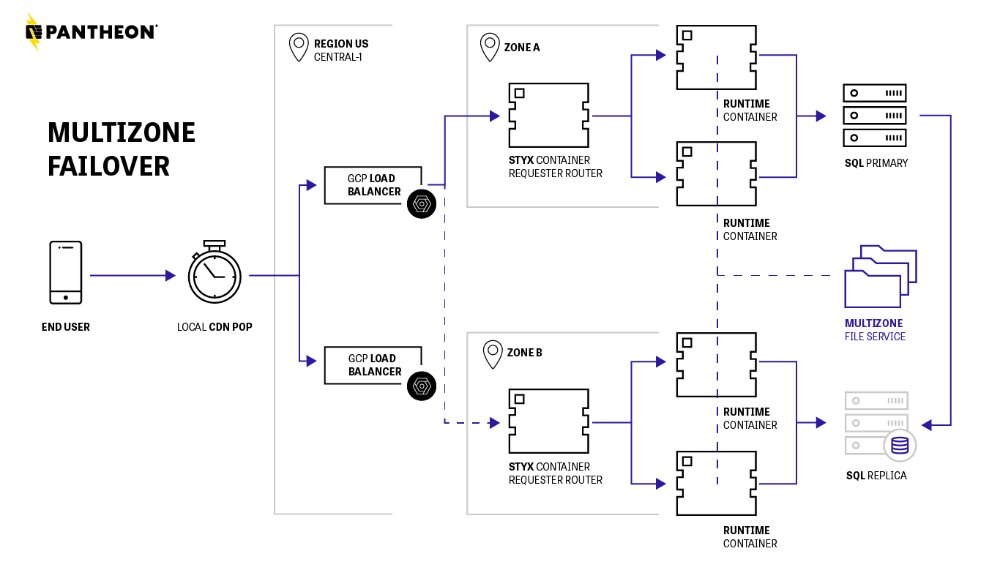
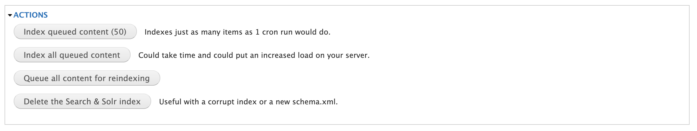
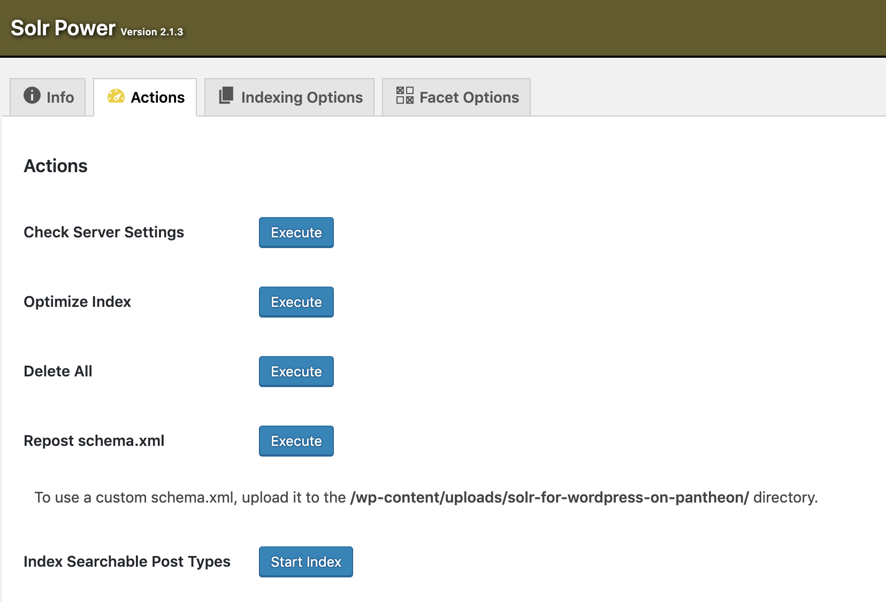

## Overview

[<dfn id="mzfailover">Multizone Failover</dfn>](https://pantheon.io/features/disaster-recovery?docs) is a high-availability Disaster Recovery solution with intelligent failover at the Global CDN layer.

It includes 24/7 support and a guaranteed 99.99% uptime Service Level Agreement (**SLA**) to keep sites from going down, and to actively respond to any incident that might occur.



### RPO and RTO - Minutes to Recovery

Multizone Failover monitors datacenter health and proactively manages failover to avoid or minimize data loss.

Recovery Point Objective (**RPO**) is a baseline of reasonably acceptable data loss in the event of a major outage. In short, think “lost transactions.” The RPO is largely determined by whether there is replication lag or not, which can result from heavy transactional load on the site’s database. We rarely see replication lag, and when we do, we have automated tools to rebuild the site’s replica and alert our team if a site is consistently experiencing replication lag. This way, we can proactively notify you so you can work toward a solution. For sites with Multizone Failover enabled, Pantheon’s RPO is 5 minutes.

Recovery Time Objective (**RTO**) is the target amount of time within which a business process must be restored after a disaster in order to avoid unacceptable consequences from a break in business continuity. In short, think “time down.” For sites with Multizone Failover enabled, Pantheon’s RTO is 15 minutes.

## Access

Site Multizone Failover is available for purchase as an add-on to all Elite site plans except Elite Starter. For more information, please [contact Sales](https://pantheon.io/contact-us?docs).

## Features

### High Availability

The Pantheon Platform has redundancy built-in throughout our containerized infrastructure. In addition, sites with Multizone Failover get a replicated database in an alternative availability zone for even higher availability.

### Intelligent Failover

Pantheon is constantly running infrastructure checks to ensure all systems are running smoothly. If we ever detect elevated error rates in any of our zones, we failover to a backup zone.

### Persistent Zone Coverage

In the event of a zone failure we reroute your site to the backup zone and provision a new replica in a healthy zone.

### Real-time Failover Support

Pantheon’s disaster response team will proactively notify you of a zone failure event and its impact to your site. Your dedicated team will keep clear and transparent lines of communication on any action taken to keep your site online, and is available 24/7 for all of your questions.

## Object Cache & Multizone Failover Best Practices

The object cache is not preserved after a site failover. This means you must ensure that the site can handle having its cache dropped under regular visitor traffic in order for the site to operate as expected in a failover scenario.

To test in a Test Environment, click the **Clear Caches** button in the upper right hand corner of the Site Dashboard.

You can also [connect to your Redis instance](/object-cache#use-the-redis-command-line-client) and run the `flushall` command to clear object cache via the Redis CLI.

If you rely on the Redis cache for locks (mutexes) or storing other long-term data, you must move them out of Redis and into the database to avoid any issues when the Redis cache is dropped during failover.

## Search and Multizone Failover

### Considerations for Sites Requiring Highly Available Search

While [Pantheon Search](/solr) can be enabled on a site with Multizone Failover, Pantheon's Search service is not highly available, nor does it include failover for Solr. The RTO and RPO do not apply to Pantheon's Search Service.

If your site requires highly available search, do not use Pantheon's Search service. If you require a highly available Solr service, please consider an [alternative Solr service](/solr#alternatives-to-pantheons-solr-service).

### Using Pantheon Search on Sites With Multizone Failover

Pantheon Search requires additional considerations when used on sites with Multizone Failover. Solr will not automatically rebuild the search index for sites using Pantheon Search and Multizone Failover. You will need to:

1. Create a support ticket requesting that Pantheon manually re-provision Solr for you if your site fails over.

    <Alert title="Note"  type="info" >

    The failover state becomes the new default when a site fails over. This means that Solr re-provisioning is done in the failover state.

    </Alert>

1. Manually re-index Solr after you are notified through the support ticket that Pantheon is done re-provisioning Solr. The re-indexing process is application-side, and varies by site.


<TabList>

<Tab title="Drupal 8" id="solr-d8" active={true}>

#### Using the search_api_pantheon module

1. As a site administrator, navigate to `/admin/config/search/search-api/server/pantheon`.

1. Click **Delete all indexed data on this server** to queue all content for re-indexing.

1. Run Drupal Cron manually until all items have been indexed. You can determine that all items are indexed when search_api stops logging to watchdog on the cron runs.

</Tab>

<Tab title="Drupal 7" id="solr-d7">

#### ApacheSolr module

You can do this at `admin/config/search/apachesolr`. Click **Queue all content for reindexing** to initiate. This will add content that has not yet been indexed to the Solr indexing queue (following the configured items-per-cron-event setting).



#### Search API Solr module

Navigate to your Search Index list page at `admin/config/search/search_api` and click the index you need to rebuild. On the index view page, you can either queue all items for reindexing or clear your existing index and re-index in batches.

</Tab>

<Tab title="WordPress" id="solr-wp">

You can initiate the reindexing process from the WordPress dashboard or via Terminus.

To reindex from the WordPress Dashboard, navigate to `/wp-admin/admin.php?page=solr-power#top#solr_action` and click **Start Index**.



You can also do this via Terminus:

```bash{promptUser: user}
terminus wp <site>.<env> -- solr index
```

For WP Site Networks, you will need to index all your subsites individually:

```bash{promptUser: user
terminus wp <site>.<env> -- url=example.pantheonsite.io/subsite solr index
```

Read more about configuring and optimizing Solr Power in the [Solr Search for WordPress](/wordpress-solr) documentation.

</Tab>

</TabList>

### Mitigating Solr/Multizone Failover issues

You may also consider one of the following options:

- Use an [Alternative Solr Service](/solr#alternatives-to-pantheons-search-service)

- **For Drupal:** Configure search to write to both Pantheon Solr and another index (either Drupal core search or an external Solr service) as a fallback. In the event the site must be recovered after a disaster, search forms can then be manually re-pointed at the fallback index until your Pantheon Solr instance has been rebuilt and re-indexed.

If none of these options work for your site's needs, see our documentation on how to safely remove Pantheon Search for [Drupal 8](/guides/solr-drupal/solr-drupal-8#safely-remove-pantheon-search), [Drupal 7](/guides/solr-drupal/solr-drupal-7/#safely-remove-solr), and [WordPress](/wordpress-solr/#safely-remove-solr).

## See also

- [Global Regions](/regions)
- [Backups Tool](/backups)
