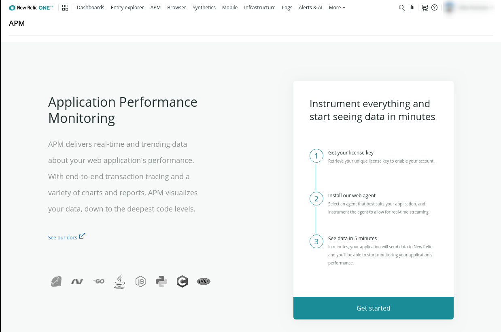

[New Relic&reg; Performance Monitoring](https://newrelic.com/) offers a wide array of metrics that provide a nearly real-time look into the performance of a web application. Using New Relic not only makes it easy for you to monitor your performance, but it can also speed up the support process by helping our support team visualize corresponding performance and symptoms.

## Supported Site Plans

All plans except for a Basic plan can use New Relic&reg; Performance Monitoring. New Relic&reg; Performance Monitoring is available to Sandbox site plans for developmental purposes, but New Relic&reg; Performance Monitoring will not be available going live on a Basic plan.

| Plans         | New Relic&reg; Performance Monitoring Support <Popover content="Available across all environments, including Multidevs." /> |
| ------------- | ------- |
| Sandbox       | ✓       |
| Basic         |         |
| Performance   | ✓       |
| Elite         | ✓       |

<Alert title="Note" type="info" >New Relic&reg; is not supported on sites using PHP 8.1. </Alert>

## Activate New Relic&reg; Performance Monitoring

Select the <i className="fa fa-eye"></i> **New Relic** tab on your Site Dashboard, and click **Activate New Relic Pro**:

  

Visit your site in the browser a couple of times to generate data in New Relic. After a few minutes pass, go to the New Relic tab on your Dashboard, and click **Go to New Relic**.

New Relic is automatically enabled for all application containers added to the site, including Multidev environments.

## New Relic&reg; Performance Monitoring Access

1. Go to the <i className="fa fa-eye"></i> **New Relic** tab on your Site Dashboard, and click **Go to New Relic**:

  

1. Ignore the **Get started**, button, and select **APM** from the menu at the top:

  

1. After agreeing to the New Relic terms of service, you can access the data for your site:

  

  

### Who is the New Relic account associated with?

* If the site owner is a **user**, the site owner's name and email address is used to create the New Relic account.
* If the site owner is an **organization**, the name and email address of the organization's Pantheon user who activates New Relic is used to create the New Relic account.

In both cases, there is not a one-to-one mapping between Pantheon users and New Relic users. Every Pantheon user selecting **Go to New Relic** from the Pantheon dashboard is logged in as the same New Relic user.

### If you go to the New Relic Dashboard and see "You do not have permission to view this account"

1. From the New Relic Dashboard, click on the User Account to the right.
1. From the Dropdown, click **Log Out**.
1. Back on the Pantheon Site Dashboard, click the **Go to New Relic** button.

### If you click the Go to New Relic button and are instead sent to a log in screen

To troubleshoot this issue, try logging into the Pantheon Dashboard in an [Incognito](https://support.google.com/chrome/answer/95464) or [Private](https://support.mozilla.org/en-US/kb/private-browsing-use-firefox-without-history) window. The New Relic accounts are shared via SSO, so loading the page in a private window will force new sign-in credentials. If you can sign in this way, use the following steps to resolve access for your main browser session:

1. Close all of your open New Relic tabs.
1. Delete all of the New Relic cookies from your browser (support articles for [Chrome](https://support.google.com/chrome/answer/95647) or [Firefox](https://support.mozilla.org/en-US/kb/clear-cookies-and-site-data-firefox#w_clear-cookies-for-any-website)).
1. Reload your Pantheon Dashboard.
1. Click the **Go to New Relic** button.

### If you are prompted to Set Up New Relic

If you try to access New Relic prior to any traffic reaching an environment, you will be prompted to set up New Relic.

1. Visit one of your site pages.
1. Close the tab, wait a few minutes.
1. Click the **Go to New Relic** button.

### If you see "We're sorry, you haven't verified your email address yet."

After activating New Relic&reg; Performance Monitoring, a confirmation email will be sent to the site owner to complete the setup process. The account will need to be verified first before members of the site can access New Relic dashboard.

If the New Relic account holder, i.e. the site owner or user who activated the New Relic account for the site, did not receive the confirmation email, you can re-send the link by clicking "Forgot your password":

1. On New Relic's login page, click **Forgot your password?**.
1. Enter the email address of the site owner.
1. Click **Send my reset link**.
1. Open the email you will receive, click the reset link, and follow the prompts to access your account.

Contact Support if you are unsure what user the New Relic account is associated with and unable to identify where the password reset email has been sent.

## Configure Ping Monitors for Availability

New Relic provides a free availability monitoring service within their Synthetics tool suite at the Lite service level. This basic monitoring check sends a request to designated URLs from configured locations at given intervals and alerts you via email when a response fails. To configure this service:

1. Click **New Relic** > **Go to New Relic** from the target environment within the Site Dashboard on Pantheon.
1. Select **Synthetics** from the menu bar at the top of the page.
1. From the **Monitors** tab (default), click **Add new**, and enter the details for the URL you want to monitor.
1. Select the locations you wish to check the site from. We recommend picking locations that correspond to your site's visitors to reduce the risk of false-positives due to long-distance networking snafus.
1. Set the frequency for checks. We suggest 5 minutes.
1. Provide an email address for notifications.
1. Click **Create my monitor**.

Pantheon can provide New Relic ping monitoring for free as part of the service. However, more advanced monitoring — full browser testing, or scripted interactions — is only available to customers on an annual contract and requires an additional cost. Contact our sales team or your dedicated account manager for details.

## Monitoring and Improving Performance

New Relic's Dashboard starts with a high-level breakdown of application performance by dividing response time into three segments in its main graph:

1. PHP Execution
1. Database Queries (MySQL or Redis)
1. External Requests (e.g. calls to third-party APIs)

Depending on which area you need to optimize, you will dig in to different areas of data. For instance, a lot of [time spent in the database](/debug-mysql-new-relic) could be the result of slow queries, or an elevated volume of queries overall.

For more information on using New Relic's features, we encourage you to read the [New Relic APM](https://docs.newrelic.com/docs/apm) docs, especially the pages on [transactions](https://docs.newrelic.com/docs/apm/transactions) and [slow query details](https://docs.newrelic.com/docs/apm/applications-menu/monitoring/viewing-slow-query-details). You can find more information on using New Relic to investigate specific areas of performance below:

* [Measuring PHP7 Performance with New Relic](https://pantheon.io/blog/measuring-php-7-performance-new-relic-nobsbenchmarks)
* [MySQL Troubleshooting With New Relic&reg; Performance Monitoring](/debug-mysql-new-relic)
* [New Relic&reg; Performance Monitoring and Drupal: Find Your Site's Slow Spots](https://pantheon.io/blog/new-relic-drupal-find-site-slow-spots)
* [Troubleshooting WordPress Performance with New Relic&reg; Performance Monitoring](https://pantheon.io/blog/troubleshooting-wordpress-performance-new-relic)

## Focusing on Authenticated Users Only

If your site consists of mostly authenticated traffic, it can be useful to exclude anonymous users who are using your site's page cache. This technique will still capture form submissions, including logins and contact pages. Similar logic can be used to disable New Relic on certain paths, such as `/admin` in Drupal or `/wp-admin` in WordPress.

### Drupal

To disable New Relic for anonymous traffic on Drupal-based sites, add the following to your `sites/default/settings.php`:

```php:title=settings.php
// Disable New Relic for anonymous users.
if (function_exists('newrelic_ignore_transaction')) {
  $skip_new_relic = TRUE;
  // Capture all transactions for users with a PHP session.
  // (SSESS is the session cookie prefix when PHP session.cookie_secure is on.)
  foreach (array_keys($_COOKIE) as $cookie) {
    if (substr($cookie, 0, 4) == 'SESS' || substr($cookie, 0, 5) == 'SSESS') {
      $skip_new_relic = FALSE;
    }
  }
  // Capture all POST requests so we include anonymous form submissions.
  if (isset($_SERVER['REQUEST_METHOD']) && $_SERVER['REQUEST_METHOD'] == 'POST') {
    $skip_new_relic = FALSE;
  }
  if ($skip_new_relic) {
    newrelic_ignore_transaction();
  }
}
```

### WordPress

To disable New Relic for anonymous traffic on WordPress sites, add the following to your `templates/<your_template>/functions.php`:

```php:title=functions.php
// Disable New Relic for anonymous users.
if (function_exists('newrelic_ignore_transaction')) {
    $skip_new_relic = !is_user_logged_in();

    // Capture all POST requests so we include anonymous form submissions.
    if (isset($_SERVER['REQUEST_METHOD']) &&
        $_SERVER['REQUEST_METHOD'] == 'POST') {
        $skip_new_relic = FALSE;
    }

    if ($skip_new_relic) {
        newrelic_ignore_transaction();
    }
}
```

<Partial file="monitor-alerts.md" />

## Troubleshooting

### Removing Multidev Environments in New Relic

After deleting a Multidev environment from your site, you'll need to manually [remove it in New Relic](https://docs.newrelic.com/docs/apm/new-relic-apm/maintenance/remove-applications-servers).

1. From your Dashboard, select the **New Relic** tab, and **Open New Relic**.
1. From the New Relic menu bar, select **APM** > **Applications**.
1. Wait until the color-coded health status turns gray, then select the app's gear icon.
1. Select **Delete app**, and click the confirmation button.

### Disable New Relic Browser Monitoring Agent

You may encounter situations where New Relic's Browser agent may interfere with other systems. For example, the JavaScript tag may cause [Google AMP validator](https://www.ampproject.org/docs/guides/validate.html) failures, such as `The tag 'script' is disallowed except in specific forms`. You can resolve many errors by disabling New Relic's Browser monitoring agent.

In this example we'll disable it on all AMP pages:

```php
$path = $_SERVER['REQUEST_URI'];
$find = '?amp';
$pos = strpos($path, $find);
if ($pos !== false){
  if (function_exists('newrelic_disable_autorum')) {
    newrelic_disable_autorum();
  }
}
```

This code should be added to `settings.php` for Drupal sites or `wp-config.php` for WordPress sites.

To isolate the disabling of New Relic to only AMP pages, the example logic checks the current request for `?amp`. Adjust this example as needed based on your site's implementation of Google AMP and it's corresponding URL patterns.

It is important to note that this method is sensitive to call location. Most customers find success calling this method early in a transaction. For Drupal 8, this can be done using an event subscriber that listens to the `kernel.request` event for instance.

### APM Availability Monitoring

Availability monitoring from APM is heavily outdated, and will not work with the Pantheon platform. As an alternative, you can use the free New Relic Synthetic Lite service using the [steps provided above](#configure-ping-monitors-for-availability).

## Frequently Asked Questions

### How do I change the New Relic site owner now that our Pantheon site has a new site owner?

A New Relic account can have only one owner at any time. You must be the current account owner to change your role to someone who currently has an Admin role for the account. For more information, see [New Relic's documentation](https://docs.newrelic.com/docs/accounts-partnerships/accounts/account-billing-usage/change-account-owner).

### How can I share a link to a particular metric?

At the bottom of any page, click **Permalink**. This will preserve the current time window and take the link recipient to the same page you're currently looking at.

### How much is New Relic&reg; Performance Monitoring?

Pantheon provides New Relic&reg; Performance Monitoring for all site plans except Basic, at no cost. Purchase additional services or upgrade your New Relic account by reaching out to [sales@newrelic.com](mailto:sales@newrelic.com).

### Will turning on New Relic&reg; Performance Monitoring slow my site down?

Basically no, New Relic will not make your site slower. There is a very small amount of overhead, but it's imperceptible. The amount of available metrics useful for debugging and improving performance far outstrips the negligible difference.

### What is the difference between app server response time and browser page load time?

App server response time measures how the page was built on Pantheon, including PHP execution, database, Redis (if used). Browser page load time measures the additional time of client-side page rendering, DOM processing, and how long it took to transfer to the client. While a fast app server response time is optimal, a slow browser page load time indicates a bad user experience. Some causes are unaggregated or uncompressed scripts and stylesheets, invalid markup, or unoptimized client-side code (like JavaScript).

### Can I use my existing New Relic license with my Pantheon site?

Yes! If you have a [Supported Site Plan](#supported-site-plans), you can bring your own New Relic&reg; Performance Monitoring license. [Activate New Relic&reg; Performance Monitoring](#activate-new-relic-performance-monitoring) for your site, then [contact support](/guides/support/contact-support/). Be sure to provide:

* The Site ID
* Your New Relic [License Key](https://docs.newrelic.com/docs/accounts/install-new-relic/account-setup/license-key#finding)
* Your New Relic [Account ID](https://docs.newrelic.com/docs/accounts/install-new-relic/account-setup/account-id#finding)

**Note:** Pantheon SSO cannot be used to sign in to New Relic for sites using their own license. You will not be able to sign in to New Relic directly from the Pantheon Dashboard.

### Why are servers listed in New Relic with no data?

Because Pantheon's runtime matrix runs your application across many containers simultaneously, it's common to see old containers with no reporting data as your application shifts around. This is not a cause for concern.

### Can I disable New Relic for a specific environment?

We don't recommend turning off New Relic for any one environment as it makes troubleshooting errors and performance issues more difficult. However, you can [disable the New Relic Browser agent](#disable-new-relic-browser-monitoring-agent) if you encounter a situation where it is interfering with other systems, and you can also [write logic based on the environment](/wp-config-php/#how-can-i-write-logic-based-on-the-pantheon-server-environment).

### Can I use the New Relic One Logs feature?

New Relic&reg; Performance Monitoring logs are available at `/logs/newrelic.log`. The New Relic provided with your Pantheon account does not include the new **Logs** feature found in the **Events** section of New Relic's left-side menu.

See [Log Files on Pantheon](/logs) for more information on accessing your logs.

## See Also

* [MySQL Troubleshooting With New Relic Pro](/debug-mysql-new-relic)
* [New Relic&reg; Performance Monitoring and Drupal: Find Your Site's Slow Spots](https://pantheon.io/blog/new-relic-drupal-find-site-slow-spots)
* [Troubleshooting WordPress Performance with New Relic](https://pantheon.io/blog/troubleshooting-wordpress-performance-new-relic)
* [New Relic University: Intro to New Relic APM](https://learn.newrelic.com/get-started-with-apm)
* [Introduction to New Relic for PHP](https://docs.newrelic.com/docs/agents/php-agent/getting-started/introduction-new-relic-php#monitor-performance)
