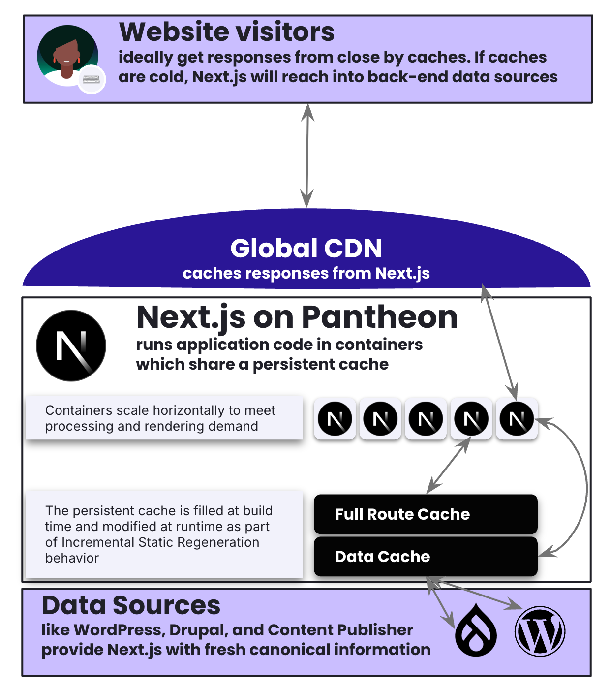

<Partial file="nextjs-pre-ga.md" />

Pantheon hosts Next.js in containers running Node.js behind a global CDN. Those containers can read and write static assets to a persistance cache that are shared across all containers in an environment for a given site.

<!-- This diagram comes from https://docs.google.com/presentation/d/1NesMYwF82xFEymuH3Mmi5oClZ3cXSnb9SAwwyPT1lBY/edit?slide=id.g39b80743bea_0_702#slide=id.g39b80743bea_0_702 -->

