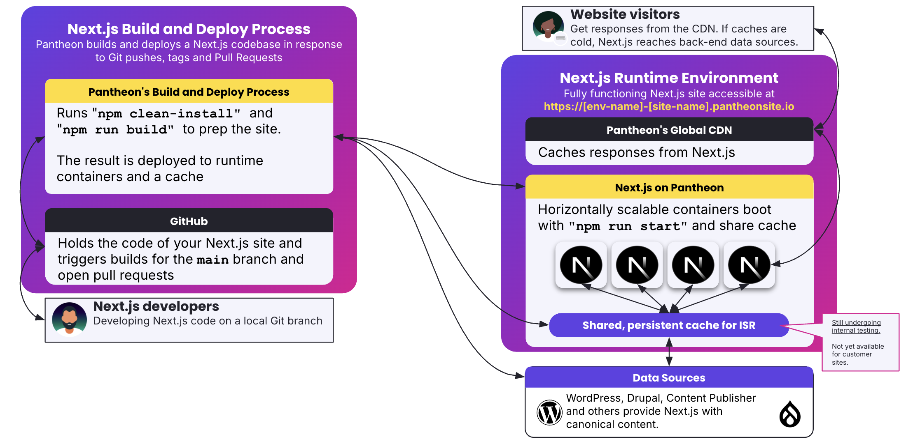

<Partial file="nextjs-pre-ga.md" />

Pantheon hosts Next.js in containers running Node.js behind a global CDN. Those containers can read and write static assets to a persistance cache that are shared across all containers in an environment for a given site.

Both the containers and the cache are populated by the result of a build process which prepares Next.js by running `npm clean-install` and `npm run build` on a codebase.

## Architecture diagram

<!-- This diagram comes from https://docs.google.com/presentation/d/1NesMYwF82xFEymuH3Mmi5oClZ3cXSnb9SAwwyPT1lBY/edit?slide=id.g39b80743bea_0_702#slide=id.g39b80743bea_0_702 -->

## Build and Deploy Process

In response to pushes to the `main` branch of your repository, or to open pull requests, Pantheon will run a build and deployment process.
This process is initiated by [Pantheon's GitHub application](/github-application), which you will need to install and authorize for your repository.

This process includes the following steps:
  * Clone the repository at the commit that triggered the build.
  * Run `npm clean-install` to install dependencies. (The exact command is `npm ci --quiet --no-fund --no-audit (NODE_ENV=development)`. [Share your thoughts on under which conditions Pantheon should use `NODE_ENV=production`](https://github.com/pantheon-systems/documentation/issues/9730).)
    * Pantheon uses `yarn` or `pnpm` if a `yarn.lock` or `pnpm-lock.yaml` file is present in the repository root instead of a `package-lock.json` file.
  * Run `npm run build` to build the Next.js application.
  * Deploy the resulting build artifacts to Pantheon, including:
    * Uploading static assets to the shared cache.
    * Package and upload the application code and dependencies to be run in Node.js containers.

The progression of these steps can be monitored using the Terminus command line interface using the `terminus node:logs:build:list site-name.env` command to list recent builds for a given site and environment.
You will observe statuses that indicate the progress of the build and deployment process such as `BUILD_QUEUED`, `BUILD_WORKING`, `BUILD_SUCCESS`, `DEPLOYMENT_QUEUED`, `DEPLOYMENT_WORKING`, and `DEPLOYMENT_SUCCESS`.
Failures during the build or deployment process will be indicated with `BUILD_FAILURE` or `DEPLOYMENT_FAILURE` statuses.

### Accessing the deployed application

The resulting Next.js application becomes available on Pantheon once the deployment is complete at the URL specific to the site and environment.
The URL pattern is `https://<env>-<site>.pantheonsite.io`, where `<env>` is one of ,`pr-*` `dev`, `test`, or `live`, and `<site>` is the unique site name determined at site creation time.
For environments specific to pull requests, the pattern includes the pull request number, e.g. `https://pr-42-mysite.pantheonsite.io` for pull request number 42.
Deployments to Test and Live environments are triggered by Git tags. Learn more about [deploying to Test and Live environments](/nextjs/test-and-live-env).

## Runtime architecture

When a request is made to a Next.js site hosted on Pantheon, the request first hits the [Global CDN](/guides/global-cdn).

From there, requests are routed to one of the Node.js containers running the Next.js application.
These containers can use a cache handler to read from the [Full Route Cache](https://nextjs.org/docs/app/guides/caching#2-nextjs-caching-on-the-server-full-route-cache) which containers prerendered HTML and React Server Component Payloads.
When Next.js finds a usable cached response, it quickly serves that directly to the client.

<Alert title="Cache handler not yet available to customer sites" type="info" >

The shared cache which enables Incremental Static Regeneration behavior is currently undergoing internal testing.

[Follow this GitHub issue for updates](https://github.com/pantheon-systems/documentation/issues/9727).

</Alert>

Cache misses trigger Next.js to render the requested page, often requiring content to be fetched from external data sources like WordPress, Drupal, or Content Publisher.
The returned HTML and React Server Component Payloads are then stored in the Full Route Cache for future requests.
This behavior is called of repopulated the cache with fresh versions of webpages is called [Incremental Static Regeneration](https://nextjs.org/docs/pages/guides/incremental-static-regeneration).
