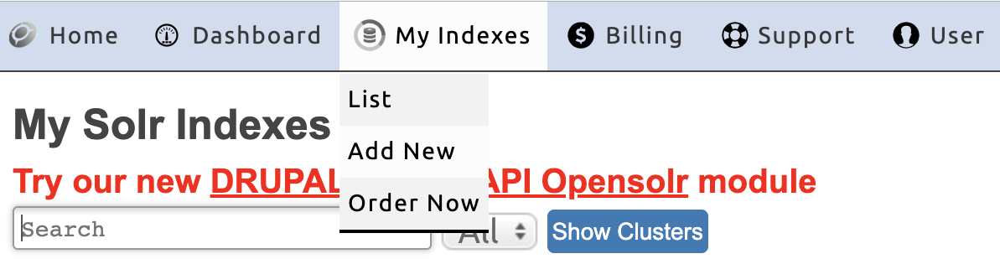
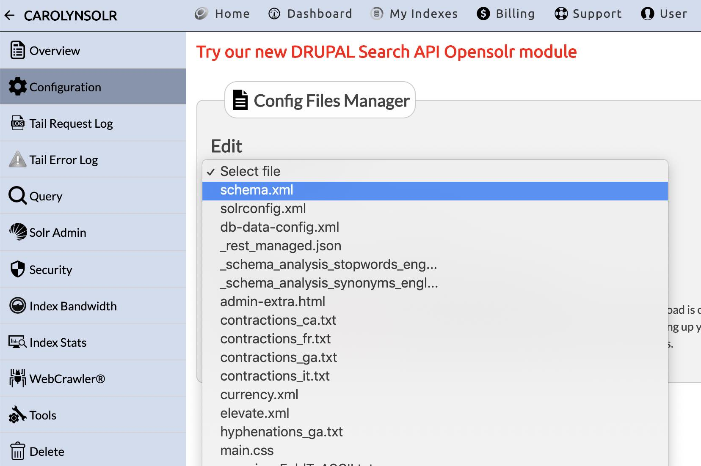

## Overview

Apache Solr is a system for indexing and searching site content. Pantheon provides [Apache Solr](/solr) as a service that works well for the majority of sites on the platform. No permission or action is required from Pantheon to use Solr.
<Partial file="solr-version.md" />

However, If you are looking for additional features for more advanced use cases, you may want to consider an external Solr service.

The [Opensolr](https://www.opensolr.com/) service offers a number of features including:

- Smart full-text search
- Faceting
- Similarity search
- PDF and document search with opensolr Tika
- JTS Polygonal geo-spatial search
- REST-like API

This doc covers Opensolr configuration for Drupal sites. For WordPress-Opensolr integration, see Opensolr's [WPSolr Integration](https://opensolr.com/faq/view/wpsolr) tutorial.

## Before You Begin

This doc assumes that you have already enabled:

- **Drupal 7** the [ApacheSolr](https://www.drupal.org/project/apachesolr) module
- **Drupal 9** the [Search API Solr](https://www.drupal.org/project/search_api_solr) module using Composer (required by Search API Solr to manage dependencies). 

## Create a New Index

After you have signed up at [Opensolr.com](https://www.opensolr.com/), log in and click **My Indexes**, then click **Add New**.



## Set Up the Index

To create your index:

1. From the **Version** list on the left, select the environment's SOLR version

1. Select your preferred region

1. Choose a name for your index

After filling out the appropriate fields, click **Add Index** to create your index. You will then see a card on your dashboard for your index. Click on the index name to go to the overview page for your index. From this page, copy the following information before moving forward:

1. **Port**

1. **Path**

1. **Hostname**

1. **Connection URL**

1. To remove HTTP Authentication, Click **Remove HTTP Auth**

## Configure Solr Module

Complete the steps below for Drupal 7.

### Configure Drupal’s ApacheSolr Module

To get your index working with a Drupal site, set some configuration options in the ApacheSolr module. You can quickly reach the ApacheSolr settings page by appending the following to your site’s URL:

```none
admin/config/search/apachesolr/settings/solr/edit?destination=admin/config/search/apachesolr/settings/solr
```

Provide two items to the ApacheSolr configuration:

1. **ServerURL:** Paste the Connection URL from Opensolr here.

1. **Description:** Briefly describe your index here.

When you've finished, click **Save**.

<Alert title="Warning" type="danger">

A schema must be pushed in each environment (Dev/Test/Live).

</Alert>

### Test Your New Solr Connection

Now that you created the index and configured the ApacheSolr Drupal module to point to the new index, test the connection and make sure ApacheSolr can communicate with the Opensolr index.

Go to `admin/config/search/apachesolr/settings` and click on your index.

To test the connection, click **Test Connection**.

If Drupal returns a success message like **“Your site has contacted the Apache Solr server”**, you have successfully set up your index. If not, go back and complete the configuration steps above.

## Customize Your Configuration

If you'd like to create custom configurations or manually edit your index, synonyms list, stopwords, etc., you can do so by clicking on the **Configuration** icon on your Opensolr Search Index's Tools page, then selecting the configuration file you wish to edit.



## More Resources

- [Drupal ApacheSolr Module](https://drupal.org/project/apachesolr) 
- [WPSolr Integration](https://opensolr.com/faq/view/wpsolr)
- [Opensolr](https://www.opensolr.com/)
- [Opensolr Support](https://www.opensolr.com/faq)
- [FAQ](/faq)
