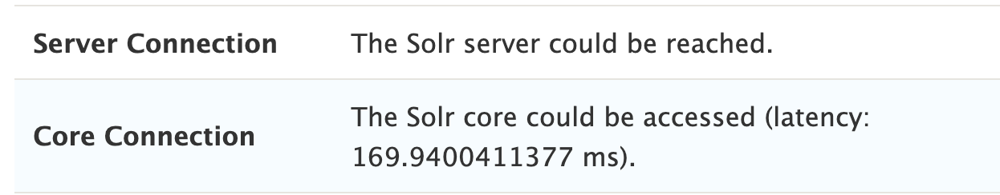
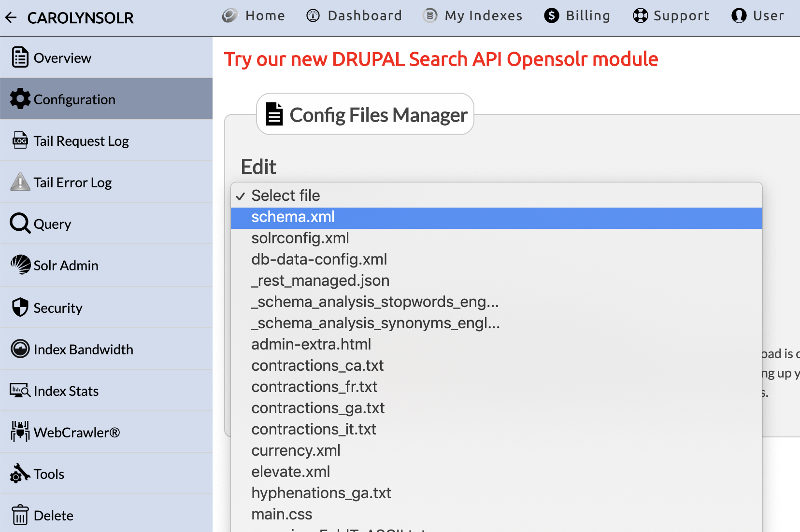

## Overview
Apache Solr is a system for indexing and searching site content. Pantheon provides [Apache Solr](/solr/) as a service that works well for the majority of sites on the platform. No permission or action is required from Pantheon to use Solr.
<Partial file="solr-version.md" />

However, If you are looking for additional features for more advanced use cases, you may want to consider an external Solr service.

The [OpenSolr](https://www.opensolr.com/) service offers a number of features including:

- Smart full-text search
- Faceting
- Similarity search
- PDF and document search with opensolr Tika
- JTS Polygonal geo-spatial search
- REST-like API

This doc covers OpenSolr configuration for Drupal sites. For WordPress-OpenSolr integration, see OpenSolr's [WPSolr Integration](https://opensolr.com/faq/view/wpsolr) tutorial.

## Before You Begin
This doc assumes that you have already enabled:
- **Drupal 7** the [ApacheSolr](https://www.drupal.org/project/apachesolr) module
- **Drupal 8** the [Search API Solr](https://www.drupal.org/project/search_api_solr) module using Composer (required by Search API Solr to manage dependencies). 

<Alert title="Note" type="info">

To get started managing Drupal 8 using Composer, see the **Drupal 8 and Composer** [site building](/guides/drupal-8-composer-no-ci) and [site conversion](/guides/drupal-8-composer-convert) guides.

</Alert>

## Create a New Index

After you have signed up at [OpenSolr.com](https://www.opensolr.com/), log in and click **My Indexes**, then click **Add New**.


## Set Up the Index

To create your index:

1. Select the environment's SOLR version
1. Select your preferred region
1. Choose a name for your index

After filling out the appropriate fields, click **Add Index** to create your index. You will then see a card on your dashboard for your index. Click on the index name to go to the overview page for your index. From this page, copy the following information before moving forward:

1. **Port**
1. **Path**
1. **Hostname**
1. **Connection URL**

## Set up Index Security

If you are using Drupal 8 and the Search API module, you need to setup (or disable) HTTP authentication for your OpenSolr servers. To do this:

1. Click the Security link in the left column of the OpenSolr dashboard.
1. To configure, enter a username and password, then click **Save**. Write it down, as you will need to enter this username and password on the Drupal Search API Add Server form.
1. To remove HTTP Authentication, Click **Remove HTTP Auth**

## Configure Solr Module

<TabList>

<Tab title="Drupal 7" id="d7-solr">

### Configure Drupal’s ApacheSolr Module

To get your index working with a Drupal site, set some configuration options in the ApacheSolr module. You can quickly reach the ApacheSolr settings page by appending the following to your site’s URL:

```
admin/config/search/apachesolr/settings/solr/edit?destination=admin/config/search/apachesolr/settings/solr
```

Provide two items to the ApacheSolr configuration:

1. **ServerURL:** Paste the Connection URL from OpenSolr here.
1. **Description:** Briefly describe your index here.

When you've finished, click **Save**.

<Alert title="Warning" type="danger">

A schema must be pushed in each environment (Dev/Test/Live).

</Alert>

### Test Your New Solr Connection

Now that you created the index and configured the ApacheSolr Drupal module to point to the new index, test the connection and make sure ApacheSolr can communicate with the OpenSolr index.

Go to `admin/config/search/apachesolr/settings` and click on your index.

To test the connection, click **Test Connection**.

If Drupal returns a success message like **“Your site has contacted the Apache Solr server”**, you have successfully set up your index. If not, go back and complete the configuration steps above.

</Tab>

<Tab title="Drupal 8" id="d8-solr" active={true}>

### Configure Drupal’s Search API Module

To get your index working with a Drupal 8 site, set some configuration options in the Search API module. You can quickly reach the Search API settings page by appending the following to your site’s URL:

```
admin/config/search/search-api/add-server?destination=admin/config/search/search-api
```

Provide these items to the Search API Search configuration:

1. **Server Name:** Enter the name for the server; including the name OpenSolr is a helpful hint here.
1. **Solr Connector:** If you enabled HTTP Auth in OpenSolr, choose Basic Auth. If you disabled it, choose Standard.
1. **HTTP protocol:** HTTPS
1. **Solr host:** Hostname from your OpenSolr connection info page.
1. **Solr port:** Port copied from your OpenSolr connection info page.
1. **Solr path:** `/solr` (if using search_api_solr 8.x-1.x). Newer branches of search_api_solr supply this.
1. **Solr core:** The name you gave your Solr core on the OpenSolr connection info page.

<Alert title="Note" type="info">

If you chose **Basic Auth**, you will see a section for HTTP Basic Authentication. Enter the username and password values from your OpenSolr Index Security page.

</Alert> 

Leave everything else with default values provided and click **Save**.
On the resulting Search API server configuration page, you should see messages indicating the Server and Core connections were successful:



### Add Search API Solr Configuration Files to OpenSolr

Your OpenSolr server now needs the Search API Solr `schema.xml` and other configuration files. These are located in `search_api_solr/solr_conf`, in a sub-directory according to the Solr version you are using on OpenSolr.

1. Create a zip archive of the files in your Solr version's directory.
1. Go to the OpenSolr instance, and click on the "Configuration" tab.
1. Upload the zip archive.

### Add Search Index and Fields

Now that you've created the server connection, add an index by visiting `admin/config/search/search-api` and clicking on the **Add index** button. Provide the information about your index:

1. **Index name**: The displayed name you wish to give the index.
1. **Datasources**: In this section, check the boxes corresponding to the entities you want indexed and available for searching. Configure each Datasource selected to indicate which items should be included in the index.
1. **Server**: Select the OpenSolr server you just configured.

When you have finished, click **Save**.

Next, add the fields your index should include for indexing.

1. Click on the **Fields** tab for your search index, then click the **Add fields** button.
1. Select the fields to include in your index.
1. When you have finished, be sure to click **Save changes**.

</Tab>

</TabList>

## Customize Your Configuration

If you'd like to create custom configurations or manually edit your index, synonyms list, stopwords, etc., you can do so by clicking on the **Configuration** icon on your OpenSolr Search Index's Tools page, then selecting the configuration file you wish to edit.



## See Also

- [Drupal ApacheSolr Module](https://drupal.org/project/apachesolr) 
- [WPSolr Integration](https://opensolr.com/faq/view/wpsolr)
- [OpenSolr](https://www.opensolr.com/)
- [OpenSolr Support](https://www.opensolr.com/faq)
- [FAQ](/faq)
