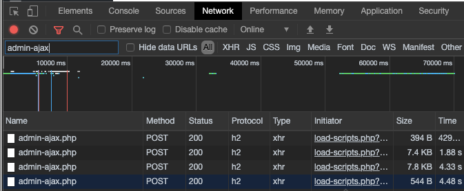
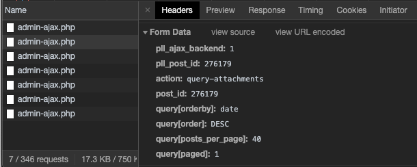
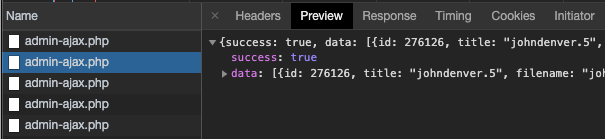

[Traffic Limits and Overages](/traffic-limits) explains what Pantheon considers billable traffic as shown in the [Dashboard Metrics](/metrics). This doc introduces some of the methods Pantheon offers to help troubleshoot traffic incidents and optimize traffic efficiency.

## Review the NGINX Access Log

To get the most information about your site's traffic, review the `nginx-access.log` with [GoAccess](/nginx-access-log). While it may be a somewhat technical process, it provides the most direct information to help identify potential traffic issues.

## WordPress Best Practices

Consult our doc for a list of [WordPress best practices](/wordpress-best-practices), and how to [avoid XML-RPC attacks](/wordpress-best-practices#avoid-xml-rpc-attacks) in particular.

In addition to your other WordPress security practices, take steps to block **brute force attacks** that attempt to access your `wp-admin` dashboard and hyperinflate traffic to your site:

1. Create a separate administrator account with a strong password, then remove the `admin` account.
1. Use a plugin to [limit login attempts](https://wordpress.org/plugins/search/limit+login+attempts/).
1. Consider adding a [honeypot](https://wordpress.org/plugins/search/honeypot/) plugin to lure and ban bad bots.

## Configure favicon.ico to Serve a Static Image

Pantheon does not count static assets against your traffic limit. However, if the CMS cannot find a favicon in the defined path, it will attempt to generate one through PHP on each request. Asset generation requests such as these are counted as traffic. In addition, since Pantheon locks down all directories except the file upload directories (`wp-contents/upload` on WordPress, or `sites/default/files` on Drupal), the CMS can’t save the file back to the path it’s generating.

This issue affects both WordPress and Drupal sites, but the request path will vary between the two platforms. On WordPress, it often appears as a `favicon.ico` file in the root directory. In Drupal (specifically Drupal 8), it shows up as a system path.

|  **CMS**  |           **Path**          |
|:---------:|:---------------------------:|
| WordPress | `/favicon.ico`              |
| Drupal    | `/system/files/favicon.ico` |

**Cause**: Usually the issue originates when adding a custom favicon through the active theme for the site through some kind of upload form, and then the icon is deleted or unavailable, which causes the CMS to look for an alternative favicon.

**Solution**: Add and commit a static `favicon.ico` into the path that is being requested. 

## WordPress: admin-ajax.php Generates Pages Served

Plugins can utilize an Ajax API to make calls to custom functions and filters in the backend.

There are a number of uses for `admin-ajax.php`, and each instance of high usage should be inspected to determine if it is causing an unexpected number of pages served. Some use cases include: 

- fetching the stored counts for when content is shared on social networks; 
- checking if a page or post is currently being worked on (locked); 
- adding media to a post during the editing process, such as when using Gutenberg widgets.

Investigate calls to `admin-ajax.php` by looking at what script is calling the path, and what the payload is through browser developer tools. Access developer tools, filter for `admin-ajax`, then refresh the page:

- **Chrome**: Access Developer Tools through the **View** menu, then **Developer**, and **Developer Tools**. Click the **Network** tab, and in **Filter** search for `admin-ajax`
- **Firefox**: Access Web Developer Tools though the **Tools** menu, then **Web Developer**, and **Network**.

In this first image, in the *Initiator* column, we see that these calls are being initiated from `load-scripts.php`. If you click the initiator reference link, you'll see the JavaScript code that is calling it:



Return to the **Network** tab and click `admin-ajax.php` to see *Headers*. These will include the payload of what was sent to `admin-ajax`, such as the post data and the action or hook to be run in the WordPress backend:



Click the Preview tab for the response, which is a list of images if available. The following screenshot shows that, for this specific call, the media window widget was opening to populate a list of images that could be added to the body of a post:



## DoS Attack Mitigation

Pantheon doesn't count [denial-of-service (DoS) attacks](https://en.wikipedia.org/wiki/Denial-of-service_attack) towards site traffic under any circumstances. If you do experience a DoS or DDoS (_distributed_ denial-of-service) attack, our [Customer Success](/support) team is available to assist with identifying a DoS attempt, and take steps to mitigate it for your site.

### Block IPs in Drupal or WordPress

IPs can be blocked with a PHP snippet in `settings.php` or `wp-config.php`, via a Drupal module, or WordPress plugin.

#### Use a PHP Snippet to Block IPs

Using a PHP snippet to block IPs offers a key advantage over using a module or plugin: the platform denies the IP before any connections, databases, or most importantly, the CMS are loaded. Additionally, if the site is under an ongoing DoS attack, PHP can be added to the configuration file even while site performance is being affected.

To block an IP, add the following to `settings.php` or `wp-config.php`. Remember to replace the example IP (`192.0.2.38`):

```php:title=wp-config.php%20or%20settings.php
if ($_SERVER['REMOTE_ADDR'] == '192.0.2.38') {
  header('HTTP/1.0 403 Forbidden');
  exit;
}
```

To block an IP range, add the following to `settings.php` or `wp-config.php`. Remember to replace the example IP (`192.0.2.38` and others):

```php:title=wp-config.php%20or%20settings.php
// IPv4: Single IPs and CIDR.
// See https://en.wikipedia.org/wiki/Classless_Inter-Domain_Routing
$request_ip_blocklist = [
  '192.0.2.38',
  '192.0.3.125',
  '192.0.67.0/30',
  '192.0.78.0/24',
];

$request_remote_addr = $_SERVER['REMOTE_ADDR'];
// Check if this IP is in blocklist.
if (!$request_ip_forbidden = in_array($request_remote_addr, $request_ip_blocklist)) {
  // Check if this IP is in CIDR block list.
  foreach ($request_ip_blocklist as $_cidr) {
    if (strpos($_cidr, '/') !== FALSE) {
      $_ip = ip2long($request_remote_addr);
      list ($_net, $_mask) = explode('/', $_cidr, 2);
      $_ip_net = ip2long($_net);
      $_ip_mask = ~((1 << (32 - $_mask)) - 1);

      if ($request_ip_forbidden = ($_ip & $_ip_mask) == ($_ip_net & $_ip_mask)) {
        break;
      }
    }
  }
}

if ($request_ip_forbidden) {
  header('HTTP/1.0 403 Forbidden');
  exit;
}
```

#### Use a Drupal Module or WordPress Plugin to Block IPs

<TabList>

<Tab title="Drupal 7" id="d7tab" active={true}>

Navigate to the site's `/admin/config/people/ip-blocking` and enter the IP address to block.

If the site is slow or unavailable, run the MySQL query below, replacing `192.0.2.38` with the IP to block:

```sql
mysql> INSERT INTO blocked_ips (ip) VALUES ('192.0.2.38');
```

</Tab>

<Tab title="Drupal 8" id="d8tab">

In Drupal 8, the [Ban](https://www.drupal.org/docs/8/core/modules/ban/overview) module is not enabled by default in the Standard install profile, but it does come with core.

Enable the module, then navigate to the site's `/admin/config/people/ban` to enter the IP address (for example, `192.0.2.38`).

If the site is slow or unavailable, run the MySQL query below, replacing `192.0.2.38` with the IP to block:

```sql
mysql> INSERT INTO ban_ip (ip) VALUES ('192.0.2.38');
```

</Tab>

<Tab title="WordPress" id="wptab">

Install and use one of the following WordPress plugins:

- [IP Blacklist Cloud](https://wordpress.org/plugins/ip-blacklist-cloud/)
- [WP Cerber Security](https://wordpress.org/plugins/wp-cerber/)

</Tab>

</TabList>

### Block User Agents in Drupal or WordPress

Similar to the IP blocking methods listed above, you can also target specific unwanted user agents that you may want to block.

You can do this by [adding the User Agents to `robots.txt`](/bots-and-indexing#indexing-your-pantheon-site) or with `stripos`.

The `stripos` function implements a case-insensitive match which can be helpful when dealing with mixed bots or crawlers, such as `Curl/dev` vs `curlBot`.

Remember to replace the example user agent (`UglyBot`):

```php:title=wp-config.php%20or%20settings.php
// Block a single bot.
if (strpos($_SERVER['HTTP_USER_AGENT'], 'Bork-bot') !== FALSE) {
  header('HTTP/1.0 403 Forbidden');
  exit;
}

// Or block a list of bots.
$user_agents_deny_list = ['Go-http-client', 'gozilla', 'InstallShield.DigitalWizard', 'GT\:\:WWW'];
foreach ($user_agents_deny_list as $agent) {
  if (strpos($_SERVER['HTTP_USER_AGENT'], $agent) !== FALSE) {
    header('HTTP/1.0 403 Forbidden');
    exit;
  }
}
```

## Block autodiscover.xml Requests

To stop `autodiscover.xml` requests that cause 404 errors, you can configure `pantheon.yml` to block requests to `autodiscover.xml`. 

Add the `autodiscover.xml` path to the [`protected_web_paths`](/pantheon-yml#protected-web-paths) directive in `pantheon.yml`. This lets you block requests at NGINX web server and will return a 403 Forbidden client error status response code.


## Advanced Protection and Performance With Advanced Global CDN

[Advanced Global CDN](/guides/professional-services/advanced-global-cdn) is a custom-configured upgrade to [Pantheon Global CDN](/global-cdn-caching), available through [Pantheon Professional Services](https://pantheon.io/professional-services). Once configured, Advanced Global CDN can serve entire pages and assets from cache, and provide an additional layer of protection against DoS attempts.
