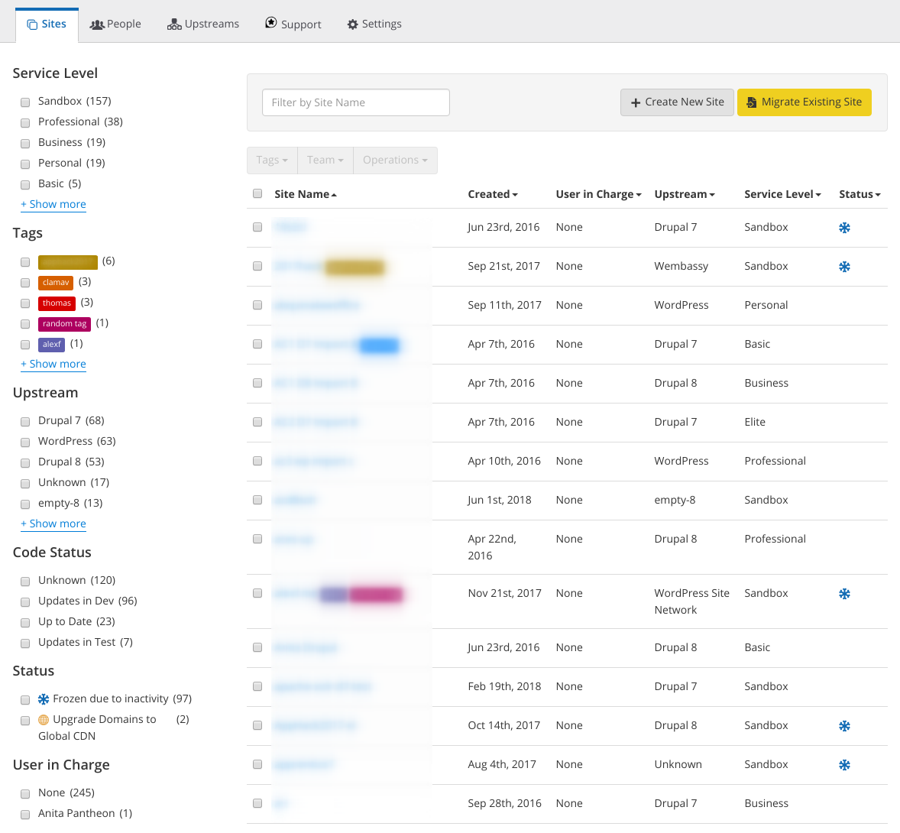
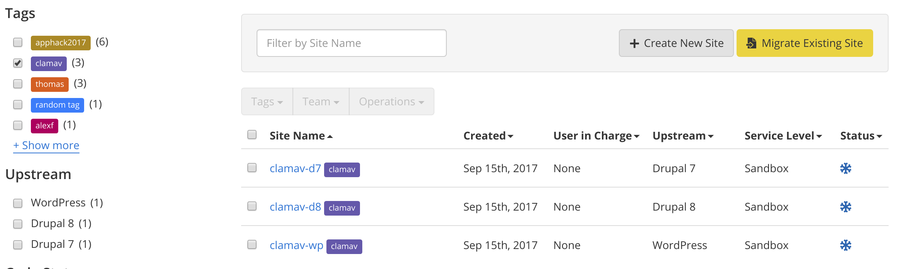

Pantheon Organizations bring together users, sites, Custom Upstreams, Multidev, and support to provide administrators with the tools needed to effectively manage a large number of sites.

## Create an Organization

Current users can create their own Agency or EDU organization by completing the appropriate form:

- [Create an Agency Organization](https://dashboard.pantheon.io/organizations/create)
- [Create an EDU Organization](https://dashboard.pantheon.io/organizations/create-edu)

New users can always [register here](https://pantheon.io/register). Any other type of organization must be created by Pantheon. [Contact us](https://pantheon.io/contact-us) for more information.

After you create an organization, you can invite team members, add existing sites, or create and migrate new sites to Pantheon.

## Organization-Site Association

Organizations can either **own** or **support** sites. Enterprise, Reseller, OEM, and EDU+ organizations **own** sites. When a site is owned by an organization, it will appear on the dashboard's "Sites" tab, be available to People in the organization, as well as be accessible privileged users via Terminus. Organizations will be charged for any owned sites that have been upgraded from Sandbox mode to paid plans. Organization ownership also provides the site with extra features based on the organization's service plan.

Registered Agencies, Pantheon Partners, Premier Pantheon Partners, Strategic Pantheon Partners, and EDU organizations **support** sites. In the Team menu on the Site Dashboard, owning organizations or users are listed at the top as the "Site Owner", while supporting organizations are listed at the bottom under "Supporting Organizations". This method of association is commonly used to provide group access to partner teams using existing roles in the supporting organization to manage access. Sites with paid plans that are associated in this manner are not billed to the "Supporting Organization", but instead are charged to the organization or user that owns them.

## The Organization Dashboard

Access the [Organization Dashboard](/organization-dashboard) in the following ways:

- From the User Dashboard, click the **Organizations** tab, then click the name of the Organization.
- From any Dashboard location, hit the "s" keyboard shortcut to toggle a list of sites and organizations, and click the Organization name.

All Organization Dashboards have five tabs: Sites, People, Upstreams, Support, and Settings. Registered Agencies, Pantheon Partners, Premier Pantheon Partners, Strategic Pantheon Partners, and Resellers have a Partner Program tab.

### Sites

 

The Sites tab shows all sites your organization has access to. You can quickly tag, sort, and filter your sites. All of the people in the organization will have access to all of the sites. You can add users to specific sites by checking the box to select the site and clicking **Team** > **Add to Team**.

Agency organizations will show "Site Owners" instead of "Users in Charge"

A **<span class="glyphicons glyphicons-snowflake" style="color:#0a6bb5"></span>** icon in the site's status column indicates that a site is [frozen due to inactivity](/platform-considerations/#inactive-site-freezing).

For more details on the Sites tab, see
[Managing Sites and Teams with the Pantheon Organization Dashboard](/organization-dashboard).

### People

View all of your collaborators, filter them by role, manage their roles, and add new users to your organization.
[Learn how to add users to the organization](/organization-dashboard/#add-users-to-your-organization).

### Upstreams

[Custom Upstreams](/custom-upstream) are Git forks of Pantheon's versions of Drupal and WordPress, owned and managed by organizations. Members of the organization can select your upstream when starting a new site, and the site will track it to receive updates to core and common code. [Contact us](https://pantheon.io/contact-us) to learn how your Partner Agency can get Custom Upstreams.

### Support

Review, open, or reply to support requests associated with your organization and its sites on the Support tab. Learn about [how to get support](/support).

### Settings

Upload a logo (85 x 85 px). Enterprise and EDU+ Administrators can add payment and terms of service information.

## Features

All Partner Agencies and EDU organizations have Change Management and Custom Upstreams. Not all account levels qualify for Multidev, custom Vanity domains, email domains, or Single Sign-On (SSO). [Contact us](https://pantheon.io/contact-us) to find out how to add features to your organization.

### Multidev

Partner Agencies, Enterprise accounts, and EDU organizations with [Gold support](/support/#support-features-and-response-times) and above have [Multidev](/multidev) available with up to 10 active environments to use. All organization members with privileged roles have access to these environments. Team members of a site who are not members of the supporting organization will not have access to Multidev environments.

### Change Management

User roles at the organization level determine their level of access to sites supported or owned by the organization. [Learn more about change management](/change-management).

### Vanity Domains

Organizations can run site environments using their own custom Vanity domains, like `sites.myorganization.com`, instead of using `pantheonsite.io`. [Learn more about Vanity domains](/vanity-domains).

### Email-Based Registration

New users who sign up with the email address domain you specify will be automatically added to your organization.

### Single Sign-On (SSO)

SSO allows users to authenticate against your Identity Provider (IdP) when logging into the Pantheon Dashboard. [Learn more about SSO with SAML](/sso-organizations).

### Tagging

Sites in an organization can have one or multiple tags, to easily identify and/or group them. Tagging can be done from the Organization Sites dashboard or through [Terminus](/terminus):



## Retrieving the Organization UUID

Every entity (user, organization, product and site) is assigned a UUID which is internal to Pantheon. The UUID is found within the URL for the entity and resembles the following:

```none
de305d54-75b4-431b-adb2-eb6b9e546014
```

You can also use [Terminus](/terminus) to find the UUID of your organizations:

```bash{promptUser: user}
terminus org:list
```

## Next Steps

- [Create a Site](/create-sites)
- [Migrate Sites to Pantheon](/migrate)
- Read the [FAQs](/organization-faq)
