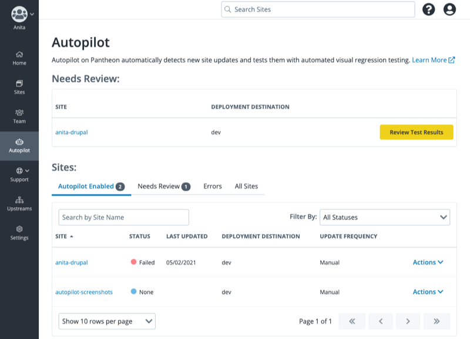

<TabList>

<Tab title="Overview" id="overview" active={true}>

Pantheon's Autopilot:

- Automatically detects when new WordPress or Drupal updates are available
- Performs the updates in an isolated [Multidev](/guides/multidev) environment
- Tests the updates with automated visual regression testing (VRT)
- Optionally deploys the updates

</Tab>

<Tab title="Features" id="features">

- Schedule updates Monthly, Weekly or Daily
- Update Core CMS, themes and extensions
- Hands-off visual regression testing (VRT)
- Pre-configured workflows
- Triggered notifications
- Activity reporting

*Autopilot Setup Wizard*

*Reviewing Test Results*

*View Recent Activity*

</Tab>

<Tab title="Requirements" id="requirements">

- Gold, Platinum or Diamond account.
- WordPress or Drupal site
- If you're using Drupal, a [compatible version of Drush or Integrated Composer](/guides/autopilot/autopilot-faq/#what-versions-of-drupal-are-supported-by-autopilot)

</Tab>

<Tab title="Resources" id="resources">

## Documentation

- [Autopilot Guide](/guides/autopilot)
- [Autopilot and Custom Upstreams](/guides/autopilot-custom-upstream)

## Learning

- [Autopilot Overview](https://learning.pantheon.io/autopilot-quick-start)
- [Is Autopilot Right for My Website?](https://learning.pantheon.io/is-autopilot-right-for-my-website-quick-lesson)

## Support

- [Account holders](https://dashboard.pantheon.io/workspace/support)

</Tab>

</TabList>
