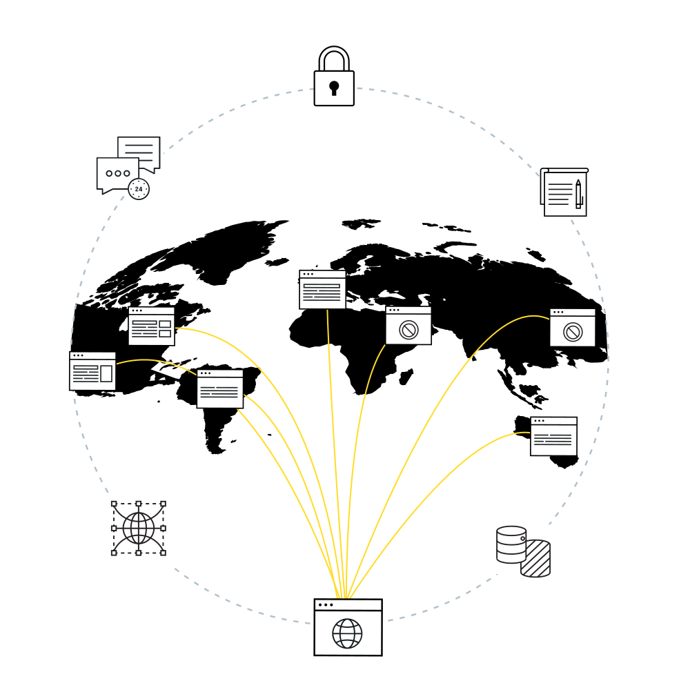

<TabList>

<Tab title="Overview" id="overview" active={true}>

A content delivery network (CDN) like Pantheon's Global CDN can help by routing requests to the nearest Point of Presence (POP) for faster data delivery. With coverage around the globe, your site's content can be delivered quickly to your visitors, no matter where they're located. By being closer to your visitors and their browsers, you can ensure that they have a fast and seamless experience on your site.

</Tab>

<Tab title="Features" id="features">

### Security Starter Package
- IP Allow/Blocklisting	
- Geolocation-based Actions
- OWASP & WAF Rules for WordPress/Drupal
- Rate Limiting

### IO Starter
- Auto WebP Support
- Auto Progressive JPG
- Automatic Caching for Optimized Images
- Edge Resizing
- Compression Quality Control
- Download Original

### AGCDN
- IP Allow/Blocklisting	
- Domain Masking
- Geolocation-based Actions
- Custom Redirects & Rules
- Full CDN Edge Logs
- Header Modifications
- Device-based Actions

### AGCDN with WAF/IO

All AGCDN features plus:

- OWASP & WAF Rules for WordPress/Drupal
- Rate Limiting
- Geolocation and IP Blocking
- IO Starter
- Additional Image Optimization features:
  - Custom Setting Profiles
  - Color Filters
  - Automatic Watermarking
  - Image Manipulation Actions
  - Auto GIF to MP4 Conversion

*Points of Presence*

<TabList>

<Tab title="Global" id="globaltab1" active={true}>

</Tab>

<Tab title="N. America" id="natab1">

Ashburn (x2), Atlanta (x2), Boston, Chicago (x2), Dallas, Denver, Los Angeles (x2), Miami, Minneapolis, Montreal, New York (x2), San Jose (x2), Seattle, Toronto

</Tab>

<Tab title="S. America" id="satab1">

São Paulo, Rio de Janeiro

</Tab>

<Tab title="Africa" id="aftab1">

Cape Town, Johannesburg

</Tab>

<Tab title="Europe" id="eutab1">

Amsterdam, Frankfurt (x2), London (x2), Madrid, Paris, Stockholm

</Tab>

<Tab title="Asia" id="asiatab1">

Dubai, Hong Kong, Osaka, Singapore, Tokyo (x2)

</Tab>

<Tab title="Australia & New Zealand" id="austab1">

Auckland, Brisbane, Melbourne, Perth, Sydney, Wellington

</Tab>

</TabList>

</Tab>

<Tab title="Requirements" id="requirements">

One of the following packages:
* Security Starter
* IO Starter
* AGCDN
* AGCDN with WAF/IO

</Tab>

<Tab title="Resources" id="resources">

## Documentation

* [Pantheon Global CDN](/guides/global-cdn)
* [Introduction to AGCDN](/guides/agcdn)

## Learning

* [Security & Performance from the Edge](https://pantheon.io/webops-security-and-performance-from-the-edge-webinar)
  
## Blog Posts

* [What You need to Know About Advanced Global CDN](https://pantheon.io/blog/what-you-need-know-about-advanced-global-cdn)
* [7 Ways to Accelerate Growth with Advanced Global CDN](https://pantheon.io/blog/7-ways-accelerate-growth-advanced-global-cdn)
* [How to fight Cyberattacks with Advanced Global CDN. ](https://pantheon.io/blog/fight-cyberattacks-advanced-global-cdn)
* [DDoS Attacks, Pantheon and You](https://pantheon.io/blog/ddos-attacks-pantheon-and-you)

## Support

* [Account holders](https://dashboard.pantheon.io/workspace/ee3995c4-652e-44a0-b00b-0085e92d78da/support)

</Tab>

</TabList>