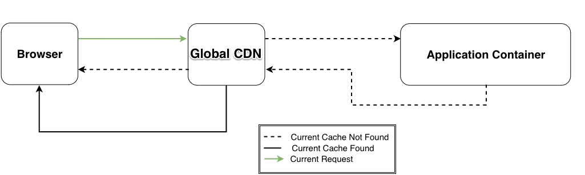

<TabList>

<Tab title="Overview" id="overview" active={true}>

A content delivery network (CDN) like Pantheon's Global CDN can help by routing requests to the nearest Point of Presence (POP) for faster data delivery. With coverage around the globe, your site's content can be delivered quickly to your visitors, no matter where they're located. By being closer to your visitors and their browsers, you can ensure that they have a fast and seamless experience on your site.

</Tab>

<Tab title="Features" id="features">

* Full-page and asset caching
* Faster page load speeds
* Free HTTPS
* DDoS protection and origin shielding

And available with Advanced Global CDN (AGCDN) only...
* Image optimization
* Web application Firewall
* IP allow/blocklisting
* Rate limiting
* Domain masking/reverse proxy
* Geolocation based edge control

</Tab>

<Tab title="Requirements" id="requirements">

One of the following packages:
* Security Starter
* IO Starter
* AGCDN
* AGCDN with WAF/IO

</Tab>

<Tab title="Resources" id="resources">

## Documentation

* [Pantheon Global CDN](/guides/global-cdn)
* [Introduction to AGCDN](/guides/agcdn)

## Learning

* [Security & Performance from the Edge](https://pantheon.io/webops-security-and-performance-from-the-edge-webinar)
  
## Blog Posts

* [What You need to Know About Advanced Global CDN](https://pantheon.io/blog/what-you-need-know-about-advanced-global-cdn)
* [7 Ways to Accelerate Growth with Advanced Global CDN](https://pantheon.io/blog/7-ways-accelerate-growth-advanced-global-cdn)
* [How to fight Cyberattacks with Advanced Global CDN. ](https://pantheon.io/blog/fight-cyberattacks-advanced-global-cdn)
* [DDoS Attacks, Pantheon and You](https://pantheon.io/blog/ddos-attacks-pantheon-and-you)

## Support

* [Account holders](https://dashboard.pantheon.io/workspace/ee3995c4-652e-44a0-b00b-0085e92d78da/support)

</Tab>

</TabList>