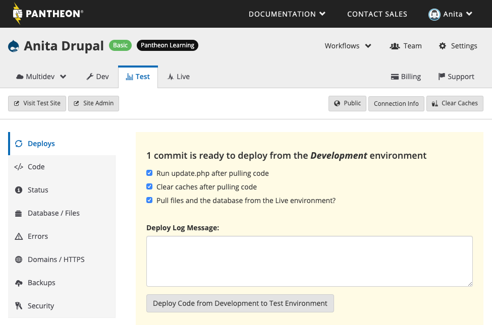
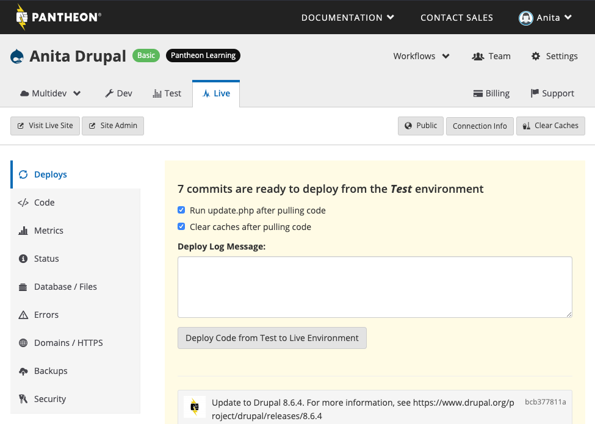

<Alert title="Note" type="info">

This page offers a high level description of the intended usage of Pantheon's Dev, Test, and Live WebOps workflow. After familiarizing yourself with the concepts described here, follow our step-by-step [Quick Start Guide](/guides/quickstart) to practice the basics.

</Alert>

Every Pantheon site comes with three environments: Dev, Test, and Live. Each environment runs a version of the site on its own container. Separate Dev, Test, and Live environments allow you to develop and test your site without impacting the Live environment's availability to the world. Additional development environments are available with [Multidev](/multidev).

<Enablement title="Get WebOps Training" link="https://pantheon.io/learn-pantheon?docs">

Optimize your dev team and streamline WebOps workflows. Pantheon delivers on-demand training to help development teams master our platform and improve their internal WebOps practices.

</Enablement>

## Components of a Site
One of the core concepts at the heart of the Pantheon WebOps workflow is the distinction between **code** and **content**.

### Code
Code refers to anything version controlled by Git which includes core, custom and contributed modules or plugins, themes, and libraries.

### Content
Content refers to your site's files and the database. In this context, files are static images and assets stored in the standard upload path `wp-content/uploads` for WordPress and `sites/default/files` for Drupal.

## Code Moves Up, Content Moves Down


The main process of the Pantheon WebOps workflow is to move code up from Dev to Test to Live and content down from Live to Test to Dev. To facilitate this, we put [files](/files) into our distributed filesystem, Valhalla, and [code](/code) on to the application containers. When you build or migrate your site to Pantheon, configuring the correct paths initially will avoid complications down the road.

<Accordion title="Why does Pantheon do this?" id="why-tab" icon="question-sign">

#### Why does Pantheon do this?

Pantheon is an "[opinionated platform](https://stackoverflow.com/questions/802050/what-is-opinionated-software)". Specifically, we're of the opinion that it makes sense to separate the code and content because there is some level of separation between the people changing each. Generally speaking, the team members editing content expect to sign into a live environment, make changes, and immediately see the changes on that public site. Developers and designers changing code often prefer to make their changes on a non-live environment because the risk of breaking the site is too great. Changing code directly on a production environment is a practice we call "[Cowboy Coding](https://pantheon.io/blog/cowboy-coding-nostalgia)" and we greatly discourage it.

</Accordion>

### Commit Code in Dev

Code is writable in the Dev (or a Multidev) environment, but is locked in Test and Live. This is intentional, and supports the WebOps workflow model we've described. Update code in the Dev environment via [SFTP](/sftp/#sftp-mode) or [Git](/git).
For more detailed information on developing directly in SFTP mode, please see the [guide](/sftp).

### Combine Code from Dev and Content from Live in Test

When you're ready to test a new set of changes, deploy your code from Dev to Test. At this point, you will be prompted to clone your content down from the Live environment. This combines the code from Dev and the database and files from Live in the Test environment. It is a WebOps best practice to simulate your eventual deployment to Live as closely as possible. Under the hood, [each deployment generates a Git tag](/git-faq#what-are-the-git-tags).

<Alert title="Note" type="info">

While you are able to update the Dev environment via Git, if you would like to deploy your changes to Test or Live from the command line, you'll need to use [Terminus](/terminus).

</Alert>

Once changes are pushed to Dev, the Deploys panel in the Test tab will prompt you to commit the changes to Test:



 - The **Deploy Log** helps you group a batch of commits into a single deployment. Best practice is to keep logical groups of edits together and then summarize those groups with a single deployment message.

 - Check the **Pull files and the database from the Live environment?** checkbox to pull the content from your Live environment to the Test environment.

 - Drupal site deployments can also run `update.php` which executes [update hooks](https://www.drupal.org/docs/8/api/update-api/introduction-to-update-api-for-drupal-8) for database changes.

   On WordPress site dashboards, cloning the content will expose an option to convert URLs from the Live environment's pattern to the Test environment's, including the protocol from HTTPS to HTTP for encrypted live environments.

After running this operation, be sure that:

* Your database updates succeed
* Your exported configuration is in place
* The site is functioning as expected in the Test environment

It's also a good idea to review the Status tab and run **Launch Check**, and make sure everything looks good. For details, see the following:

- [Launch Check - Drupal Performance and Configuration Analysis](/drupal-launch-check)
- [Launch Check - WordPress Performance and Configuration Analysis](/wordpress-launch-check)

Many teams have a standardized review procedure that they execute in the Test environment. That might mean manually checking important pages on the site or walking through content creation forms. If you have automated tests, you can trigger them upon deployment with our [platform hook system](/quicksilver).

This entire process is designed around making sure that the Live environment is always stable and never at risk due to code updates.

### Deploy Code to Live

After testing your changes in the Test environment you can move them to the Live environment. Deploying code from Test to Live will immediately update your public website; however, static assets such as images and CSS may still be outdated. To refresh them, check the **Clear Caches** option when deploying changes to your Live environment. For more details, see [Clearing Caches for Drupal and WordPress](/clear-caches).



## Configuration Management

Dealing with changes to your site's configuration, stored in the database, can be a challenge. Moving the database up from Dev to Test and Live typically won't work, because it will overwrite content in Live. While you can make manual configuration changes on each environment, **it's a best practice to manage configuration in code**.

### WordPress

* [WP-CFM](https://wordpress.org/plugins/wp-cfm/) plugin: exports bundles of configuration to `.json` files in `wp-content/config`.
* [Advanced custom fields can be exported to code](https://stevegrunwell.com/blog/exploring-the-wordpress-advanced-custom-fields-export-feature/).


### Drupal

* [hook\_update\_N()](https://api.drupal.org/api/drupal/modules%21system%21system.api.php/function/hook_update_N/7.x): Encapsulate changes into a custom module and apply them by running `update.php`. Here is a great example of this approach: [Automate Drupal site updates with a deployment module](http://befused.com/drupal/site-deployment-module).
* [Features](https://www.drupal.org/project/features) module: Export sets of configuration like content types and fields to code as modules. 
* Drupal 8 tackles configuration management head on. For more information, see [Configuration Workflow for Drupal 8 Sites](/drupal-8-configuration-management).

## Understanding Write Permissions in Test and Live

By design, code changes via SFTP are prevented in Test and Live. All code changes should be done in Dev. There are two ways to update code in Test or Live:

1. **Use the Workflow** (Recommended): Deploy code from Dev to Test to Live via the Site Dashboard or Terminus as outlined above, beginning in the [Combine Code from Dev and Content from Live in Test](#combine-code-from-dev-and-content-from-live-in-test) section.

2. **Hotfixes**: Hotfixes is not a best practice and should be the exception, not the norm. Pushing a [hotfix via Git tags](/hotfixes) is the only way to push code changes directly to Live without deploying through Dev and Test.

## Managing Database and Files: Clone, Import, Export, Wipe

You may also clone, import, export, and wipe the database and files per environment. Wiping completely resets the database and files, but leaves the codebase intact. This means you will lose all data and will need to either re-import, or re-install to get your site back online.

The [database clone operation](/database-workflow#cloning-the-database) excludes some tables by default. The excluded tables are:

* `cache`
* `cache_block`
* `cache_bootstrap`
* `cache_field`
* `cache_filter`
* `cache_form`
* `cache_image`
* `cache_menu`
* `cache_page`
* `cache_path`
* `cache_update`
* `cache_views`
* `cache_views_data`
* `accesslog`
* `watchdog`

You can clone databases from one environment to another at any point. It does not need to only be within the deployment process.

<Alert title="Note" type="info">

The **Export** tool does not include a copy of the site's codebase and cannot be used as the basis to create a new site. Use the archive files generated by the [Backups Tool](/backups) if you wish to create a new site.

</Alert>

## Uncommon Workflows

Typically, you'll create content in the Live environment. However, when deploying a newly-built site for the very first time, it is often necessary to push the content "up", which is the opposite of the normal content workflow. In this case, you may move the database and files (e.g. images) from Dev or Test to Live via the **Database/Files** > **Clone** area of the Dashboard.

Moving content up to Live should almost never be done on a launched site. The only exception is if that site is 100% read-only, as pushing the database and files will overwrite all changes made in Live, like comments or ecommerce orders from the public. Also note that overwriting the database of a Live environment may cause downtime.

If there are other workflows you would like to see, contact us. We're always looking for ways to improve the platform.

## Troubleshooting

#### Uncaught Exception: Table 'pantheon.semaphore' Doesn't Exist

If you access the site before a database import is complete, you may see the following error:

```sql
Uncaught exception 'PDOException' with message 'SQLSTATE[42S02]: Base table or view not found: 1146 Table 'pantheon.semaphore' doesn't exist'
```

MySQL imports tables sequentially, in alphabetical order from A to Z. If you access the site before the operation is complete, Drupal will try to bootstrap, and the MySQL import may be at the table letter G, for example, and the result is the semaphore table does not exist error. Once the import or clone operation has finished, the error should no longer appear.

## See Also
 - [Infographic: The Pantheon Development Cycle Workflow](https://pantheon.io/blog/infographic-pantheon-development-cycle-workflow)
 - [Your Site Code on Pantheon](/code)
 - [Pantheon Filesystem](/files)
