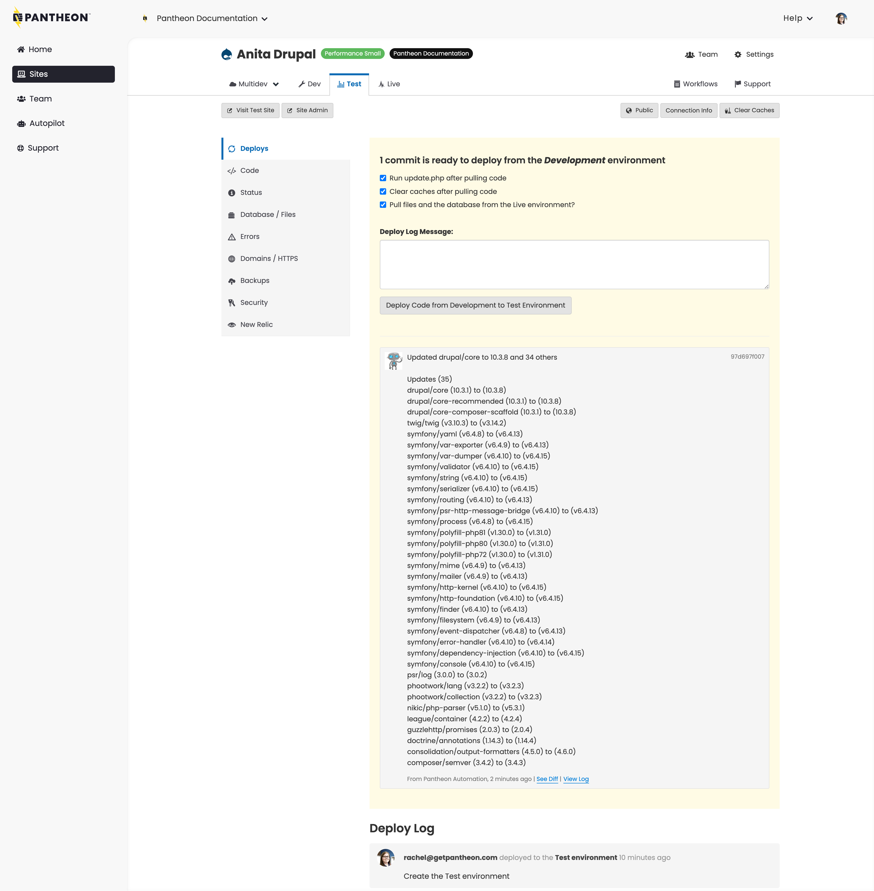
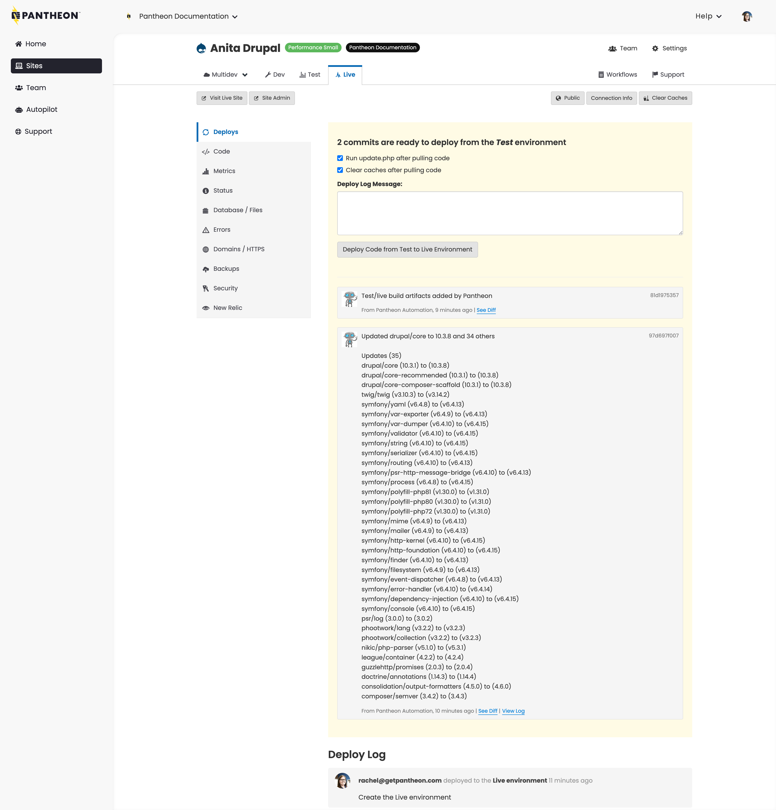

Every Pantheon site comes with three environments: Dev, Test, and Live.
Each environment runs a version of the site on its own container. Separate Dev, Test, and Live environments allow you to develop and test your site without impacting the Live environment's availability to the world. Additional development environments are available with [Multidev](/guides/multidev).

<Enablement title="Get WebOps Training" link="https://pantheon.io/learn-pantheon?docs">

Optimize your dev team and streamline WebOps workflows. Pantheon delivers on-demand training to help development teams master our platform and improve their internal WebOps practices.

</Enablement>

## Components of a Site

One of the core concepts at the heart of the Pantheon WebOps workflow is the distinction between **code** and **content**.

- Code refers to anything version controlled by Git which includes core, custom and contributed modules or plugins, themes, and libraries.

- Content refers to your site's files and the database. In this context, files are static images and assets stored in the standard upload path `wp-content/uploads` for WordPress and `sites/default/files` for Drupal.

## Your Site Code on Pantheon

This section outlines how your code is processed in the WebOps workflow.

### Code Moves Up, Content Moves Down


The main process of the Pantheon WebOps workflow is to move code up from Dev to Test to Live and content down from Live to Test to Dev. To facilitate this, we put [files](/guides/filesystem) into our distributed filesystem, Valhalla, and [code](/guides/git/collaborative-development#git-repositories-on-pantheon) on to the application containers. When you build or migrate your site to Pantheon, configuring the correct paths initially will avoid complications down the road.

<Accordion title="Why does Pantheon do this?" id="why-tab" icon="question-sign">

#### Why does Pantheon do this?

Pantheon is an "[opinionated platform](https://stackoverflow.com/questions/802050/what-is-opinionated-software)". Specifically, we're of the opinion that it makes sense to separate the code and content because there is some level of separation between the people changing each. Generally speaking, the team members editing content expect to sign into a live environment, make changes, and immediately see the changes on that public site. Developers and designers changing code often prefer to make their changes on a non-live environment because the risk of breaking the site is too great. Changing code directly on a production environment is a practice we call "[Cowboy Coding](https://pantheon.io/blog/cowboy-coding-nostalgia)" and we greatly discourage it.

</Accordion>

### Commit Code in Dev

Code is writable in the Dev (or a Multidev) environment, but is locked in Test and Live. This is intentional, and supports the WebOps workflow model we've described. Update code in the Dev environment via [SFTP](/guides/sftp/sftp-development) or [Git](/guides/git/git-config).
For more detailed information on developing directly in SFTP mode, please see the [guide](/guides/sftp).

### Combine Code from Dev and Content from Live in Test

When you're ready to test a new set of changes, deploy your code from Dev to Test. At this point, you will be prompted to clone your content down from the Live environment. This combines the code from Dev and the database and files from Live in the Test environment. It is a WebOps best practice to simulate your eventual deployment to Live as closely as possible. Under the hood, [each deployment generates a Git tag](/guides/git/faq-git#what-are-the-git-tags).

<Alert title="Note" type="info">

While you are able to update the Dev environment via Git, if you would like to deploy your changes to Test or Live from the command line, you'll need to use [Terminus](/terminus).

</Alert>

After changes are pushed to Dev, the Deploys panel in the Test tab will prompt you to commit the changes to Test:



 - The **Deploy Log** helps you group a batch of commits into a single deployment. Best practice is to keep logical groups of edits together and then summarize those groups with a single deployment message.

 - We provide a rolling view of typical workflow log entries on the site for 14 days. Log entries are no longer visible on the site after 14 days, but are kept for internal auditing. Log entries visible for longer than 14 days include:

    - `deploy`
    - `create_environment` (this only applies to Test and Live environments)
    - `freeze_site`
    - `unfreeze_site`

 - Check the **Pull files and the database from the Live environment?** checkbox to pull the content from your Live environment to the Test environment.

 - Drupal site deployments can also run `update.php` which executes [update hooks](https://www.drupal.org/docs/8/api/update-api/introduction-to-update-api-for-drupal-8) for database changes.

 - On WordPress site dashboards, cloning the content will expose an option to convert URLs from the Live environment's pattern to the Test environment's, including the protocol from HTTPS to HTTP for encrypted live environments.

After running this operation, be sure that:

* Your database updates succeed
* Your exported configuration is in place
* The site is functioning as expected in the Test environment

It's also a good idea to review the Status tab and run **Launch Check**, and make sure everything looks good. For details, see the following:

- [Launch Check - Drupal Performance and Configuration Analysis](/drupal-launch-check)
- [Launch Check - WordPress Performance and Configuration Analysis](/guides/wordpress-pantheon/wordpress-launch-check)

Many teams have a standardized review procedure that they execute in the Test environment. That might mean manually checking important pages on the site or walking through content creation forms. If you have automated tests, you can trigger them upon deployment with our [platform hook system](/guides/quicksilver).

This entire process is designed around making sure that the Live environment is always stable and never at risk due to code updates.

### Deploy Code to Live

After testing your changes in the Test environment you can move them to the Live environment. Deploying code from Test to Live will immediately update your public website; however, static assets such as images and CSS may still be outdated. To refresh them, check the **Clear Caches** option when deploying changes to your Live environment. For more details, see [Clearing Caches for Drupal and WordPress](/clear-caches).



## Examples

### Create an Article on the Site

1. Click the <Icon icon="externalLink" text="Site Admin"/> button to open your Live site in a new tab. You’ll need to log in before being directed to the site administration dashboard.

    <Alert title="Note" type="info">
      Your WordPress or Drupal username and password are the same set you
      created when you installed your Dev site for the first time.
    </Alert>

1. Create a new Drupal article or WordPress post. If you need help with this step, refer to the [WordPress Codex](https://codex.wordpress.org/Posts) or [Drupal Documentation](https://www.drupal.org/docs/8/administering-drupal-8-site/managing-content/) on how to add a post or article. When finished, visit the front page of your site and confirm that you can see the new content.

1. Go back to your **Site Dashboard**, click the <Icon icon="wrench" text="Dev"/> tab, and open your Dev site by clicking <Icon icon="externalLink" text="Visit Development Site"/>.

    Notice that the content you just created on your Live site doesn’t appear on your Dev site. This is because each environment is a stand-alone copy of your site, with its own codebase, database, and files.

    It’s important to develop on a recent copy of your site with the newest content, so let’s clone your Live site—with its new content—to your Dev environment.

    <Alert title="Warning" type="danger" >

    Consider creating a backup before proceeding. After the next step, you will not be able to recover Dev database and files without a backup. To do so, click <Icon icon="cloud-upload" text="Backups"/> on the <Icon icon="wrench" text="Dev"/> tab of your Site Dashboard, then click **Create New Backup**.

    </Alert>

1. Go to your [Site Dashboard](/guides/account-mgmt/workspace-sites-teams/sites#site-dashboard), select the <Icon icon="wrench" text="Dev"/> tab, then click <Icon icon="server" text="Database / Files"/>.

1. Select **Live** from the **From this Environment** list to clone the database and files from the Live site.

1. Click **Clone the Database & files from Live into the Development Environment**.

   The Clone operation only copies the [files](/guides/filesystem) folder (`wp-content/uploads` or `sites/default/files`) and does not include core, theme, plugins or modules.

1. When complete, click <Icon icon="externalLink" text="Visit Development Site"/> to confirm that the content you created on your Live site now appears on your Dev site.

Nice work! You added a page to your Live site, then cloned this environment "down" to Dev. Your Dev environment is a safe place for editing code, and now it's up-to-date with your latest content.

### Make Changes to the Site Theme

1. Go to **Site Dashboard**, select the **Dev** tab, then select **Code**.

1. Confirm your Connection Mode is set to **SFTP**.

1. Log in to your Dev site by clicking the <Icon icon="externalLink" text="Site Admin"/> button.

1. Install and activate a _new_ theme (do not activate/enable a theme that came pre-packaged with your site).

   - [WordPress instructions](https://wordpress.org/documentation/article/worik-with-themes/)
   - [Drupal instructions](https://www.drupal.org/docs/user_guide/en/extend-theme-install.html)

1. Visit your site to confirm the theme change.

1. Return to **Site Dashboard** and select the **Dev** tab. The files you just added are highlighted.

  <Alert title="Note" type="info">

  You may need to refresh your dashboard to see these files in your Dev environment.

  </Alert>

1. Add a commit message, then click **Commit** to add these files to your Dev environment.

    <Alert title="Note" type="info">

    In the Dev environment, you can’t make a commit without first adding a commit message.

    </Alert>

1. Review your changes in Dev.

1. Go to your **Site Dashboard**, select the **Test** tab, then select **Deploys**. As you can see, 1 commit is ready to deploy from the Dev environment.

1. Check the **Pull files and the database from the Live environment** box.

    <Alert title="Warning" type="danger" >

    Consider creating a backup before proceeding. After the next step, you will not be able to recover Dev database and files without a backup. To do so, click <Icon icon="cloud-upload" text="Backups"/> on the <Icon icon="wrench" text="Dev"/> tab of your Site Dashboard, then click **Create New Backup**.

    </Alert>

1. Add a Deploy Log Message (optional), then click **Deploy Code from Development to Test Environment**.

    <Accordion title="Deploy Commits to Test (optional)" id="understand-deploy" icon="lightbulb">

    Test is a separate environment from Dev, with its own codebase, database, and media files. When you deploy code from Dev, the platform leverages Git to pull any code changes into your Test environment.

    </Accordion>

1. When complete, click <Icon icon="externalLink" text="Site Admin"/> to go to your Test site. Here you’ll notice that your theme is installed, but not active/enabled. You’ll also find that your content has been pulled “down” from Live.

1. Activate/enable your theme. If you need help with this step, refer to the [WordPress Codex](https://codex.wordpress.org/Using_Themes) or [Drupal Documentation](https://www.drupal.org/docs/user_guide/en/extend-theme-install.html).

1. Review your Test site.

1. [Go to the Site Dashboard](/guides/account-mgmt/workspace-sites-teams/sites#site-dashboard), select the **Live** tab, then click **Deploys**.

1. Add a Deploy Log Message (optional), then click **Deploy Code from Test to Live Environment**.

1. Activate/enable your theme. If you need help with this step, refer to the [WordPress Codex](https://codex.wordpress.org/Using_Themes) or [Drupal Documentation](https://www.drupal.org/docs/user_guide/en/extend-theme-install.html).

Congratulations! You just performed on-server development to make changes to your UI. You made changes on your Dev site, reviewed them on your Test site, then deployed them to Live.


## Specific Workflow Tasks

### Content Staging

Typically, you'll create content in the Live environment. However, when deploying a newly-built site for the very first time, it is often necessary to push the content "up", which is the opposite of the normal content workflow. In this case, you may move the database and files (e.g. images) from Dev or Test to Live via the **Database/Files** > **Clone** area of the Dashboard.

Moving content up to Live should almost never be done on a launched site. The only exception is if that site is 100% read-only, as pushing the database and files will overwrite all changes made in Live, like comments or ecommerce orders from the public. Also note that overwriting the database of a Live environment may cause downtime.

You can upload files directly to your Test and Live environments through an SFTP connection. Refer to [SFTP File Uploads to Test and Live Environments](/guides/sftp/sftp-connection-info#sftp-file-uploads-to-test-and-live-environments) for more information.

Review our [Content Staging](/content-staging) guide for WordPress and Drupal content staging workflow solutions.

### Configuration Management

Dealing with changes to your site's configuration, stored in the database, can be a challenge. Moving the database up from Dev to Test and Live typically won't work, because it will overwrite content in Live. While you can make manual configuration changes on each environment, **it's a best practice to manage configuration in code**.

WordPress

* [WP-CFM](https://wordpress.org/plugins/wp-cfm/) plugin: exports bundles of configuration to `.json` files in `wp-content/config`.
* [Advanced custom fields can be exported to code](https://stevegrunwell.com/blog/exploring-the-wordpress-advanced-custom-fields-export-feature/).


Drupal

* [hook\_update\_N()](https://api.drupal.org/api/drupal/modules%21system%21system.api.php/function/hook_update_N/7.x): Encapsulate changes into a custom module and apply them by running `update.php`. Here is a great example of this approach: [Automate Drupal site updates with a deployment module](http://befused.com/drupal/site-deployment-module).
* [Features](https://www.drupal.org/project/features) module: Export sets of configuration like content types and fields to code as modules.

### Managing Write Permissions in Test and Live

By design, code changes via SFTP are prevented in Test and Live. All code changes should be done in Dev. There are two ways to update code in Test or Live:

1. **Use the Workflow** (Recommended): Deploy code from Dev to Test to Live via the Site Dashboard or Terminus as outlined above, beginning in the [Combine Code from Dev and Content from Live in Test](#combine-code-from-dev-and-content-from-live-in-test) section.

2. **Hotfixes**: Hotfixes is not a best practice and should be the exception, not the norm. Pushing a [hotfix via Git tags](/guides/git/hotfixes) is the only way to push code changes directly to Live without deploying through Dev and Test.

### Managing Database and Files: Clone, Import, Export, Wipe

You may also clone, import, export, and wipe the database and files per environment. Wiping completely resets the database and files, but leaves the codebase intact. This means you will lose all data and will need to either re-import, or re-install to get your site back online.

The [database clone operation](/guides/mariadb-mysql/database-workflow-tool#cloning-the-database) excludes some tables by default. The excluded tables are:

* `accesslog`
* `watchdog`
* any table that starts with `cache`

You can clone databases from one environment to another at any point. It does not need to only be within the deployment process.

<Alert title="Note" type="info">

The **Export** tool does not include a copy of the site's codebase and cannot be used as the basis to create a new site. Use the archive files generated by the [Backups Tool](/guides/backups) if you wish to create a new site.

</Alert>

#### Uncaught Exception: Table 'pantheon.semaphore' Doesn't Exist

If you access the site before a database import is complete, you may see the following error:

```sql
Uncaught exception 'PDOException' with message 'SQLSTATE[42S02]: Base table or view not found: 1146 Table 'pantheon.semaphore' doesn't exist'
```

MySQL imports tables sequentially, in alphabetical order from A to Z. If you access the site before the operation is complete, Drupal will try to bootstrap, and the MySQL import may be at the table letter G, for example, and the result is the semaphore table does not exist error. Once the import or clone operation has finished, the error should no longer appear.


## Additional Workflow Tools

Within the Pantheon WebOps workflow, there are several ways you can manage and develop your sites.

- Manage multiple sites with [Custom Upstreams](/guides/custom-upstream).
- Create sites by using Pantheon Upstreams, importing existing sites, [plus other methods](/start-state).
- Support large teams using [Multidev](/guides/multidev).
- Migrate your site [from a competitor](/get-started).
- [Use the command line](/terminus) to manage and create sites.
- Develop using either [Git](/guides/git) or [SFTP](/guides/sftp).

There are even more tools and options available to you.  Refer to [Develop](/develop) for more information.

## More Resources
 - [Infographic: The Pantheon Development Cycle Workflow](https://pantheon.io/blog/infographic-pantheon-development-cycle-workflow)
 - [Pantheon Filesystem](/guides/filesystem/)
