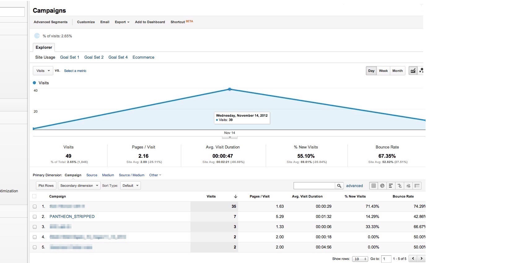

Typically, Pantheon's edge cache uses the entire request URL, including query string parameters, as the content cache key. In some cases, the query parameters do not affect the content returned in the response and we can optimize your site's performance by safely ignoring these parameters from a cache perspective. For example, specific Google Analytics query parameters are used solely by JavaScript to track different AdWords campaigns running for the same page on your site.

<Alert title="Warning" type="danger">

Variables that are converted to `PANTHEON_STRIPPED` cannot be read with PHP, and original values will not appear in the `nginx-access.log` or be available to the application backend. However, the parameters can be read using JavaScript and will appear correctly in analytics tools.

</Alert>

## Issue: PANTHEON_STRIPPED Displays in the utm_source URL Parameter in Google Analytics



This is typically caused by PHP in your site’s code reading in `PANTHEON_STRIPPED` as part of the url that it sees, and then using that in a page response in such a way that shows up in a customer browser, it will then be dutifully reported to Google. Pantheon makes every effort to prevent this, but it is not possible to predict all possible PHP behavior. In most cases, it's safe to simply ignore `PANTHEON_STRIPPED` in your traffic results, as usually customers will have hit the site with a valid parameter first, and the `PANTHEON_STRIPPED` values are duplicate "self-referrals".

You may also experience unexpected behavior when you overload Google's `utm_` parameter namespace. The URL parameters that Google Analytics uses are specific to their platform and are not intended to be extended by site developers. Using it as a general tracking parameter with patterns like `utm_mytrackingparameter` is discouraged. Please refer to Google Analytics [URL Builder](https://support.google.com/analytics/answer/1033867) for a list of the valid `utm_` parameters.

## Redirection and PANTHEON_STRIPPED

If you redirect a request that contains `utm_` parameters, Pantheon's edge should be able to preserve the original values.  It's always better for campaigns to avoid sending customers to a page that redirects (e.g. to the www domain, or to https, or to an updated url), but sometimes this can't be helped.

You can see this for yourself by testing how Pantheon's own public facing website behaves. Try requesting the homepage over http with a `utm_campaign` parameter:

```bash{outputLines: 2-21}
curl -I http://pantheon.io/?utm_campaign=documentation_example
```

```http
HTTP/1.1 301 Moved Permanently
Cache-Control: max-age=3600
Content-Type: text/html
Date: Fri, 12 Feb 2016 00:19:51 GMT
Server: nginx
X-Pantheon-Endpoint: 2c1830ae-a962-46b8-844a-5cbd437bb525
X-Pantheon-Styx-Hostname: styx94699a92
X-Styx-Build-Date: Tue Sep  8 20:14:49 UTC 2015
X-Styx-Build-Num: 975
X-Styx-Build-Sha: 75058451cd2e622496298f556cda4ba5248e3ab6
X-Styx-Req-Id: styx-633d1e17bd17cbbd335145ca26c855bd
X-Styx-Version: StyxGo
Content-Length: 0
X-Varnish: 891633459 912361636
Age: 15
Via: 1.1 varnish-v4
Vary: , Cookie
X-Pre-Strip-Debug: utm_campaign=documentation_example
Location: https://pantheon.io/?utm_campaign=documentation_example
Connection: keep-alive
```

Note that the resulting `Location` header, which is where a browser would bounce to, still has your `utm_campaign` value in addition to being on https. That's great. We also include a special `X-Pre-Strip-Debug` header to help with debugging.

However, as far as Pantheon's application environments are concerned, the value coming in was `PANTHEON_STRIPPED`.
Query keys will still be passed to the application container, but the values will be changed to PANTHEON_STRIPPED to indicate that the URL is being altered. Looking in the `nginx-access.log` you would see something like this:

```nginx
nginx-access.log:10.223.193.24 - - [26/Jun/2015:17:12:52 +0000]  "GET /utm_campaign=PANTHEON_STRIPPED HTTP/1.1" 301 5 "https://www.google.com/aclk?sa=l&&ctype=4&clui=3&rct=j&q=&ved=0CB4QwgUoAg&adurl=https://example.com/features%3Futm_source%3Dgoogle_adwords%26utm_medium%3Dcpc%26utm_term%3Dmam%26utm_campaign%3Drlsa_mam%26utm_content%3Drlsa_mam_broad" "Mozilla/5.0 (iPhone; CPU iPhone OS 8_3 like Mac OS X) AppleWebKit/600.1.4 (KHTML, like Gecko) Version/8.0 Mobile/12F70 Safari/600.1.4" 0.002 "108.87.108.187, 184.106.100.21, 10.189.246.4"
```

Please note that this behavior only holds for HTTP redirects with a status code of 301 or 302, and only if the resulting redirect URLs parameters remain the same as on the way in. It is possible for your PHP code or CMS to pick up `PANTHEON_STRIPPED` and place it in a link that users are invited to click, or to issue a redirect that re-formulates the structure of the url to the point that we cannot restore the original parameters.

## Resolution

We recommend distributing campaign URLs that are in their final, non-redirectable form and avoid using PHP redirects.

Finally, to optimize caching performance, make sure any parameters are in the supported format, as those that are not in the format utm_ or are preceded by double underscores will instead act as query keys and be served and cached as distinct pages. You can build campaign links in the correct format using [Google’s URL builder](https://ga-dev-tools.appspot.com/campaign-url-builder/) tool.

For more information, see [Caching: Advanced Topics](/caching-advanced-topics).

### Which query parameters are optimized?

Any URL query parameters (GET requests) matching the following criteria will have its value replaced with `PANTHEON_STRIPPED`:

- `utm_*` -- Matches standard Google Analytics parameters
- `__*` (two underscores) -- Matches conventional content insignificant query parameters

### How do I test my Google Analytics or Google Ads (AdWords) URLs on Pantheon?

You can use [curl](https://curl.haxx.se//) or [wget](https://www.gnu.org/software/wget/) to perform a simple test to see if PANTHEON_STRIPPED is appearing in URLs generated with the Google [URL Builder](https://support.google.com/analytics/answer/1033867):

```bash{outputLines: 1}
# example using curl and grep
curl -i "https://live-mysite.pantheon.io/landing_page.html?utm_source=test-source&utm_medium=test-campaign&utm_term=test-term&utm_content=test-content&utm_campaign=test" | grep utm
```

## FAQ

### What if I have a link in the wild that’s not in its final, non-redirectable form?

To resolve these links before they hit the application, place the following within `settings.php` (Drupal) or `wp-config.php` (WordPress):

```php:title=settings.php%20or%20wp-config.php
// Remove query strings and tracking parameters from URLs
$strip = array('/[&?]__.+?(&|$)$/', '/[&?]utm_.+?(&|$)$/');
$_SERVER['REQUEST_URI'] = preg_replace($strip, '', $_SERVER['REQUEST_URI']);
```

Adjust the regex as required to match your link's parameters.

### Why doesn't Google Analytics match Pantheon's traffic metrics?

Google Analytics focuses on measuring visits while our request log more comprehensively measures traffic. For more details, see the [Traffic Limits and Overages](/traffic-limits#why-doesnt-pantheons-traffic-metrics-match-my-other-analytics) doc.
