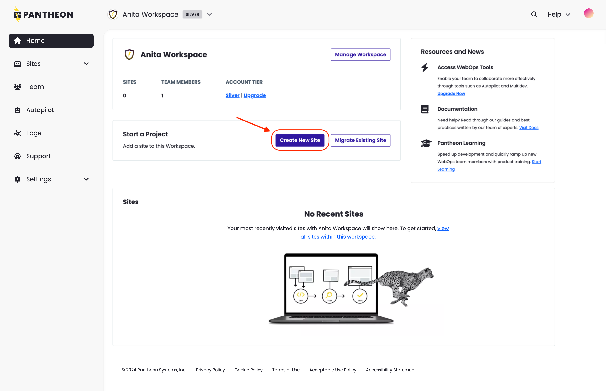
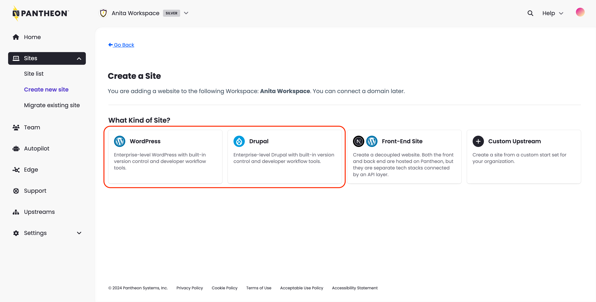
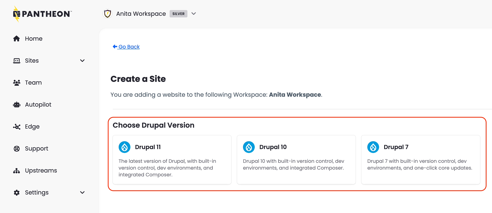

1. [Go to the workspace](/guides/account-mgmt/workspace-sites-teams/workspaces#switch-between-workspaces) and select the **Create New Site** button:

   

1. Select **WordPress** or **Drupal**.

   

   If you select Drupal, you will have the option to select the Drupal version you want to use.

   

   <Alert title="Note" type="info" >

   The above options are available during site creation in the **new dashboard**. The legacy dashboard site creation experience does not match today, but it will be aligned in the future.

   Upgrade today by clicking **Try the New Dashboard**, located in the top right of the legacy dashboard navigation. Or if you prefer not to upgrade, use the following site creation links:

   * [Drupal 11](https://dashboard.pantheon.io/sites/create?upstream_machine_name=drupal-11-composer-managed)
   * [Drupal 10](https://dashboard.pantheon.io/sites/create?upstream_machine_name=drupal-10-composer-managed)

   </Alert>

1. Enter the following information and click **Continue**:
   - Sitename
   - Select a region for this site.
   - If this site is to be part of a Professional Workspace, select a Workspace from **Choose a Workspace for the Site**.

   

1. The deployment process begins. It can take several minutes to create a new site on Pantheon.

   

   <Alert title="Note" type="info" >

   You can navigate away from this page during this process, but later, you'll have access the site via the **Sites** tab in your Workspace.

   </Alert>

1. Click **Visit your Pantheon Site Dashboard** when the process is complete.

   

You've now created the core portion of your Dev environment; now you have to install the CMS.
